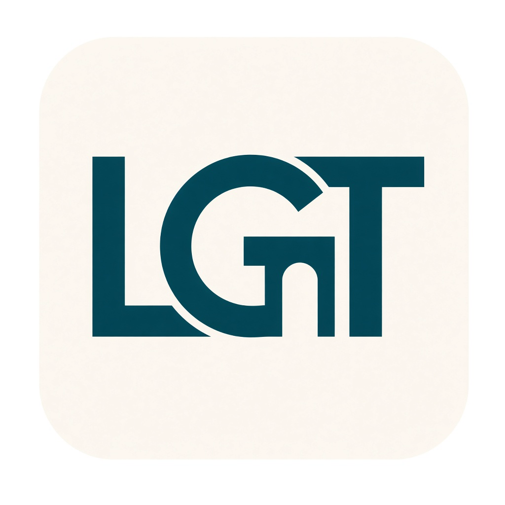

# NOTICE — rights protection mark (Loregate)



**Effective date:** 29 September 2026

**Product name:** **Loregate** (short mark **LGT**). Tagline: *From lore to merge through gates.* The GitHub repository id may still be `cursor-spells` until a human renames it — see [NAME-OPTIONS.md](NAME-OPTIONS.md).

This file is an attribution and rights-reservation notice. It does **not** modify the MIT copyright license stated for the Software in `README.md` / [TERMS.md](TERMS.md). Apache License–style practice treats `NOTICE` contents as informational and separate from the copyright license grant; the same separation is intended here.

---

## Rights reserved / mark (display block)

Copy and display the following block where attribution is appropriate (repository README, about screens, redistribution docs, or fork banners):

```text
================================================================================
  Loregate (LGT)
  Copyright (c) 2026 Andrey Trembak (GitHub: a-trembak)
  https://github.com/a-trembak/cursor-spells
  (GitHub repo id may still be cursor-spells until renamed to loregate)

  RIGHTS RESERVED (NAMES & IDENTITY)
  The name “Loregate”, the short mark “LGT”, associated pipeline identifiers
  as product names, the former working name “cursor-spells”, and the author’s
  name/identity are reserved by Andrey Trembak.
  The MIT copyright license for the Software does NOT grant trademark,
  trade-name, or endorsement rights. Do not remove required copyright and
  permission notices. Do not claim authorship of the original project or
  imply endorsement without written permission.

  SOFTWARE LICENSE
  Software copyright licensed under MIT (SPDX: MIT), as stated in README.md.
  Provided AS IS, without warranty; use at your own risk.
  See docs/legal/DISCLAIMER.md and docs/legal/TERMS.md.

  LANGUAGE POLICY
  Russian language is forbidden inside this pipeline under the kit’s
  sanctions-based language policy. Use tools outside this pipeline if needed.
================================================================================
```

**Short mark (one line):**

```text
Loregate (LGT) © 2026 Andrey Trembak (a-trembak). Names/identity rights reserved. Software: MIT (AS IS).
```

---

## Clarifications

1. **No invented company.** Rights are asserted by the individual author **Andrey Trembak**, GitHub user **`a-trembak`**, for the **Loregate** project — not by a fictional corporate entity.  
2. **Trademarks.** No registration status is claimed in this file. “Rights reserved” here means the author reserves whatever name, trade-dress, and anti-misrepresentation protections applicable law already provides, and clarifies that MIT does not license those away.  
3. **Forks.** Forks may keep the name for describing origin (“based on Loregate by a-trembak”) but should not present themselves as the upstream project.  
4. **Third-party notices.** Optional third-party skills and tools remain under their own copyright and trademark rules; preserve their notices when required.
5. **Do not put “Cursor” in the product title.** Cursor is a third-party host product mark.

---

## Related documents

- [Terms](TERMS.md) · [Disclaimer](DISCLAIMER.md) · [Privacy](PRIVACY.md) · [Sources](SOURCES.md) · [Name](NAME-OPTIONS.md)
