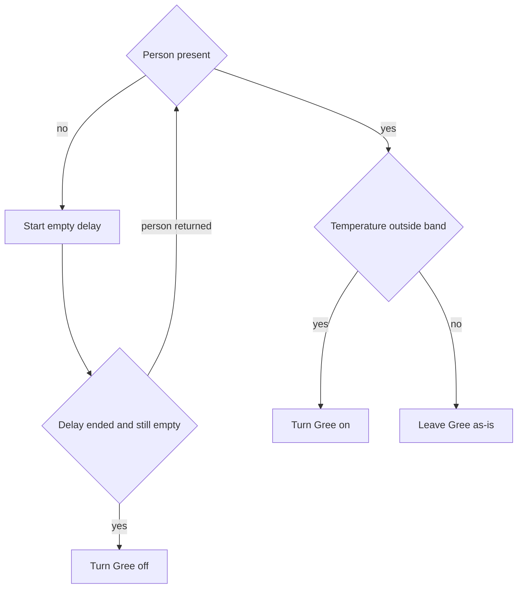
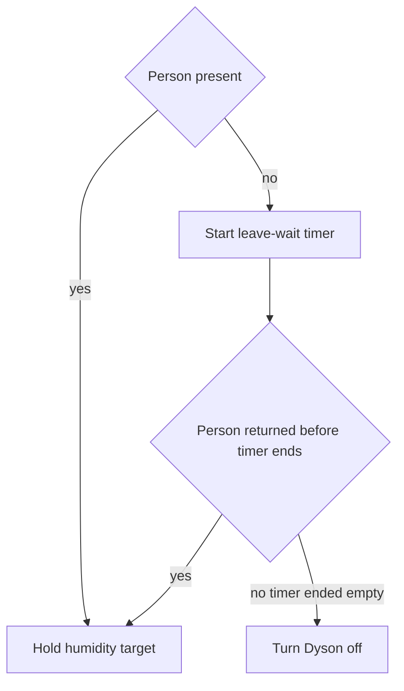

# Apartment Climate Hub - Plan

## Goal Capsule

- **Objective:** Run two apartment climate scenarios from Home Assistant on a home Mac Mini, with the phone as a remote. First slice is four devices only: Sonoff thermometer, Tapo camera, Gree air conditioner, Dyson humidifier.
- **Product authority:** This Product Contract. Surrounding work (every other apartment device, a custom controller, a product for other people) is not active scope.
- **Open blockers:** None that block planning. Exact hardware model strings, numeric set points, and delay lengths stay editable Home Assistant conditions. They are not locked here.
- **Execution profile:** Configuration of Home Assistant on the owner's Mac Mini. Not application code in this repository.

---

## Product Contract

### Summary

Install Home Assistant on the owner's always-on Mac Mini and use the phone as a remote. Connect four devices and run two editable automations: Gree climate from presence plus temperature, and Dyson humidity hold from presence plus a leave-wait timer.

### Problem Frame

The owner wants one apartment controller, but devices speak different vendor languages. A first useful slice is one room: presence, temperature, air conditioner, and humidifier. Writing a custom controller would rebuild links that already exist in a ready home hub. Numeric targets and delays belong in the hub as scenario conditions, not as values frozen in chat.

### Key Decisions

- KD1. Ready Home Assistant, not a custom controller. `(session-settled: user-directed — chosen over writing a custom app: the owner said a ready Home Assistant solution is enough.)` Governs R1, R2.
- KD2. Always-on Mac Mini at home; phone is remote only. `(session-settled: user-directed — chosen over phone-only Home Assistant or a machine outside the apartment: rules must keep running when the phone sleeps, and devices share the apartment network.)` Governs R2, R3.
- KD3. Sonoff thermometer is the primary temperature source; Dyson temperature is backup. `(session-settled: user-directed — chosen over Dyson as the only temperature source: a dedicated thermometer is more reliable than a large appliance sensor.)` Governs R5, R6.
- KD4. Dyson is also a controlled device that holds humidity. `(session-settled: user-directed — chosen over temperature-only use of Dyson: the owner asked to control Dyson in the same linkage.)` Governs R8, R12, F2.
- KD5. Scenario numbers stay editable hub conditions. `(session-settled: user-directed — chosen over locking humidity percent, delays, and temperature band in this document: the owner said those are configured as scenario conditions.)` Governs R9.
- KD6. Personal apartment only. `(session-settled: user-directed — chosen over a product for other people: first-party use.)` Governs R1.

### Actors

- A1. Apartment owner. Uses the phone to watch state, change editable conditions, and override devices by hand.
- A2. Home Assistant on the Mac Mini. Holds device links, runs both scenarios, and keeps leave-wait timers.
- A3. Sonoff thermometer. Primary room temperature.
- A4. Tapo camera. Presence signal for the room.
- A5. Gree air conditioner. Heating and cooling action for scenario A.
- A6. Dyson humidifier. Humidity hold for scenario B, and backup temperature.

### Requirements

**Hosting and control**

- R1. The first slice serves the owner's apartment only.
- R2. Home Assistant is the ready hub. This repository does not ship a custom controller.
- R3. Home Assistant runs on the owner's Mac Mini, which stays powered and on the apartment network. The phone app is a remote, not the place the scenarios live.

**Devices**

- R4. The Tapo camera supplies the room presence signal used by both scenarios.
- R5. The Sonoff thermometer is the primary temperature input for scenario A.
- R6. The Dyson humidifier may supply backup temperature when the Sonoff reading is missing.
- R7. The Gree air conditioner is the climate actuator for scenario A.
- R8. The Dyson humidifier is the humidity actuator for scenario B.

**Editable conditions**

- R9. Temperature band, humidity target, air-conditioner empty delay, and Dyson leave-wait duration are user-editable Home Assistant conditions. Defaults may be suggested at setup (about five minutes empty for the air conditioner; about one hour leave-wait for Dyson). This document does not lock the numbers.

**Scenario A — air conditioner**

- R10. When a person is present and room temperature is outside the set band, turn the Gree air conditioner on. Per R9.
- R11. When the person leaves and the empty delay elapses with the room still empty, turn the Gree air conditioner off. Per R9.

**Scenario B — humidifier**

- R12. While a person is present, the Dyson humidifier holds the humidity target. Use the target already set in the Dyson app unless the owner sets a different target in the hub. Per R9.
- R13. When the person leaves, start the leave-wait timer. If the person returns before the timer ends, cancel the timer and keep holding humidity. If the timer ends with the room still empty, turn the Dyson humidifier off. Per R9.

**Honesty constraints**

- R14. Treat Tapo presence as imperfect. A false empty or false occupied reading can start or cancel both timers.
- R15. Gree local control may fail on some 2026 Wi-Fi module versions. If the unit only answers the vendor cloud, say so and stop that device rather than inventing a custom protocol.
- R16. Dyson hub control uses a community link. It can break after firmware changes. Setup may need a one-time Dyson account login to fetch local credentials.

### Key Flows

- F1. Air conditioner from presence and temperature
  - **Trigger:** Presence or Sonoff temperature changes, or the empty delay elapses.
  - **Actors:** A1, A2, A3, A4, A5
  - **Steps:** Hub reads presence and primary temperature. If present and outside the band, turn Gree on. If presence becomes empty, start the empty delay. If presence returns, cancel that delay. If the delay ends empty, turn Gree off.
  - **Covered by:** R4, R5, R7, R9, R10, R11, R14

- F2. Humidity hold with leave-wait cancel
  - **Trigger:** Presence changes, humidity leaves the target, or the leave-wait timer ends.
  - **Actors:** A1, A2, A4, A6
  - **Steps:** If present, hold humidity. If presence becomes empty, start the leave-wait timer. If presence returns before the timer ends, cancel the timer and keep holding. If the timer ends empty, turn Dyson off.
  - **Covered by:** R4, R8, R9, R12, R13, R14, R16

### Acceptance Examples

- AE1. Occupied and too warm or too cold
  - **Covers R10, R5, R4.**
  - **Given:** A person is present and Sonoff temperature is outside the set band.
  - **When:** The hub evaluates scenario A.
  - **Then:** The Gree air conditioner turns on.

- AE2. Short empty does not kill climate
  - **Covers R11, R9.**
  - **Given:** The air conditioner is on and the person leaves.
  - **When:** The person returns before the empty delay ends.
  - **Then:** The air conditioner stays on. The empty delay is cancelled.

- AE3. Empty delay completed
  - **Covers R11.**
  - **Given:** The person left and the empty delay finished with no return.
  - **When:** The hub evaluates scenario A.
  - **Then:** The Gree air conditioner turns off.

- AE4. Humidity while occupied
  - **Covers R12.**
  - **Given:** A person is present and air is drier than the target.
  - **When:** The hub evaluates scenario B.
  - **Then:** The Dyson humidifier runs to hold the target.

- AE5. Return clears the Dyson wait
  - **Covers R13.**
  - **Given:** The person left and the leave-wait timer is still running.
  - **When:** The person returns.
  - **Then:** The timer is cancelled. Humidity hold continues.

- AE6. Leave-wait completed
  - **Covers R13.**
  - **Given:** The person left and the leave-wait timer ended with the room still empty.
  - **When:** The hub evaluates scenario B.
  - **Then:** The Dyson humidifier turns off.

- AE7. Phone asleep, scenarios still run
  - **Covers R3.**
  - **Given:** Home Assistant is up on the Mac Mini and the phone is asleep or in another room.
  - **When:** Presence and temperature match scenario A or B.
  - **Then:** The hub still applies the matching action.

### Success Criteria

- S1. Both scenarios run from the Mac Mini without the phone staying open.
- S2. The owner can change temperature band, humidity target, and both delays in Home Assistant without writing a new program.
- S3. A later agent can execute the companion implementation plan on the Mac Mini without changing application code in this repository.

### Scope Boundaries

**Deferred for later**

- Other apartment devices beyond these four.
- Storing exported automation files in a second repository, unless the owner later asks.
- A custom presence sensor if the Tapo camera proves too noisy.

**Outside this product's identity**

- A custom software controller written from scratch.
- A product or service for other households.
- Uniting every Wi-Fi device in the apartment in this slice.

### Dependencies / Assumptions

- The Mac Mini stays powered and on the same apartment network as the devices.
- The Gree unit has a Wi-Fi module and was first joined with the vendor app.
- The Tapo camera can emit a usable presence or motion signal without a paid cloud plan. Person-versus-motion quality depends on the camera model.
- The Sonoff unit is either a Zigbee sensor (needs a coordinator on the hub) or a Wi-Fi TH-class device (eWeLink or local link). Exact model is unknown.
- Dyson control uses a community Home Assistant integration after a Dyson account login.

### Outstanding Questions

**Deferred to Planning**

- Exact Sonoff, Tapo, Gree, and Dyson model strings. Planning chooses the matching Home Assistant integration per device family.
- Whether Tapo exposes person detection or only motion on this unit. Planning uses the best local presence entity the camera offers.
- Official Home Assistant virtual-machine install path on Apple silicon versus Intel Mac Mini. Planning follows current Home Assistant install docs at execution time.

### Sources / Research

- Home Assistant Gree Climate integration (local polling after Gree+ bind): `https://www.home-assistant.io/integrations/gree/`
- Community Gree reports that some 2026 Wi-Fi firmware no longer answers the old local bind path (home-assistant/core issue 176486).
- Official Sonoff guidance: Zigbee SNZB-class sensors join Home Assistant locally through a Zigbee coordinator.
- Tapo: person detection exists in the Tapo app without Tapo Care; hub presence often comes from the community Tapo Cameras Control integration, which is local after camera account setup.
- Dyson: official app is MyDyson. Community integrations (`libdyson-wg/ha-dyson`, `cmgrayb/hass-dyson`) can expose temperature, humidity, and humidifier controls after cloud credential fetch, then local talk.

<!-- ce-section: work-relationships -->
### How This Work Fits Together

This plan owns the first climate-and-humidity slice on Home Assistant. The broader wish to unite every apartment device is current understanding, not a roadmap.

- Later device coverage
  - **Depends on:** this hub staying up and the first two automations working.
  - **Can proceed independently of:** a custom controller, which this plan rejected.
  - **Still to decide:** which next device is worth a later plan.
- Optional automation export to another git repository
  - **Depends on:** the two automations existing in Home Assistant.
  - **Can proceed independently of:** this repository's skills kit.
  - **Still to decide:** whether the owner wants YAML stored in git at all.
