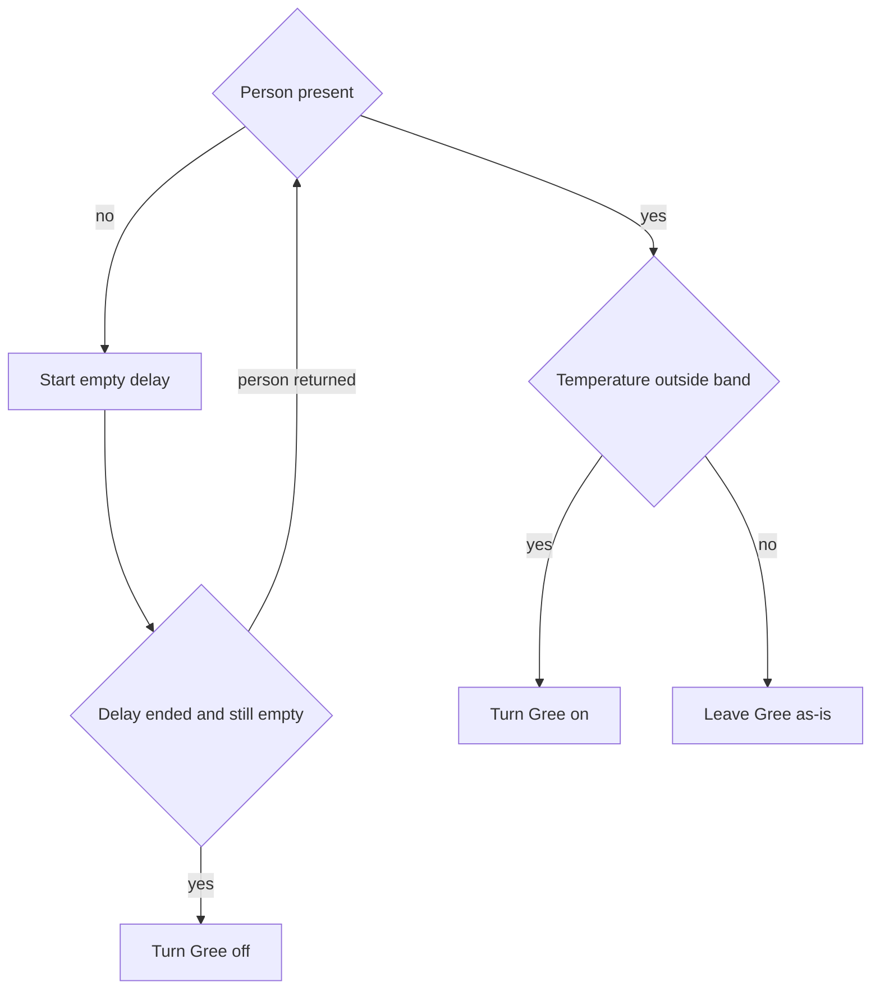
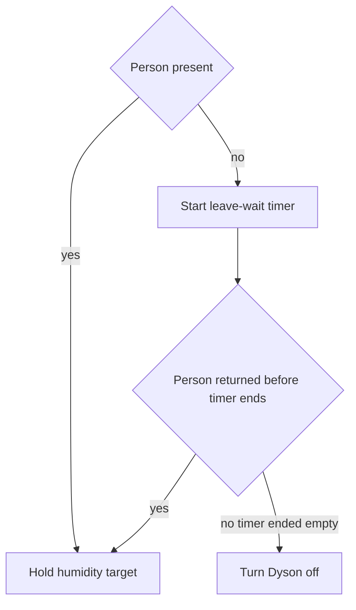
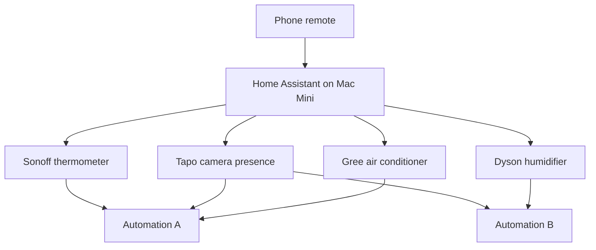

# Apartment Home Assistant - Plan

Для виконання: відкрийте цей файл у іншому репозиторії і скажіть агенту виконати його. Робота — поставити й налаштувати Home Assistant на Мак міні власника, підключити чотири пристрої й зібрати два сценарії. Не писати нову програму-контролер і не змінювати код цього набору навичок.

**Target runtime:** the owner's Mac Mini Home Assistant instance on the apartment network. Not this git repository.

**Product Contract preservation:** Product Contract copied from `docs/plans/2026-08-30-001-feature-apartment-climate-hub-plan.md`, unchanged.

**Run in another repository:** execution is Home Assistant install and configuration. That other repository does not need application code from this workspace. Store exported automation files there only if the owner later asks.

---

## Goal Capsule

- **Objective:** Install Home Assistant on the owner's Mac Mini, attach the phone as a remote, connect four devices, and create two editable automations for Gree climate and Dyson humidity.
- **Product authority:** This Product Contract. Planning Contract says how. Surrounding apartment-wide unification is not active scope.
- **Open blockers:** None. Model strings and numeric conditions are chosen at the Mac Mini during setup. Per R9.
- **Execution profile:** knowledge-work on the Mac Mini. Do not open a feature branch to ship an app. Do not implement a custom controller.
- **Stop conditions:** A device cannot be reached after the matching official or community integration is tried. Record the failure and continue with the other devices. Do not invent a vendor protocol.
- **Tail ownership:** Leave Home Assistant running on the Mac Mini. Phone remote works. Both automations are editable by the owner.

---

## Product Contract

### Summary

Install Home Assistant on the owner's always-on Mac Mini and use the phone as a remote. Connect four devices and run two editable automations: Gree climate from presence plus temperature, and Dyson humidity hold from presence plus a leave-wait timer.

### Problem Frame

The owner wants one apartment controller, but devices speak different vendor languages. A first useful slice is one room: presence, temperature, air conditioner, and humidifier. Writing a custom controller would rebuild links that already exist in a ready home hub. Numeric targets and delays belong in the hub as scenario conditions, not as values frozen in chat.

### Key Decisions

- KD1. Ready Home Assistant, not a custom controller. `(session-settled: user-directed — chosen over writing a custom app: the owner said a ready Home Assistant solution is enough.)` Governs R1, R2.
- KD2. Always-on Mac Mini at home; phone is remote only. `(session-settled: user-directed — chosen over phone-only Home Assistant or a machine outside the apartment: rules must keep running when the phone sleeps, and devices share the apartment network.)` Governs R2, R3.
- KD3. Sonoff thermometer is the primary temperature source; Dyson temperature is backup. `(session-settled: user-directed — chosen over Dyson as the only temperature source: a dedicated thermometer is more reliable than a large appliance sensor.)` Governs R5, R6.
- KD4. Dyson is also a controlled device that holds humidity. `(session-settled: user-directed — chosen over temperature-only use of Dyson: the owner asked to control Dyson in the same linkage.)` Governs R8, R12, F2.
- KD5. Scenario numbers stay editable hub conditions. `(session-settled: user-directed — chosen over locking humidity percent, delays, and temperature band in this document: the owner said those are configured as scenario conditions.)` Governs R9.
- KD6. Personal apartment only. `(session-settled: user-directed — chosen over a product for other people: first-party use.)` Governs R1.

### Actors

- A1. Apartment owner. Uses the phone to watch state, change editable conditions, and override devices by hand.
- A2. Home Assistant on the Mac Mini. Holds device links, runs both scenarios, and keeps leave-wait timers.
- A3. Sonoff thermometer. Primary room temperature.
- A4. Tapo camera. Presence signal for the room.
- A5. Gree air conditioner. Heating and cooling action for scenario A.
- A6. Dyson humidifier. Humidity hold for scenario B, and backup temperature.

### Requirements

**Hosting and control**

- R1. The first slice serves the owner's apartment only.
- R2. Home Assistant is the ready hub. This repository does not ship a custom controller.
- R3. Home Assistant runs on the owner's Mac Mini, which stays powered and on the apartment network. The phone app is a remote, not the place the scenarios live.

**Devices**

- R4. The Tapo camera supplies the room presence signal used by both scenarios.
- R5. The Sonoff thermometer is the primary temperature input for scenario A.
- R6. The Dyson humidifier may supply backup temperature when the Sonoff reading is missing.
- R7. The Gree air conditioner is the climate actuator for scenario A.
- R8. The Dyson humidifier is the humidity actuator for scenario B.

**Editable conditions**

- R9. Temperature band, humidity target, air-conditioner empty delay, and Dyson leave-wait duration are user-editable Home Assistant conditions. Defaults may be suggested at setup (about five minutes empty for the air conditioner; about one hour leave-wait for Dyson). This document does not lock the numbers.

**Scenario A — air conditioner**

- R10. When a person is present and room temperature is outside the set band, turn the Gree air conditioner on. Per R9.
- R11. When the person leaves and the empty delay elapses with the room still empty, turn the Gree air conditioner off. Per R9.

**Scenario B — humidifier**

- R12. While a person is present, the Dyson humidifier holds the humidity target. Use the target already set in the Dyson app unless the owner sets a different target in the hub. Per R9.
- R13. When the person leaves, start the leave-wait timer. If the person returns before the timer ends, cancel the timer and keep holding humidity. If the timer ends with the room still empty, turn the Dyson humidifier off. Per R9.

**Honesty constraints**

- R14. Treat Tapo presence as imperfect. A false empty or false occupied reading can start or cancel both timers.
- R15. Gree local control may fail on some 2026 Wi-Fi module versions. If the unit only answers the vendor cloud, say so and stop that device rather than inventing a custom protocol.
- R16. Dyson hub control uses a community link. It can break after firmware changes. Setup may need a one-time Dyson account login to fetch local credentials.

### Key Flows

- F1. Air conditioner from presence and temperature
  - **Trigger:** Presence or Sonoff temperature changes, or the empty delay elapses.
  - **Actors:** A1, A2, A3, A4, A5
  - **Steps:** Hub reads presence and primary temperature. If present and outside the band, turn Gree on. If presence becomes empty, start the empty delay. If presence returns, cancel that delay. If the delay ends empty, turn Gree off.
  - **Covered by:** R4, R5, R7, R9, R10, R11, R14

- F2. Humidity hold with leave-wait cancel
  - **Trigger:** Presence changes, humidity leaves the target, or the leave-wait timer ends.
  - **Actors:** A1, A2, A4, A6
  - **Steps:** If present, hold humidity. If presence becomes empty, start the leave-wait timer. If presence returns before the timer ends, cancel the timer and keep holding. If the timer ends empty, turn Dyson off.
  - **Covered by:** R4, R8, R9, R12, R13, R14, R16

### Acceptance Examples

- AE1. Occupied and too warm or too cold
  - **Covers R10, R5, R4.**
  - **Given:** A person is present and Sonoff temperature is outside the set band.
  - **When:** The hub evaluates scenario A.
  - **Then:** The Gree air conditioner turns on.

- AE2. Short empty does not kill climate
  - **Covers R11, R9.**
  - **Given:** The air conditioner is on and the person leaves.
  - **When:** The person returns before the empty delay ends.
  - **Then:** The air conditioner stays on. The empty delay is cancelled.

- AE3. Empty delay completed
  - **Covers R11.**
  - **Given:** The person left and the empty delay finished with no return.
  - **When:** The hub evaluates scenario A.
  - **Then:** The Gree air conditioner turns off.

- AE4. Humidity while occupied
  - **Covers R12.**
  - **Given:** A person is present and air is drier than the target.
  - **When:** The hub evaluates scenario B.
  - **Then:** The Dyson humidifier runs to hold the target.

- AE5. Return clears the Dyson wait
  - **Covers R13.**
  - **Given:** The person left and the leave-wait timer is still running.
  - **When:** The person returns.
  - **Then:** The timer is cancelled. Humidity hold continues.

- AE6. Leave-wait completed
  - **Covers R13.**
  - **Given:** The person left and the leave-wait timer ended with the room still empty.
  - **When:** The hub evaluates scenario B.
  - **Then:** The Dyson humidifier turns off.

- AE7. Phone asleep, scenarios still run
  - **Covers R3.**
  - **Given:** Home Assistant is up on the Mac Mini and the phone is asleep or in another room.
  - **When:** Presence and temperature match scenario A or B.
  - **Then:** The hub still applies the matching action.

### Success Criteria

- S1. Both scenarios run from the Mac Mini without the phone staying open.
- S2. The owner can change temperature band, humidity target, and both delays in Home Assistant without writing a new program.
- S3. An agent can execute this plan on the Mac Mini without writing application code in this repository or in a later repository.

### Scope Boundaries

**Deferred for later**

- Other apartment devices beyond these four.
- Storing exported automation files in a second repository, unless the owner later asks.
- A custom presence sensor if the Tapo camera proves too noisy.

**Deferred to Follow-Up Work**

- Export of the two automations into git, if the owner wants a file copy after they work.

**Outside this product's identity**

- A custom software controller written from scratch.
- A product or service for other households.
- Uniting every Wi-Fi device in the apartment in this slice.

### Dependencies / Assumptions

- The Mac Mini stays powered and on the same apartment network as the devices.
- The Gree unit has a Wi-Fi module and was first joined with the vendor app.
- The Tapo camera can emit a usable presence or motion signal without a paid cloud plan. Person-versus-motion quality depends on the camera model.
- The Sonoff unit is either a Zigbee sensor (needs a coordinator on the hub) or a Wi-Fi TH-class device (eWeLink or local link). Exact model is unknown.
- Dyson control uses a community Home Assistant integration after a Dyson account login.

<!-- ce-section: work-relationships -->
### How This Work Fits Together

This plan owns the first climate-and-humidity slice on Home Assistant. The broader wish to unite every apartment device is current understanding, not a roadmap.

- Later device coverage
  - **Depends on:** this hub staying up and the first two automations working.
  - **Can proceed independently of:** a custom controller, which this plan rejected.
  - **Still to decide:** which next device is worth a later plan.
- Optional automation export to another git repository
  - **Depends on:** the two automations existing in Home Assistant.
  - **Can proceed independently of:** this repository's skills kit.
  - **Still to decide:** whether the owner wants YAML stored in git at all.

---

## Planning Contract

### Key Technical Decisions

- KTD1. Official Home Assistant operating system in a virtual machine on the Mac Mini. Do not install the hub as a native Mac app. Follow the current Home Assistant virtual-machine install page for the Mac chip (Apple silicon or Intel) at execution time. Governs R3.
- KTD2. Use shipped or community Home Assistant integrations only. Do not write device clients. Governs R2, R15, R16.
- KTD3. Expose temperature band, humidity target, and both delays as Home Assistant helpers or automation inputs the owner can edit. Suggested defaults only: about five minutes empty for Gree, about one hour leave-wait for Dyson. Governs R9.
- KTD4. Prefer a Tapo person-detection entity when the camera offers one. If it only offers motion, use motion as presence and tell the owner. Governs R4, R14.
- KTD5. Sonoff path follows the box: Zigbee SNZB-class uses a USB or network Zigbee coordinator on the hub. Wi-Fi TH-class uses the eWeLink or Sonoff local integration. Governs R5.
- KTD6. Gree uses the official Home Assistant Gree Climate integration after the unit is on the apartment Wi-Fi via Gree+. If local bind fails after a 2026 module update, stop and report. Do not add an infrared blaster in this slice. Governs R7, R15.
- KTD7. Dyson uses a maintained community integration (`libdyson-wg/ha-dyson` or `cmgrayb/hass-dyson`). One-time MyDyson login is allowed to fetch credentials. Prefer local talk afterward. Governs R8, R16.

### High-Level Technical Design

Home Assistant on the Mac Mini is the only always-on brain. Devices stay on the apartment network. The phone talks to the hub, not to each vendor cloud for the two scenarios.

Directional only: each automation is a Home Assistant automation with a wait-for-trigger or timer that cancels if presence returns. Do not pre-write automation YAML in this plan.

### Assumptions

- The Mac Mini can run a current Home Assistant virtual machine and stay on.
- Vendor phone apps (eWeLink, Tapo, Gree+, MyDyson) can finish first-time device Wi-Fi join if not already done.
- Looking at each device box at execution time is enough to pick KTD5 through KTD7.

### Sequencing

U1 then U2. U3, U4, U5, U6 after U1, in any order. U7 after U3, U4, and U5. U8 after U4 and U6.

### Implementation constraints

- No application source tree in this repository or in a later repository.
- No new vendor protocol.
- Do not lock humidity percent or delay numbers in files the owner cannot edit from the hub.

---

## Implementation Units

### U1. Home Assistant virtual machine on the Mac Mini

- **Goal:** Home Assistant is reachable on the apartment network from a browser on the Mac Mini.
- **Requirements:** R2, R3. KTD1.
- **Files:** virtual machine disk and Home Assistant data on the Mac Mini. Nothing in this git repository.
- **Approach:** Install the official Home Assistant operating system in a virtual machine using the current Home Assistant Mac instructions. Give the guest a stable address on the apartment network. Complete onboarding. Leave the Mac Mini set to stay awake.
- **Test scenarios:**
  - Happy path: open the Home Assistant web interface from the Mac Mini. The onboarding dashboard loads.
  - Edge: Mac Mini sleep. After wake, the interface is reachable again. If sleep killed the guest, turn off Mac sleep for this machine.
  - Error: install image fails for this chip. Stop and use the matching official image. Do not fall back to a custom container stack unless the official virtual-machine path is documented as unsupported.
- **Verification:** Web interface loads. Hub has a local network address. Mac Mini does not sleep the guest away.
- **Dependencies:** none.

### U2. Phone remote

- **Goal:** The owner can open Home Assistant on the phone as a remote. Per AE7.
- **Requirements:** R3. KD2.
- **Files:** Home Assistant Companion app on the phone. Hub user account on the Mac Mini instance.
- **Approach:** Install the official Companion app. Point it at the hub on the apartment network. Confirm the owner can see the default dashboard.
- **Test scenarios:**
  - Happy path: phone on apartment Wi-Fi shows the hub dashboard.
  - Edge: lock the phone for several minutes. Open the app again. The hub is still running (U1), not the phone.
  - Error: app cannot find the hub. Fix local address or name resolution. Do not expose the hub to the public internet in this slice.
- **Verification:** Phone shows the hub. Closing the app does not stop U1.
- **Dependencies:** U1.

### U3. Sonoff thermometer

- **Goal:** Home Assistant has a live primary temperature entity. Per R5.
- **Requirements:** R5. KTD5.
- **Files:** Home Assistant device registry on the Mac Mini instance.
- **Approach:** Read the model on the box. Zigbee: add a coordinator if missing, then pair. Wi-Fi TH-class: add the matching Sonoff or eWeLink integration. Name the entity so automations can treat it as primary temperature.
- **Test scenarios:**
  - Happy path: temperature updates in the hub within a few minutes of pairing.
  - Edge: reading stalls. Recheck battery, Zigbee distance, or local versus cloud sensor updates for TH-class units.
  - Error: model is neither Zigbee nor known Wi-Fi TH. Stop this unit and report. Do not flash custom firmware in this slice.
- **Verification:** A temperature entity changes when the room warms or cools, or when the sensor is held.
- **Dependencies:** U1.

### U4. Tapo camera presence

- **Goal:** Home Assistant has a presence entity from the Tapo camera. Per R4, R14.
- **Requirements:** R4, R14. KTD4.
- **Files:** Home Assistant device registry on the Mac Mini instance. Tapo camera third-party compatibility setting in the Tapo app.
- **Approach:** Enable third-party access in the Tapo app. Add the community Tapo Cameras Control integration (or the current equivalent). Prefer a person-detection binary entity. If only motion exists, use it and tell the owner.
- **Test scenarios:**
  - Happy path: walk into the room. The presence entity turns on.
  - Edge: sit still for a minute. Note whether the entity drops. Record this for R14.
  - Error: no local events without a memory card or with Tapo Care plus card blocking the local watch path. Follow current Tapo notes. Do not buy a paid cloud plan just to get presence.
- **Verification:** The entity toggles when a person enters and leaves. The owner knows if it is person or motion.
- **Dependencies:** U1.

### U5. Gree air conditioner

- **Goal:** Home Assistant can turn the Gree unit on and off and set a temperature. Per R7, R15.
- **Requirements:** R7, R15. KTD6.
- **Files:** Home Assistant Gree Climate integration on the Mac Mini instance.
- **Approach:** Confirm the unit is on apartment Wi-Fi via Gree+. Add official Gree Climate. Bind on the local network. Test on and off from the hub.
- **Test scenarios:**
  - Happy path: hub turns the unit on, then off. The indoor unit responds.
  - Edge: unit is on a different network segment. Put hub and unit on the same apartment network.
  - Error: local bind fails and Gree+ still works. Stop. Report possible 2026 module change. Do not write a new client.
- **Verification:** Climate entity reflects on and off after a hub command.
- **Dependencies:** U1.

### U6. Dyson humidifier

- **Goal:** Home Assistant can read humidity and temperature and start or stop humidify. Per R6, R8, R16.
- **Requirements:** R6, R8, R16. KTD7.
- **Files:** Home Assistant custom Dyson integration on the Mac Mini instance.
- **Approach:** Install a current community Dyson integration. Sign in to MyDyson once if needed. Enable continuous monitoring on the machine so sensors keep updating. Confirm humidify mode and a humidity reading.
- **Test scenarios:**
  - Happy path: hub shows humidity and can start humidify.
  - Edge: sensors freeze while the machine is idle. Turn on continuous monitoring.
  - Error: integration fails after firmware change. Stop and report. Do not write a Dyson client.
- **Verification:** Humidity entity updates. Hub can start and stop humidify.
- **Dependencies:** U1.

### U7. Automation A — Gree climate

- **Goal:** Scenario A matches F1 and AE1 through AE3.
- **Requirements:** R9, R10, R11, R14. KTD3. KD3, KD5.
- **Files:** one Home Assistant automation plus helpers for temperature band and empty delay, stored on the Mac Mini instance.
- **Approach:** Trigger on presence and Sonoff temperature. If present and outside the band, turn Gree on. If presence goes empty, wait the empty-delay helper. Cancel the wait if presence returns. Turn Gree off if the wait finishes empty. Use Dyson temperature only if the Sonoff entity is unavailable. Per R5, R6.
- **Test scenarios:**
  - Happy path: AE1. Person present, temperature outside the band, Gree turns on.
  - Edge: AE2. Leave and return before the delay ends. Gree stays on.
  - Error: Tapo flickers empty. Owner sees Gree may start the delay. Per R14. Do not add extra filtering in this slice unless a single flicker makes the unit unusable.
- **Verification:** Walk AE1, AE2, and AE3. Owner can change the band and the delay without editing a program.
- **Dependencies:** U3, U4, U5.

### U8. Automation B — Dyson humidity

- **Goal:** Scenario B matches F2 and AE4 through AE6.
- **Requirements:** R9, R12, R13, R14, R16. KTD3. KD4, KD5.
- **Files:** one Home Assistant automation plus helpers for humidity target (optional) and leave-wait duration, stored on the Mac Mini instance.
- **Approach:** While present, hold humidity using the Dyson target unless the owner set a hub helper. On empty, start the leave-wait helper (suggest about one hour). Cancel and keep holding if presence returns. Turn Dyson off if the wait finishes empty.
- **Test scenarios:**
  - Happy path: AE4. Occupied and dry air. Dyson humidifies.
  - Edge: AE5. Leave and return before the wait ends. Timer clears. Hold continues.
  - Error: Dyson command fails. Automation logs the failure. Do not switch to an infrared blaster in this slice.
- **Verification:** Walk AE4, AE5, and AE6. Owner can change the wait duration in the hub.
- **Dependencies:** U4, U6.

---

## Verification Contract

There is no application test suite in this repository. Proof is live behavior on the Mac Mini.

| Gate | When | Signal |
|---|---|---|
| Hub up | After U1 | Home Assistant web interface loads on the apartment network |
| Remote | After U2 | Companion app shows the hub. Phone sleep does not stop scenarios (AE7) |
| Devices | After U3–U6 | Each connected device has a live entity. Failed devices are listed, not faked |
| Scenario A | After U7 | AE1, AE2, AE3 pass with the owner's current helper values |
| Scenario B | After U8 | AE4, AE5, AE6 pass with the owner's current helper values |
| Editable conditions | After U7 and U8 | Owner changes one helper and sees the next run use the new value (S2) |

Do not run this repository's skill or trajectory test scripts as proof of the apartment hub.

---

## Definition of Done

**Global**

- Home Assistant runs on the Mac Mini and survives the phone going to sleep.
- Four devices are either connected or recorded as blocked with a real reason (R15, R16).
- Automation A and automation B match F1 and F2.
- Helpers exist for the values in R9.
- No custom controller code landed in this repository or in a later repository.
- Abandoned install experiments on the Mac Mini are removed or powered off.

**Per unit**

- U1. Hub web interface reachable. Guest stays up.
- U2. Phone remote works on the apartment network.
- U3. Primary temperature entity live, or blocked with model reason.
- U4. Presence entity live, labeled person or motion.
- U5. Gree on and off from the hub, or blocked per R15.
- U6. Dyson humidity read and humidify control, or blocked per R16.
- U7. AE1–AE3 demonstrated.
- U8. AE4–AE6 demonstrated.

---

## Appendix

### Research breadcrumbs

- Home Assistant Gree Climate (local after Gree+ bind): `https://www.home-assistant.io/integrations/gree/`
- Gree 2026 local-bind failures: home-assistant/core issue 176486
- Sonoff Zigbee temperature sensors: official Sonoff Home Assistant pairing guide for SNZB-class units
- Tapo Cameras Control (community, local, no paid plan): `https://github.com/JurajNyiri/HomeAssistant-Tapo-Control`
- Dyson community integrations: `https://github.com/libdyson-wg/ha-dyson` and `https://github.com/cmgrayb/hass-dyson`
