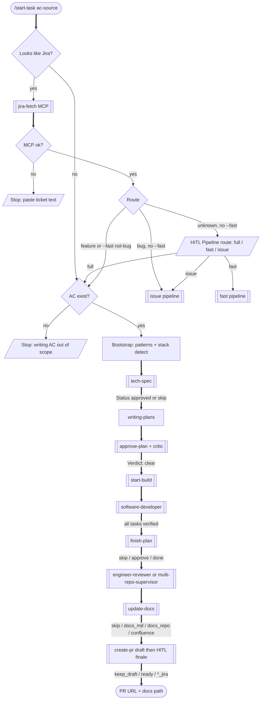
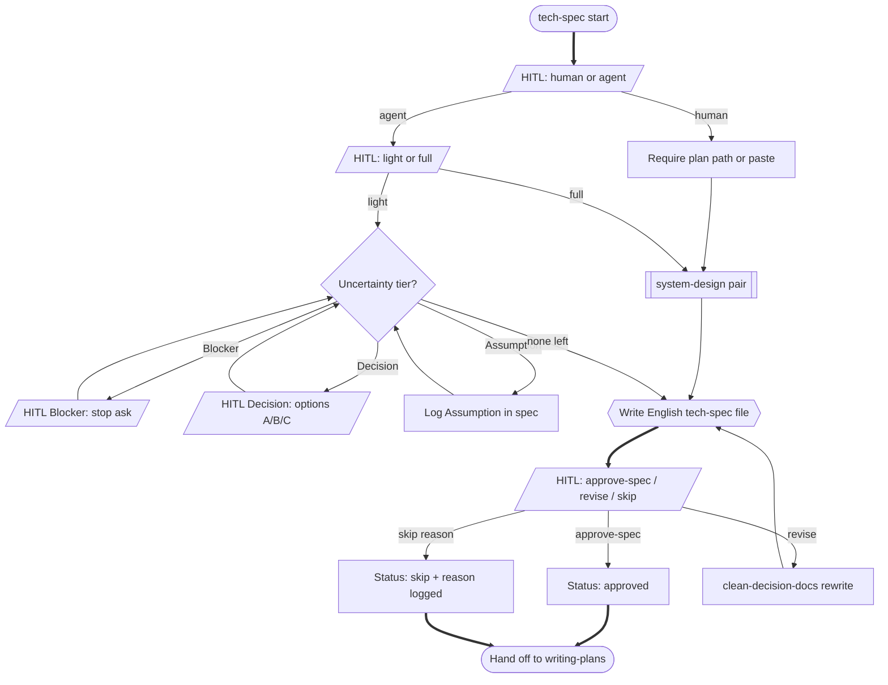
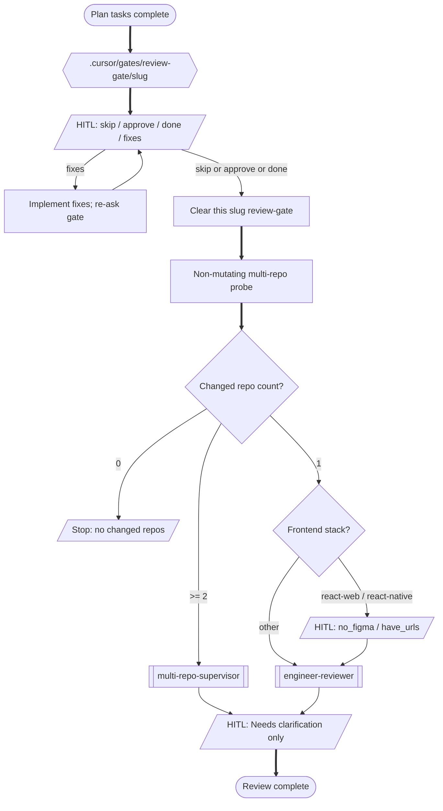
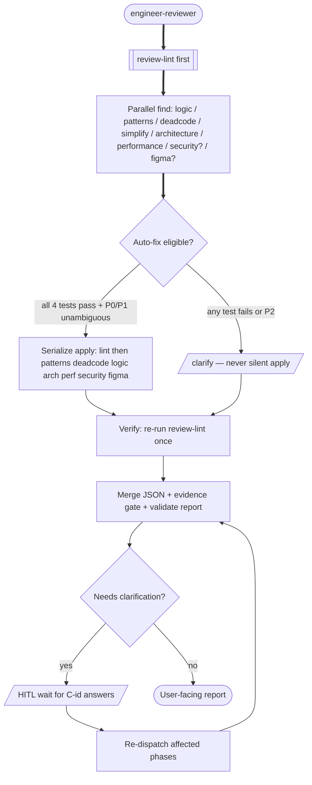
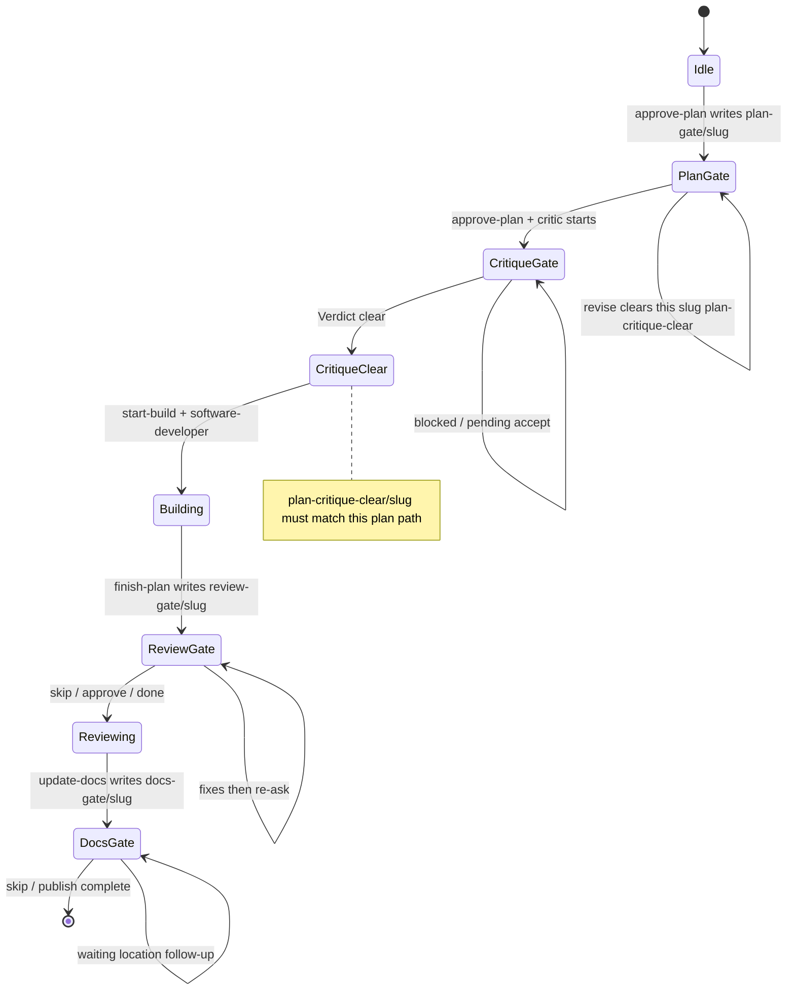
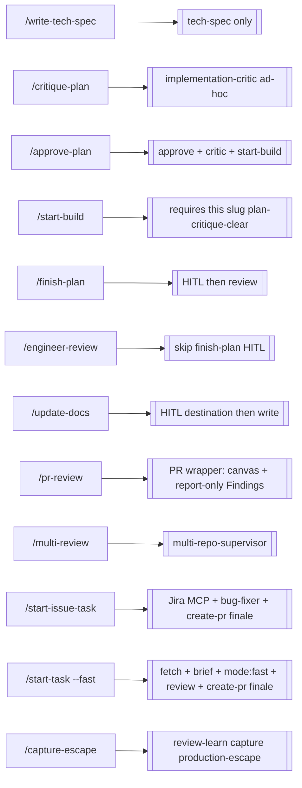
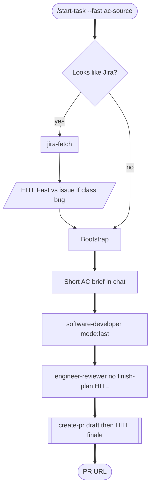
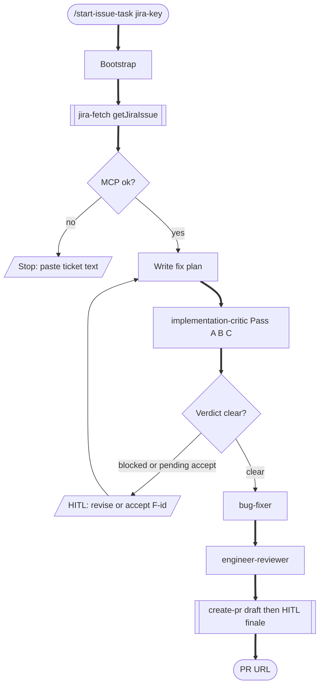
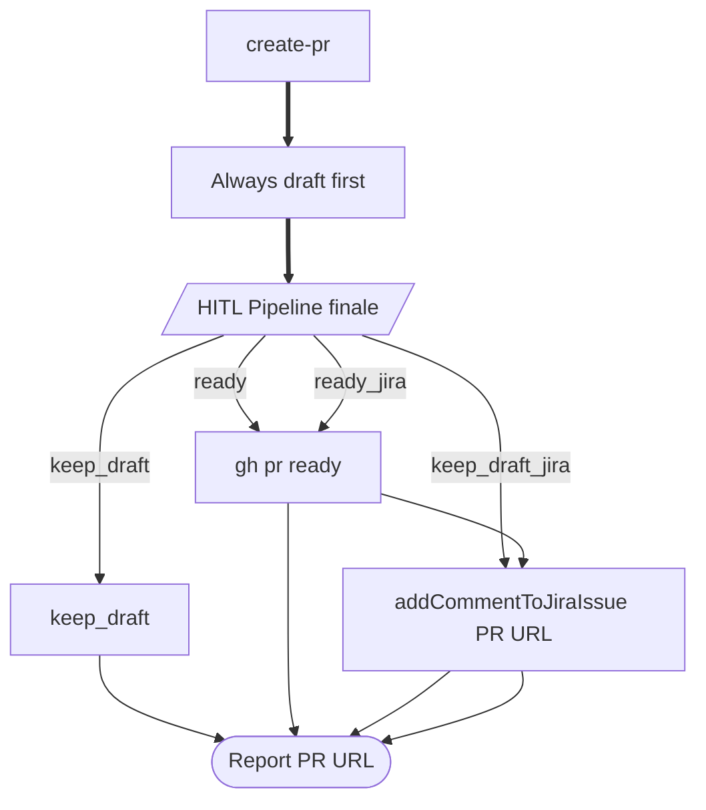

# Quality pipeline flow (canvas)

Canonical flowchart of `/start-task` (full + `--fast`), `/start-issue-task`, and shared finale `create-pr` — every stage, HITL gate, condition, and branch as shipped in this kit.

**Interactive canvas (click stages → detail branches):** open [`pipeline-flow.html`](pipeline-flow.html) in a browser.

Static Mermaid diagrams below are the same graph for GitHub preview and diffs.

**Legend**

| Shape / style | Meaning |
|---------------|---------|
| Stadium `([…])` | Start / end |
| Rectangle `[…]` | Automatic stage |
| Diamond `{…}` | Decision / condition |
| Trapezoid `[/…/]` | HITL gate (human must answer) |
| Hexagon `{{…}}` | Artifact / marker handoff |
| Thick `==>` | Happy path |
| Cross `--x` | Stop / blocked |
| Dotted `-.->` | Loop / re-entry |

Source of truth: [`commands/start-task.md`](../../commands/start-task.md), [`commands/start-issue-task.md`](../../commands/start-issue-task.md), [`commands/capture-escape.md`](../../commands/capture-escape.md), plus `jira-fetch`, `tech-spec`, `approve-plan`, `start-build`, `finish-plan`, `update-docs`, `create-pr`, `bug-fix`, `hitl-choice`.

Closed-set HITL: skill `hitl-choice` **must** call AskQuestion (or alias) first; typed tokens only after failed/missing tool (rule `hitl-askquestion`).

---

## 1. Full pipeline (end-to-end)

`--fast` is never auto-selected. `--fast` + classified bug → HITL **Fast vs issue** (`issue` / `stay_fast`) before the fast pipeline. Explicit `/start-issue-task` always stays on the issue path.

---

## 2. Tech spec — modes, tiers, gate

---

## 3. Approve plan → critic → build

### Critic verdict rules

| Verdict | Condition | Build? |
|---------|-----------|--------|
| `clear` | No open Must-fix; no un-accepted Accept-risk | Yes → `start-build` |
| `clear pending accept` | Must-fix resolved/accepted; Accept-risk still open | No — HITL `accept F<id>` or revise |
| `blocked` | Open Must-fix remains | No — revise or `accept F<id>` |

Should-fix findings are visible but never block.

---

## 4. Start-build → software-developer

`start-build` **must Wait for** the `software-developer` Task to return, then invoke `finish-plan` in the parent chat so `engineer-reviewer` starts. **Fire-and-forget** dispatch is a pipeline bug: the nested Task cannot run `AskQuestion`, so review never launches.

---

## 5. Finish-plan → review routing

---

## 6. Update-docs destination

| Token | Meaning |
|-------|---------|
| `skip` | No product docs this run |
| `docs_md` | Markdown under `docs/` in the current repo (not `docs/superpowers/`) |
| `docs_repo` | Separate documentation repository — path/URL in chat next |
| `confluence` | Confluence page — space/parent or URL in chat next |

Writing shape: skill `update-docs` + `references/writing-guide.md`. For `docs_repo` / `confluence`, **style resolution** first (custom user/engineer style → house siblings → kit default dual-audience). Optional follow-ups: `ce-compound` for durable learnings, `ce-explain` for personal teaching artifacts — neither replaces this gate.

---

## 7. Engineer-review internals (phase graph)

Auto-fix requires all four: deterministic check, single correct answer, no information loss, zero blast radius on data/UX. Traceability drift and migrations are always `clarify`.

---

## 8. Marker state machine

Runtime markers live in the **consumer project** `.cursor/gates/<kind>/<slug>` (never the kit). Parallel tickets use different slugs; a foreign slug never blocks this plan. Legacy flat files (`.cursor/*.pending`, `plan-critique.clear`) migrate-on-read then delete.

| Marker | Written by | Cleared when |
|--------|------------|--------------|
| `.cursor/gates/plan-gate/<slug>` | `approve-plan` | Human replies `approve-plan` |
| `.cursor/gates/critique-gate/<slug>` | after plan approval | `Verdict: clear` |
| `.cursor/gates/plan-critique-clear/<slug>` | on `Verdict: clear` | invalidated on `revise` / re-approve |
| `.cursor/gates/review-gate/<slug>` | `finish-plan` | `skip` / `approve` / `done` |
| `.cursor/gates/docs-gate/<slug>` | `update-docs` | `skip` or publish/abort complete |

---

## 9. Standalone entry points (bypass full orchestrator)

`/critique-plan` alone does **not** write `plan-critique-clear/<slug>` for build — prefer `/approve-plan` so plan HITL is not skipped.

`/pr-review` resolves a GitHub PR, optionally builds a **PR Review Canvas** (Cursor plugin `pr-review-canvas`; skip with `no-canvas`), then runs the same engineer-review phases. Canvas orients the diff; validated Findings remain the review contract.

---

## 10. Fast mode (`/start-task --fast`)

No tech-spec, writing-plans, approve-plan, critic, finish-plan, or update-docs. Clarify HITL only if engineer-review needs it. `--fast` is explicit only.

---

## 11. Issue mode (`/start-issue-task`)

Always this path when `/start-issue-task` is invoked explicitly (even if type is Story). Jira comment options appear on the Pipeline finale when `jira_key` is known. Never `transitionJiraIssue`.

---

## 12. Create-pr Pipeline finale

`keep_draft_jira` / `ready_jira` only when a Jira key is known. Never merge. Never transition Jira status.
