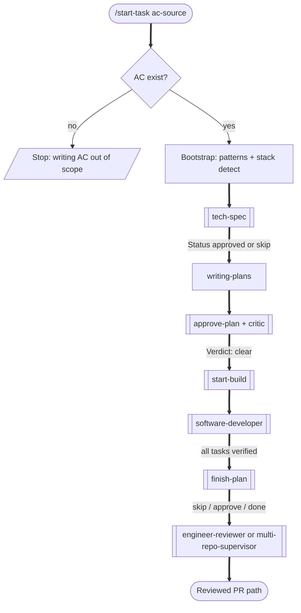
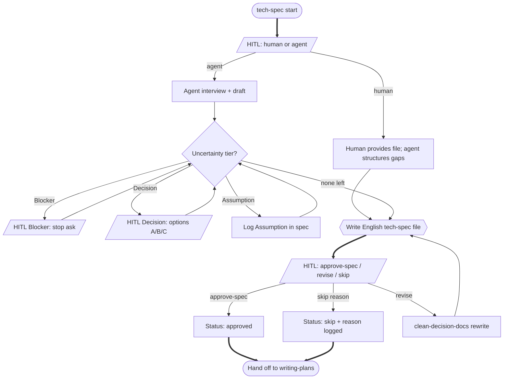
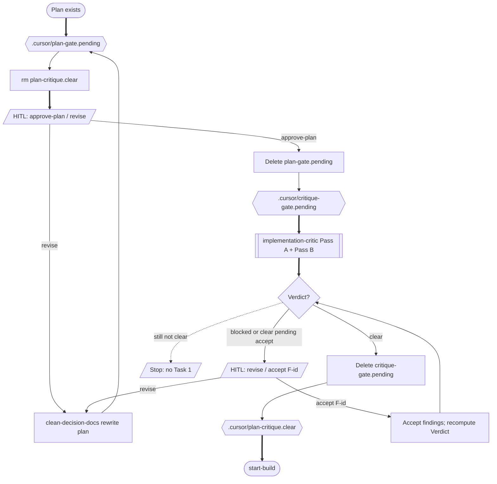
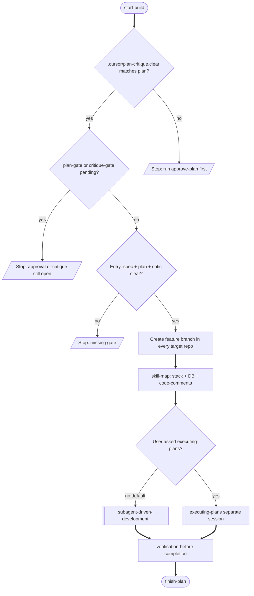
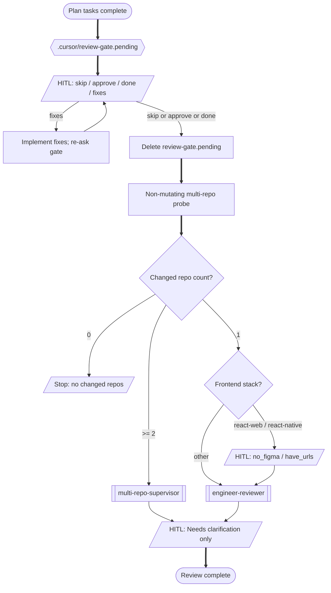
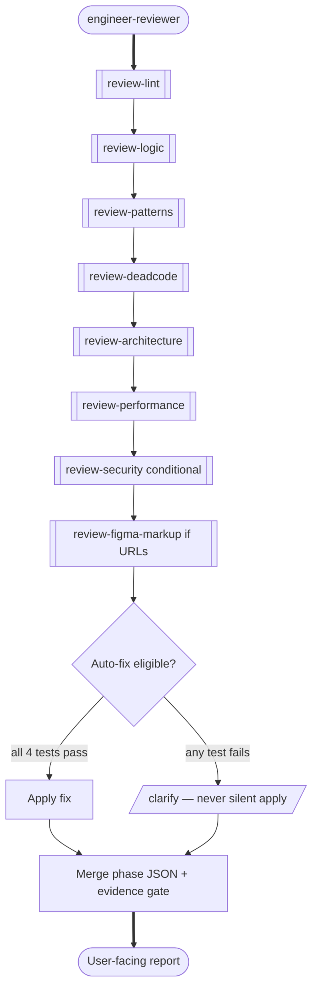
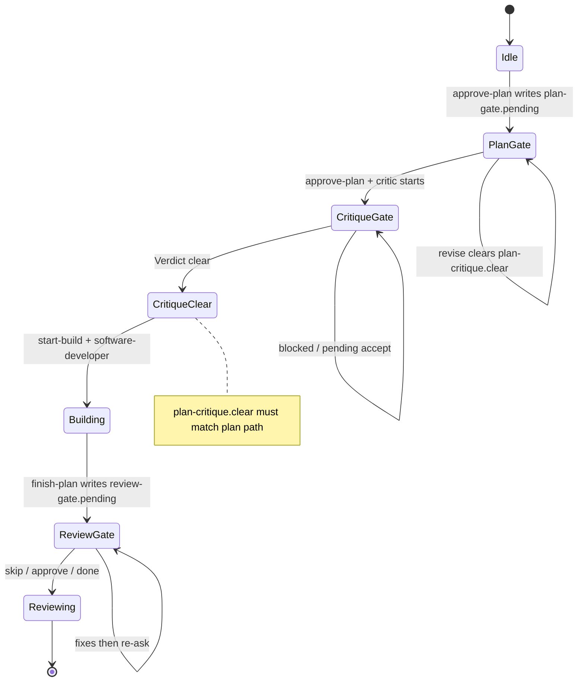
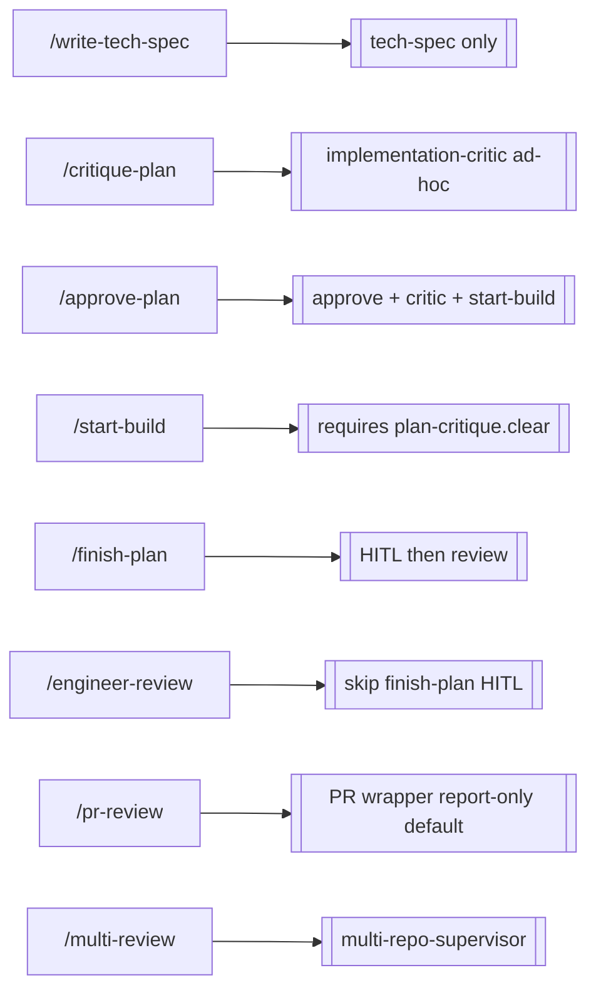

# Quality pipeline flow (canvas)

Canonical flowchart of `/start-task` — every stage, HITL gate, condition, and branch as shipped in this kit.

**Legend**

| Shape / style | Meaning |
|---------------|---------|
| Stadium `([…])` | Start / end |
| Rectangle `[…]` | Automatic stage |
| Diamond `{…}` | Decision / condition |
| Trapezoid `[/…/]` | HITL gate (human must answer) |
| Hexagon `{{…}}` | Artifact / marker handoff |
| Thick `==>` | Happy path |
| Cross `--x` | Stop / blocked |
| Dotted `-.->` | Loop / re-entry |

Source of truth: [`commands/start-task.md`](../../commands/start-task.md), plus `tech-spec`, `approve-plan`, `start-build`, `finish-plan`, `hitl-choice`.

---

## 1. Full pipeline (end-to-end)

---

## 2. Tech spec — modes, tiers, gate

---

## 3. Approve plan → critic → build

### Critic verdict rules

| Verdict | Condition | Build? |
|---------|-----------|--------|
| `clear` | No open Must-fix; no un-accepted Accept-risk | Yes → `start-build` |
| `clear pending accept` | Must-fix resolved/accepted; Accept-risk still open | No — HITL `accept F<id>` or revise |
| `blocked` | Open Must-fix remains | No — revise or `accept F<id>` |

Should-fix findings are visible but never block.

---

## 4. Start-build → software-developer

---

## 5. Finish-plan → review routing

---

## 6. Engineer-review internals (phase graph)

Auto-fix requires all four: deterministic check, single correct answer, no information loss, zero blast radius on data/UX. Traceability drift and migrations are always `clarify`.

---

## 7. Marker state machine

Runtime markers live in the **consumer project** `.cursor/` (never the kit).

| Marker | Written by | Cleared when |
|--------|------------|--------------|
| `.cursor/plan-gate.pending` | `approve-plan` | Human replies `approve-plan` |
| `.cursor/critique-gate.pending` | after plan approval | `Verdict: clear` |
| `.cursor/plan-critique.clear` | on `Verdict: clear` | invalidated on `revise` / re-approve |
| `.cursor/review-gate.pending` | `finish-plan` | `skip` / `approve` / `done` |

---

## 8. Standalone entry points (bypass full orchestrator)

`/critique-plan` alone does **not** write `plan-critique.clear` for build — prefer `/approve-plan` so plan HITL is not skipped.
