# Quality pipeline flow (canvas)

Canonical flowchart of `/csp-start-task` (full + `--fast`), `/csp-start-issue-task`, and shared finale `create-pr` — every stage, HITL gate, condition, and branch as shipped in this kit.

**Interactive canvas (click stages → detail branches):** open [`pipeline-flow.html`](pipeline-flow.html) in a browser.

Static Mermaid diagrams below are the same graph for GitHub preview and diffs.

**Legend**

| Shape / style | Meaning |
|---------------|---------|
| Stadium `([…])` | Start / end |
| Rectangle `[…]` | Automatic stage |
| Diamond `{…}` | Decision / condition |
| Trapezoid `[/…/]` | HITL gate (human must answer) |
| Hexagon `{{…}}` | Artifact / marker handoff |
| Subgraph box | Layer in time (Plan → Build → Review → Docs) |
| Thick `==>` | Happy-path sequence |
| Cross `--x` | Stop / blocked |
| Dotted `-.->` | Cycle: stay in this layer, or go **one layer back** |

`review-gate` is the HITL **after code**. Skill `finish-plan` (slash command `/csp-finish-plan`) writes `.cursor/gates/review-gate/<slug>` and asks `skip` / `approve` / `done` / `fixes`. It does **not** reopen `writing-plans`.

Source of truth: [`commands/csp-start-task.md`](../../commands/csp-start-task.md), [`commands/csp-start-issue-task.md`](../../commands/csp-start-issue-task.md), [`commands/csp-capture-escape.md`](../../commands/csp-capture-escape.md), plus `jira-fetch`, `jira-transition`, `csp-tech-spec`, `approve-plan`, `start-build`, `finish-plan`, `propose-commit`, `update-docs`, `create-pr`, `bug-fix`, `hitl-choice`, `teach-review`.

Closed-set HITL: skill `hitl-choice` **must** call AskQuestion (or alias) first; typed tokens only after failed/missing tool (rule `hitl-askquestion`).

### Orientation strip and live canvas

At every closed-set human gate, skill `hitl-choice` prints a short **orientation strip** (via skill `pipeline-status` / `scripts/pipeline-status.sh`) before the question. Humans may run `/csp-pipeline-status` anytime — read-only; it does not advance gates.

| Surface | What it does |
|---------|----------------|
| Chat strip | Route · layer · stage · next stages · legal returns · canvas link |
| `/csp-pipeline-status` | Same strip from disk markers + optional session ledger |
| Canvas URL | `pipeline-flow.html?route=&layer=&stage=` (+ optional `#stage` hash) |

**URL query parameters** (highlight on load; overview stays highlighted; hash opens a detail view and keeps the query so Back retains highlight):

| Param | Example | Effect |
|-------|---------|--------|
| `route` | `full` | Shown in the header when present |
| `layer` | `review` | That layer box is `here`; earlier layers `done`; later `waiting` |
| `stage` | `review-gate` | Matching overview node (`data-stage`) is `here` |
| `pending` | `review-gate` | Optional; styles waiting human-gate nodes |

**Legal returns** in the strip are **informational only** in v1 (for example `fixes` → Build). There is no `/pipeline-back` that mutates gates.

Resolver: `scripts/pipeline-status.sh` (`--json`, `--canvas-url`, optional `--invocation <id>`). Pending-gate precedence for stage/layer: `docs-gate` → `review-gate` → `critique-gate` → `plan-gate`; else last `stages_entered` from the session ledger; else `idle`.

### Pipeline run-log (consumer orientation journal)

Short append-only journals live under the **consumer** project (not in the Spells kit checkout). There is **no** kit-global chat / vector memory.

| When | Path |
|------|------|
| Pre-plan | `.cursor/gates/run-log/inv-<invocation_id>.md` |
| After successful promote | `.cursor/gates/run-log/<slug>.md` |
| Pointer (every successful `init`) | `.cursor/gates/run-log/current-invocation` |
| Optional fast/tiny brief | `.cursor/gates/run-log/briefs/inv-<id>.brief.md` |

Helper: `scripts/pipeline-run-log.sh` (`init` / `append` / `promote` / `read-tail` / `path` / `brief-upsert`). Installer copies it beside `pipeline-status.sh` and recommends gitignoring `.cursor/gates/run-log/`.

**Promote:** target absent → `mv` + header refresh; target already exists → **refuse-on-conflict** (exit non-zero, leave `inv-*.md` intact, no merge). Keep appending with `--invocation`.

**Authority split:** pending gates + trajectory session ledgers own stage/scoring; the run-log only enriches orientation (`run_log_path` / `run_log_tail`, optional `Recent:`). Status resolution: `--invocation` → pending-plan slug journal → pointer → omit.

**Forbidden in journals/briefs:** chat transcripts, full ticket bodies, secrets.

---

## 1. Layers, sequence, and cycles

Time flows **down**. Thick arrows are the happy path. Dotted arrows are the only legal loops.

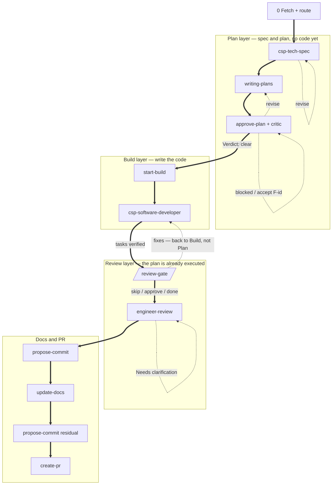

| Cycle | Returns to | Does not return to |
|-------|------------|--------------------|
| `revise` on csp-tech-spec | Plan / csp-tech-spec | Build |
| `revise` / `accept F-id` on critic | Plan / writing-plans or the same critic HITL | Build |
| **`fixes` on review-gate** | **Build / `csp-software-developer`, then the same review-gate** | **`writing-plans`** |
| Needs clarification | Review / engineer-review | Plan |
| Docs location follow-up | Docs | Review |

`--fast` skips the Plan layer and skips `review-gate`; it still runs engineer-review. `/csp-start-issue-task` has its own fix-plan loop, not this full Plan layer.

---

## 2. Full pipeline (end-to-end)

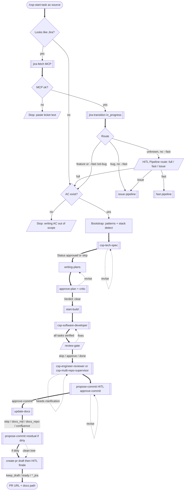

`--fast` is never auto-selected. `--fast` + classified bug → HITL **Fast vs issue** (`issue` / `stay_fast`) before the fast pipeline. Explicit `/csp-start-issue-task` always stays on the issue path. Skill `finish-plan` (slash command `/csp-finish-plan`) is how the orchestrator enters `review-gate` after `csp-software-developer` returns.

---

## 3. Tech spec — modes, tiers, gate

---

## 4. Approve plan → critic → build

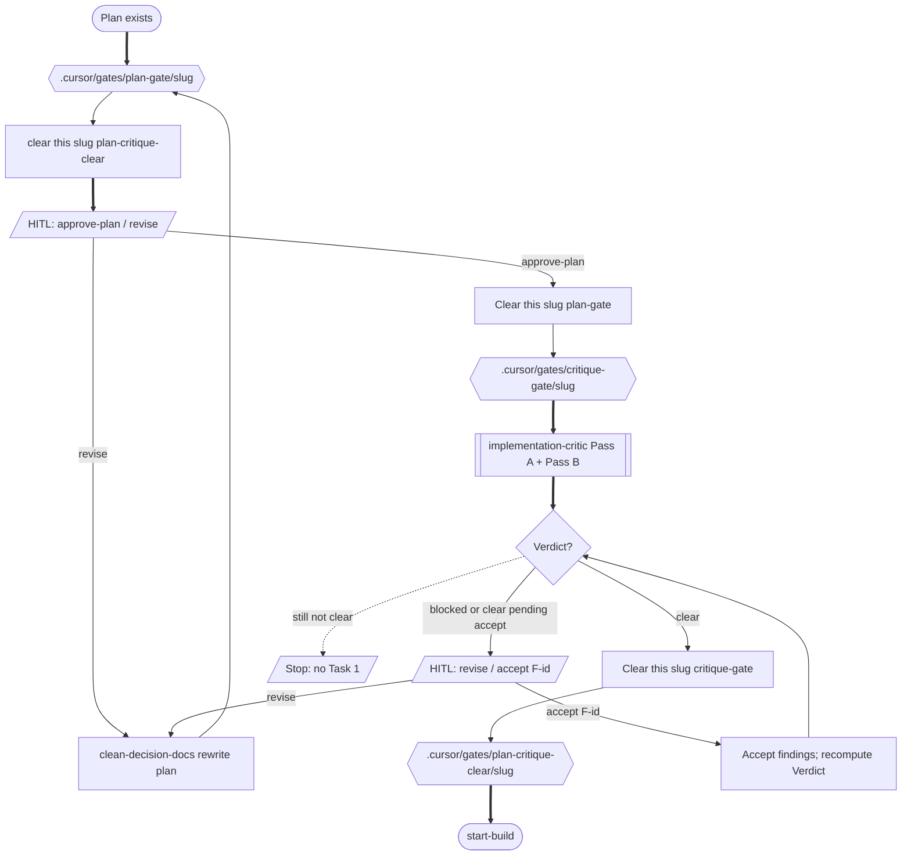

### Critic verdict rules

| Verdict | Condition | Build? |
|---------|-----------|--------|
| `clear` | No open Must-fix; no un-accepted Accept-risk | Yes → `start-build` |
| `clear pending accept` | Must-fix resolved/accepted; Accept-risk still open | No — HITL `accept F<id>` or revise |
| `blocked` | Open Must-fix remains | No — revise or `accept F<id>` |

Should-fix findings are visible but never block.

---

## 5. Start-build → csp-software-developer

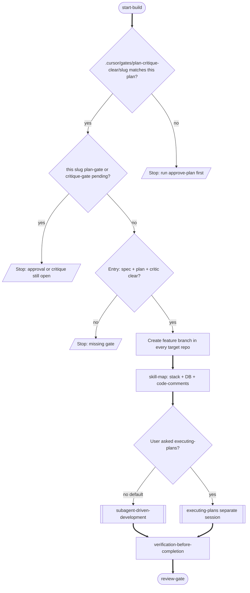

`start-build` **must Wait for** the `csp-software-developer` Task to return, then invoke skill `finish-plan` (slash command `/csp-finish-plan`) in the parent chat. That handoff **is** the `review-gate` HITL; after `skip` / `approve` / `done` it starts `csp-engineer-reviewer`. **Fire-and-forget** dispatch is a pipeline bug: the nested Task cannot run `AskQuestion`, so review never launches.

---

## 6. review-gate → review routing

Coding is done. This gate is **not** another Plan-layer step and **not** the pipeline end. Skill `finish-plan` (slash command `/csp-finish-plan`) writes the marker, applies `review-surface` (`SetActiveBranch` + checkout in each open folder so the human can see the merge-base diff), asks HITL, then routes to engineer-review. When the branch has **zero commits ahead of base**, the merge-base pull request tab may be empty — `review-surface` still surfaces the **uncommitted working tree** in chat (`git status` / `git diff` summaries). `fixes` returns to `csp-software-developer` (Build), then re-runs `review-surface` and re-asks this same gate. Product commits happen later via `propose-commit` (after engineer-review). GitHub `create-pr` still happens after docs and any residual `propose-commit`.

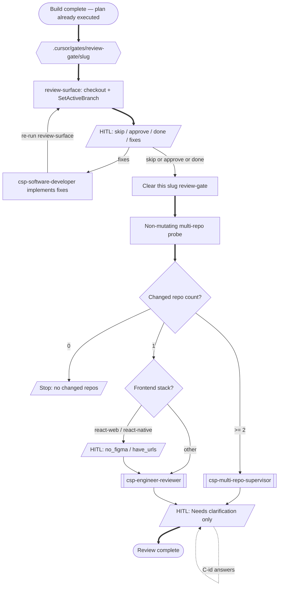

---

## 7. Update-docs destination

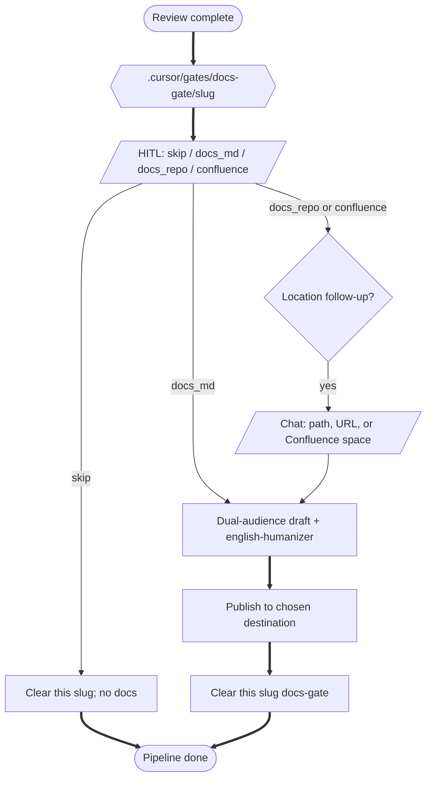

| Token | Meaning |
|-------|---------|
| `skip` | No product docs this run |
| `docs_md` | Markdown under `docs/` in the current repo (not `docs/superpowers/`) |
| `docs_repo` | Separate documentation repository — path/URL in chat next |
| `confluence` | Confluence page — space/parent or URL in chat next |

Writing shape: skill `update-docs` + `references/writing-guide.md`. For `docs_repo` / `confluence`, **style resolution** first (custom user/engineer style → house siblings → kit default dual-audience). Optional follow-ups: `ce-compound` for durable learnings, `ce-explain` for personal teaching artifacts — neither replaces this gate.

---

## 8. Engineer-review internals (phase graph)

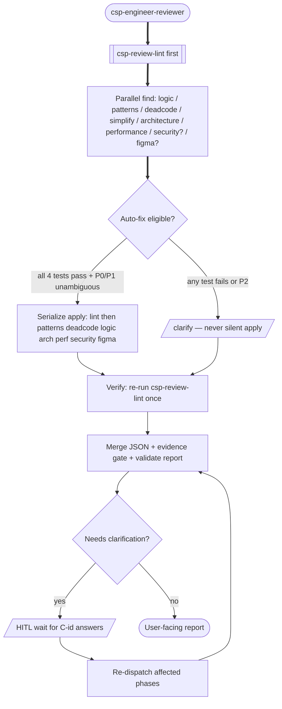

Auto-fix requires all four: deterministic check, single correct answer, no information loss, zero blast radius on data/UX. Traceability drift and migrations are always `clarify`.

After a validated engineer-review report, HITL **Teach-review miss** (`miss` / `project_secret` / `no_miss`). `miss` invokes skill `teach-review` (kit `learn/…` branch and a ready-for-review pull request when `land` is `draft_merge`; does not merge to `main`). `project_secret` writes this project's `.cursor/review-learnings.md` only.

Pipeline handoff (full / `--fast` / issue): invoke skill **`propose-commit`** next — HITL `approve-commit` / `revise`, then `git commit` only (never push). Writes `.cursor/gates/commit-approved/<slug>`. Full path continues to `update-docs`; if the tree is still dirty after docs, run **`propose-commit`** again for residual files, then `create-pr`. Manual `/csp-engineer-review` does not auto-start `propose-commit`.

---

## 9. Propose-commit (commit gate)

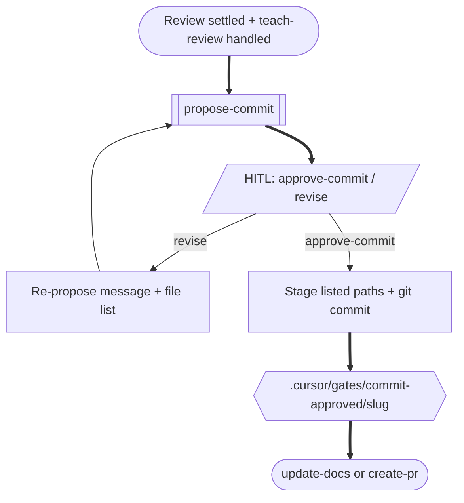

| Rule | Detail |
|------|--------|
| When | After engineer-review (or `csp-multi-repo-supervisor`) settles; again on full path if docs left uncommitted files |
| HITL | `approve-commit` / `revise` via skill `hitl-choice` preset **Propose commit** |
| Marker | `.cursor/gates/commit-approved/<slug>` written on `approve-commit` |
| Never | `git push`, `gh pr create`, `git add -A`, commits on default branch |
| Zero commits until gate | `csp-software-developer` / `csp-bug-fixer` must not product-commit; branch may be 0 commits ahead of base until this gate |

---

## 10. Marker state machine

Runtime markers live in the **consumer project** `.cursor/gates/<kind>/<slug>` (never the kit). Parallel tickets use different slugs; a foreign slug never blocks this plan. Stop hooks emit `followup_message` only when the current plan path is known and that slug is pending. Unknown plan path stays silent — listing every open slug auto-continues unrelated chats and cannot be cleared there. Legacy flat files (`.cursor/*.pending`, `plan-critique.clear`) migrate-on-read then delete.

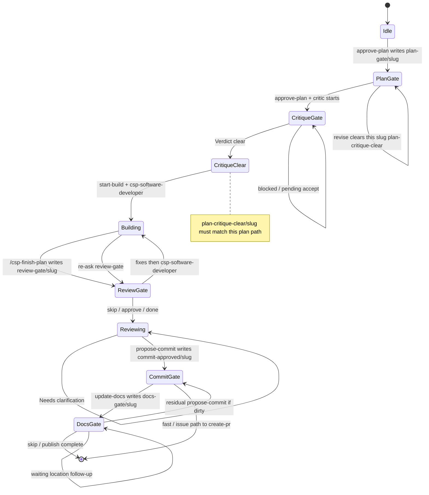

| Marker | Written by | Cleared when |
|--------|------------|--------------|
| `.cursor/gates/plan-gate/<slug>` | `approve-plan` | Human replies `approve-plan` |
| `.cursor/gates/critique-gate/<slug>` | after plan approval | `Verdict: clear` |
| `.cursor/gates/plan-critique-clear/<slug>` | on `Verdict: clear` | invalidated on `revise` / re-approve |
| `.cursor/gates/review-gate/<slug>` | `/csp-finish-plan` (`review-gate` HITL) | `skip` / `approve` / `done` |
| `.cursor/gates/commit-approved/<slug>` | `propose-commit` on `approve-commit` | consumed by `create-pr` / next pipeline step |
| `.cursor/gates/docs-gate/<slug>` | `update-docs` | `skip` or publish/abort complete |

---

## 11. Standalone entry points (bypass full orchestrator)

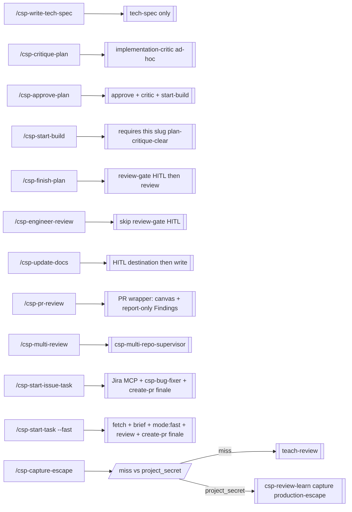

`/csp-critique-plan` alone does **not** write `plan-critique-clear/<slug>` for build — prefer `/csp-approve-plan` so plan HITL is not skipped.

`/csp-pr-review` resolves a GitHub PR, optionally builds a **PR Review Canvas** (Cursor plugin `pr-review-canvas`; skip with `no-canvas`), then runs the same engineer-review phases. Canvas orients the diff; validated Findings remain the review contract.

---

## 12. Fast mode (`/csp-start-task --fast`)

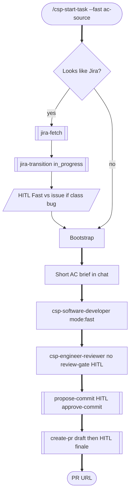

No tech-spec, writing-plans, approve-plan, critic, review-gate, or update-docs. Clarify HITL only if engineer-review needs it. `--fast` is explicit only.

---

## 13. Issue mode (`/csp-start-issue-task`)

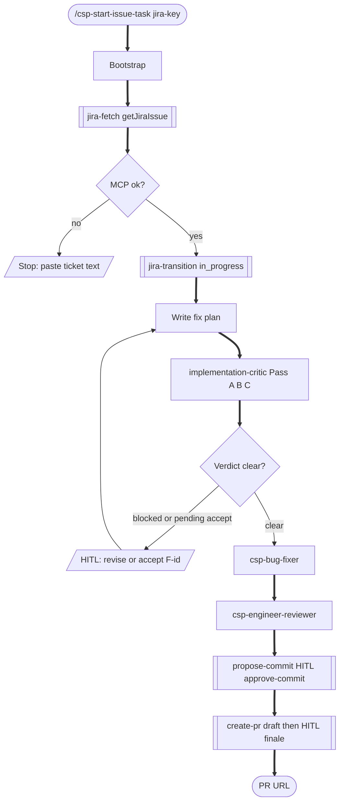

Always this path when `/csp-start-issue-task` is invoked explicitly (even if type is Story). After fetch, `jira-transition` target `in_progress`. Jira comment options appear on the Pipeline finale when `jira_key` is known. `ready` / `ready_jira` run `jira-transition` target `review` only after every opened pull request is merged and continuous integration succeeded. Never `gh pr merge`.

---

## 14. Create-pr Pipeline finale

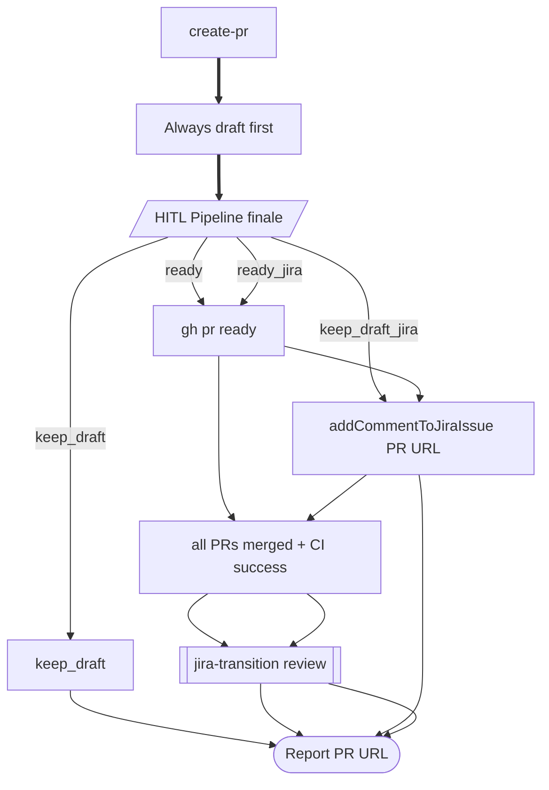

`keep_draft_jira` / `ready_jira` only when a Jira key is known. Never merge. `ready` / `ready_jira` with a key → wait until `pr_merge_ci_verdict` is `all_merged_ci_success`, then `jira-transition` target `review` (skip if already Review; report and continue on failure). `keep_draft` / `keep_draft_jira` leave the ticket In Progress.
