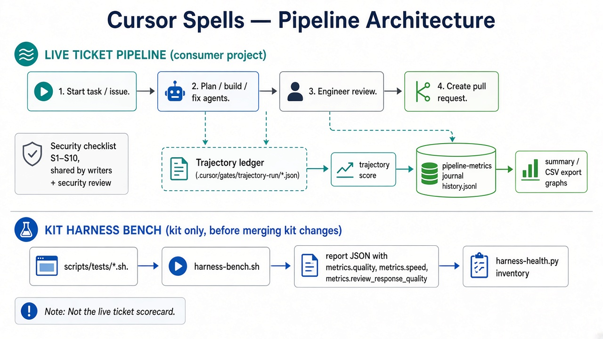
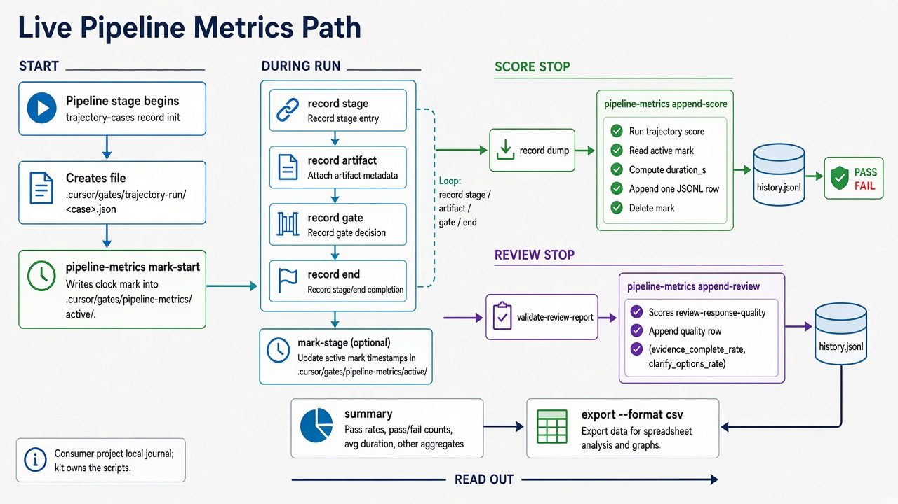

# Метрики пайплайну і звіти стенду — коротка пам’ятка

Ця сторінка пояснює **двома картинками**, що у нас є і як цим користуватись.
Англійські назви команд лишаємо в зворотному апострофі — так їх шукають у коді.

## Два різні інструменти (не плутати)

| Українською | У коді / чаті | Навіщо |
|-------------|---------------|--------|
| **Живий журнал прогонів** | `pipeline-metrics` → файл `history.jsonl` | Під час реальних тікетів у продуктовому репозиторії записує: чи пройшла оцінка шляху, скільки тривало, яка якість звіту рев’ю. З цього потім будують **графіки в часі**. |
| **Стенд здоров’я набору** | `harness-bench` → звіти в `evals/harness/reports/` | Перед змінами навичок/агентів у **цьому** репозиторії (кіті). Перевіряє контракти набору. **Не** scorecard кожного тікета. |
| **Орієнтир здоров’я** | `harness-health` / `/csp-harness-status` | Інвентар + матриця підключення кейсів + останній звіт стенду, якщо є. Ворота пайплайну **не** рухає. |

Живий журнал **не комітять** у git. Звіти стенду теж зазвичай локальні (у `.gitignore`).

---

## Картинка 1 — загальна архітектура



**Верхня смуга — живий тікет** у проєкті споживача:

1. Старт задачі → план / збірка / виправлення → інженерне рев’ю → запит на злиття.
2. Паралельно пишеться **журнал траєкторії** (що реально зробив агент).
3. Оцінка траєкторії + якість рев’ю потрапляють у **живий журнал метрик** (`history.jsonl`).
4. З журналу: `summary` (текст) або `export` (таблиця CSV) → ваші графіки.

Збоку: спільний **чекліст безпеки S1–S10** для тих, хто пише код, і для рев’ю безпеки.

**Нижня смуга — стенд кіту** (лише зміни набору):

`scripts/tests/*.sh` → `harness-bench` → звіт з якістю / швидкістю / якістю рев’ю на фікстурах → `harness-health` показує звіт.

---

## Картинка 2 — шлях запису живих метрик (детально)

Це те, що раніше називали «pipeline metrics path» — просто **шлях, як рядок потрапляє в журнал**.



| Крок | Команда | Простими словами |
|------|---------|------------------|
| Старт годинника | `pipeline-metrics.py mark-start` | Після створення журналу траєкторії засікаємо час. |
| Під час роботи | `trajectory-cases.py record …` | Агент дописує етапи / артефакти / ворота. |
| Оцінка шляху | `pipeline-metrics.py append-score` | Рахує оцінку траєкторії, тривалість, **один рядок** у `history.jsonl`. |
| Після звіту рев’ю | `pipeline-metrics.py append-review` | Сенсори якості звіту → ще **один рядок** у той самий журнал. |
| Подивитись | `summary` | Скільки PASS/FAIL, середня тривалість. |
| Для графіка | `export --format csv` | Таблиця в Excel / Google Sheets / будь-який чарт. |

Файл журналу (продуктовий проєкт):

`.cursor/gates/pipeline-metrics/history.jsonl`

---

## Коли що робити

**Стенд (`harness-bench`)**
- Перед злиттям змін навичок / агентів / скриптів оцінки в кіті.
- Зараз **не** запускається сам на кожному запиті на злиття — треба вручну (або додати в безперервну інтеграцію пізніше).

**Живий журнал**
- Пишеться сам під час тікетів (якщо кіт оновлений і навички викликають скрипт).
- Дивитись раз на тиждень або після відчуття регресії: `summary` + CSV-графік.
- Якщо ніколи не дивитесь — файл можна видалити; пайплайн не зламається.

---

## Швидкі команди

```bash
# Орієнтир (кіт)
python3 scripts/harness-health.py

# Повний стенд (кіт, перед злиттям змін набору)
bash scripts/harness-bench.sh

# Живий журнал (у продуктовому репозиторії)
python3 "$KIT"/scripts/pipeline-metrics.py summary
python3 "$KIT"/scripts/pipeline-metrics.py export --format csv --out /tmp/pipeline-metrics.csv
```

Контрактні тести: `bash scripts/tests/pipeline-metrics-test.sh`, `bash scripts/tests/harness-health-test.sh`.

Англійський технічний опис стенду: [`../../evals/harness/README.md`](../../evals/harness/README.md).
