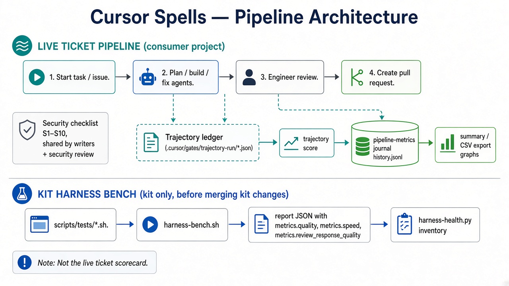
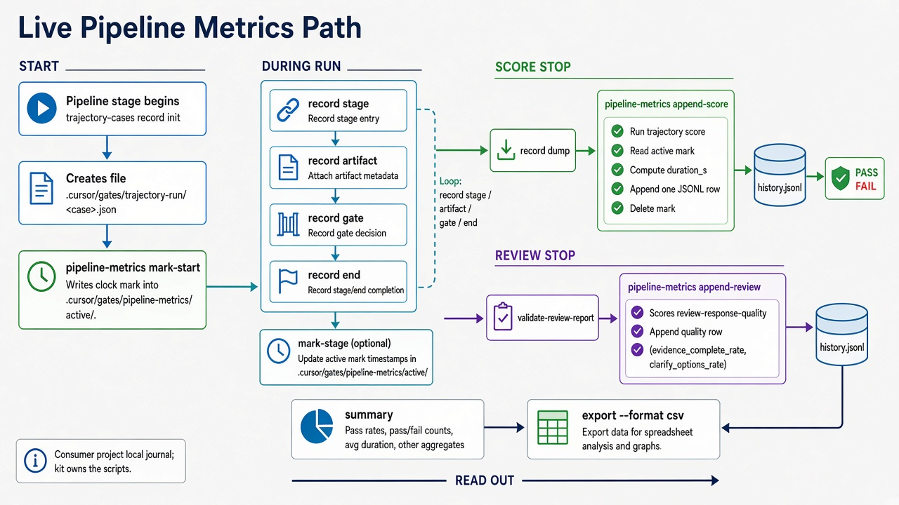

# Pipeline metrics and harness reports — short guide

This page explains **with two pictures** what we have and how to use it.
Command names stay in backticks — that is how they appear in code.

## Two different tools (do not mix them up)

| Plain name | In code / chat | What it is for |
|------------|----------------|----------------|
| **Live run journal** | `pipeline-metrics` → file `history.jsonl` | During real tickets in a product repository, records whether path scoring passed, how long it took, and review-report quality. From that you build **charts over time**. |
| **Kit health harness** | `harness-bench` → reports under `evals/harness/reports/` | Before changing skills/agents in **this** repository (the kit). Checks kit contracts. **Not** a per-ticket scorecard. |
| **Health orientation** | `harness-health` / `/csp-harness-status` | Inventory + case wiring matrix + latest harness report if present. Does **not** advance pipeline gates. |

The live journal is **not committed** to git. Harness reports are usually local too (in `.gitignore`).

---

## Picture 1 — overall architecture



**Top band — live ticket** in a consumer project:

1. Start task → plan / build / fix → engineer review → pull request.
2. In parallel, a **trajectory journal** is written (what the agent actually did).
3. Trajectory score + review quality go into the **live metrics journal** (`history.jsonl`).
4. From the journal: `summary` (text) or `export` (CSV table) → your charts.

On the side: shared **security checklist S1–S11** for who writes code and for security review.

**Bottom band — kit harness** (kit changes only):

`scripts/tests/*.sh` → `harness-bench` → report with quality / speed / review quality on fixtures → `harness-health` shows the report.

---

## Picture 2 — how live metrics get written (detail)

This is what used to be called the “pipeline metrics path” — simply **how a row lands in the journal**.



| Step | Command | In plain words |
|------|---------|----------------|
| Start the clock | `pipeline-metrics.py mark-start` | After the trajectory journal is created, start timing. |
| During the run | `trajectory-cases.py record …` | The agent appends stages / artifacts / gates. |
| Path score | `pipeline-metrics.py append-score` | Computes trajectory score, duration, **one row** in `history.jsonl`. |
| After review report | `pipeline-metrics.py append-review` | Report-quality sensors → another **one row** in the same journal. |
| Inspect | `summary` | How many PASS/FAIL, average duration. |
| For a chart | `export --format csv` | Table for Excel / Google Sheets / any chart tool. |

Journal file (product project):

`.cursor/gates/pipeline-metrics/history.jsonl`

---

## When to do what

**Harness (`harness-bench`)**
- Before merging skill / agent / scoring-script changes in the kit.
- Today it does **not** run automatically on every pull request — run it by hand (or add continuous integration later).

**Live journal**
- Written automatically during tickets (when the kit is current and skills call the script).
- Inspect weekly or after a suspected regression: `summary` + CSV chart.
- If you never look at it — you can delete the file; the pipeline will not break.

---

## Quick commands

```bash
# Orientation (kit)
python3 scripts/harness-health.py

# Full harness (kit, before merging kit changes)
bash scripts/harness-bench.sh

# Live journal (in the product repository)
python3 "$KIT"/scripts/pipeline-metrics.py summary
python3 "$KIT"/scripts/pipeline-metrics.py export --format csv --out /tmp/pipeline-metrics.csv
```

Contract tests: `bash scripts/tests/pipeline-metrics-test.sh`, `bash scripts/tests/harness-health-test.sh`.

English technical harness description: [`../../evals/harness/README.md`](../../evals/harness/README.md).
