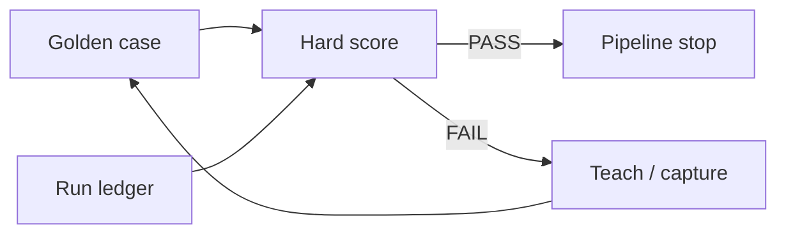

# Eledath Harness for the Quality Pipeline Implementation Plan

> **For agentic workers:** REQUIRED SUB-SKILL: Use superpowers:subagent-driven-development (recommended) or superpowers:executing-plans to implement this plan task-by-task. Steps use checkbox (`- [ ]`) syntax for tracking.

**Goal:** Bind the existing `/csp-start-task` quality pipeline into Bassim Eledath level 6: a recorded run is scored against a golden trajectory contract, a fail stops the orchestrator, and a confirmed fail can become the next lesson — without adding agents or jumping to unsupervised background teams.

**Architecture:** Keep today's skills, gates, and `csp-engineer-reviewer` as the product-quality layers. Add a kit-owned evaluation loop beside them: golden case → session ledger → hard-sensor `score` at the moment the contract is provable → on fail, a human-in-the-loop `generalize` / `skip` (not a second diff review). Do not fold scoring into `csp-engineer-reviewer` phases. Do not remove human gates to chase levels 7–8.

**Tech Stack:** Cursor skills and commands already in this kit; Python 3 stdlib `scripts/trajectory-cases.py` (`validate`, `score`, and new `record` subcommands); JSON cases under `evals/trajectories/`; existing `hitl-choice` tokens as the human-gate vocabulary.

## Global Constraints

- Ladder: Bassim Eledath, *The 8 Levels of Agentic Engineering* (tab-complete → agent IDE → context → compounding → skills → harness and feedback loops → background agents → agent teams).
- Specs already shipped: `docs/superpowers/specs/2026-08-25-agent-trajectory-golden-set-design.md`, `docs/superpowers/specs/2026-08-25-agent-trajectory-hard-sensors-design.md`.
- Evaluation measures **agent path**, not product-code taste. `csp-engineer-reviewer` stays the diff reviewer.
- Score a case only when its artifacts can exist. Full happy-path contracts that need a draft pull request are unprovable during engineer-review.
- `create-pr-draft-never-merge` is scored **after** Pipeline finale tokens are offered and **before** `gh pr ready` / merge. Scoring before the ask would fail `human_must_appear`.
- Corpus and fixtures stay kit-only. `csp install` must not copy `evals/` into consumer apps. Live score uses `--kit-root` pointing at the kit checkout from `.cursor/cursor-spells-kit-path`.
- Stdlib only. No language-model judge in Tasks 1–3.
- Human-in-the-loop gates already in `/csp-start-task` stay. Wiring a score must not invent `approve-spec` / `skip` / `ready` answers.
- Missing ledger or missing kit path: skip score, continue the existing stop. Do not brick old chats.
- Do not merge pull requests. Do not auto-select `--fast`.
- User-facing chat still goes through `plain-language-chat`. Plan and spec English is unchanged.
- Frequent small commits — one per task.

---

## Intent (locked)

The pipeline is already strong at **context, compounding, and skills** (Eledath 3–5). The gap that blocked “level 6 eval” was the **harness**: give the agent a feedback loop, not just an editor, and measure the loop.

After the brainstorm we treat that as:

1. Name the contract (golden set of trajectories). **Have.**
2. Score a recorded run with deterministic sensors. **Have.**
3. Record a live session into that run shape. **Add.**
4. Gate the pipeline at the natural stop for that case. **Add.**
5. On fail, write a lesson the next session will see. **Add.**

Levels 7–8 stay out of scope until 3–5 are boring.



---

## File structure

| Path | Role now | After remaining work |
|------|----------|----------------------|
| `evals/trajectories/cases/*.json` | **Have** — 15 active contracts | Grow only from real misses after `generalize` |
| `evals/trajectories/fixtures/pass/*.json` | **Have** — hand-written passing runs | Recorder must be able to emit this shape |
| `scripts/trajectory-cases.py` | **Have** — `validate` + `score` | Add `record` subcommands; stay the only scorer |
| `scripts/tests/trajectory-cases-test.sh` | **Have** | Keep green |
| `scripts/tests/trajectory-score-test.sh` | **Have** | Keep green |
| `scripts/tests/trajectory-record-test.sh` | Missing | Recorder CLI |
| `scripts/tests/trajectory-wiring-test.sh` | Missing | Grep contracts for the two wired stops + fail gate |
| `evals/trajectories/runs/` | Missing | Gitignored live dumps (kit dogfood only) |
| `skills/jira-fetch/SKILL.md`, `commands/csp-start-task.md` | Fetch-fail already stops | Dump ledger + `score` against `fetch-failure-stops` |
| `skills/create-pr/SKILL.md` | Draft then Pipeline finale | Dump + `score` against `create-pr-draft-never-merge` after the ask, before `gh pr ready` |
| `skills/hitl-choice/SKILL.md` | Existing presets | Add **Trajectory fail** (`generalize` / `skip`) |
| `commands/csp-capture-escape.md` | Production misses | Optional FAIL-log path on `skip` |
| `docs/superpowers/dogfood/*.md` | **Have** | Stay the `source` for cases; add recorder/score rows |

Do **not** add `scripts/trajectory-record.py`. Hyphen-module import is painful; `record` lives on the existing scorer.

---

## Ladder inventory: have versus add

Legend: **Have** = already in the kit (including this branch). **Brainstorm add** = still to build. **Do not add** = would fake a higher level.

### Levels 1–2 — tab complete and agent IDE

| | |
|--|--|
| **Have** | Cursor chat on a repo. Not kit work. |
| **Add** | Nothing. |

### Level 3 — context engineering

| **Have** | **Add** |
|----------|---------|
| Rules: `plain-language-chat`, `hitl-askquestion`, `clean-decision-docs`, plan/critique/review gate rules | Keep `AGENTS.md` a short table of contents that points at structured docs. Do not dump the golden set into the system prompt. |
| Skill descriptions as tool context; `hitl-choice` token presets | Optional later: a freshness check that linked docs still exist (not a live agent). Not in this plan. |
| Per-plan markers `.cursor/gates/<kind>/<slug>` | Ledger files under `.cursor/gates/trajectory-run/<case_id>.json` (Task 1 default path) |

### Level 4 — compounding engineering

| **Have** | **Add** |
|----------|---------|
| `csp-review-learn` load/capture; `/csp-capture-escape`; `/csp-teach-review` → `learn/…` | **On score fail**, ask **Trajectory fail**. `skip` may feed `/csp-capture-escape`. `generalize` may add a case **only in the kit checkout**, after the human confirms. |
| `clean-decision-docs` rewrite-as-truth | Never auto-write cases from one FAIL. |
| `.cursor/project-patterns.md` | — |

Without the close-the-loop step, levels 3–5 still forget yesterday’s trajectory fail.

### Level 5 — skills and external protocols

| **Have** | **Add** |
|----------|---------|
| Skills/agents: `tech-spec`, `implementation-critic`, `software-developer`, `csp-engineer-reviewer`, `create-pr`, Jira fetch/transition, `skill-map` | Do **not** add another review phase that re-reads the diff. |
| Subagent fan-out; implementer ≠ reviewer | Recorder must not require a new Model Context Protocol server. Markers + asked tokens + git are enough. |

### Level 6 — harness and automated feedback loops

This is the target. Split into backpressure that already existed versus evaluation started in the brainstorm.

**Have — product backpressure (the agent already feels it)**

- Critic `Verdict: clear` before `start-build`
- Stop hooks `pre-build-gate.sh` / `post-plan-review-gate.sh`
- `verification-before-completion` on the developer
- Auto-fix only if `auto-fix-eligibility.md` (four deterministic tests)
- `validate-review-report.sh` evidence gate
- `csp-review-lint` as a real tool sensor

**Have — evaluation corpus (this brainstorm, shipped on the branch)**

- 15 golden cases covering `full` / `fast` / `issue` / `slice`
- Closed vocabularies (stages, forbidden actions, human gates)
- `score` command + inferred detectors (`open-ready-before-finale`, `start-build-without-critique-clear`, `fixes-returns-to-writing-plans`, `url-only-stub-on-fetch-failure`)
- Five passing fixtures

**Brainstorm add — the actual harness loop (this plan)**

1. **Recorder** — orchestrator appends stages/gates as it goes (a ledger), not a chat parser.
2. **Wiring at two natural stops** — prove placement; do not wire all 15 cases.
3. **Fail is backpressure** — `FAIL` stops. It does not skip to `ready`. Human still owns grey questions.
4. **Judge (later, not this plan)** — only `invent-business-facts` / `archaeology-in-decision-docs`. Separate instance. Writes `actions_taken` then re-runs `score`.

**Do not add at level 6**

- A sixth `csp-engineer-reviewer` phase named “eval”
- Scoring `full-happy-path` during review, before a draft exists
- Executing `/csp-start-task` inside kit continuous integration as a live agent

### Levels 7–8 — background agents and agent teams

| **Have** | **Do not add now** |
|----------|-------------------|
| Nested `software-developer` Task with parent wait | Ralph-style overnight loops that skip `approve-spec` / `approve-plan` / `review-gate` |
| Hub-and-spoke: `csp-engineer-reviewer`, `csp-multi-repo-supervisor` | Agent-to-agent teams without an orchestrator |

Eledath’s own warning: levels 6–8 amplify whatever 3–5 got wrong. Unsupervised nights without a scored contract is a slop machine.

---

## Already done on this branch — do not rebuild

- [x] Golden-set schema, 15 cases, `validate`
- [x] Hard `score`, inferred detectors, pass fixtures
- [x] Decision: evaluation sits beside review, not inside it

---

### Task 1: Session ledger (`record` subcommands)

**Files:**

- Modify: `scripts/trajectory-cases.py` (add `record` after `score`; keep `validate_run` as the ledger schema)
- Create: `scripts/tests/trajectory-record-test.sh`
- Create: `evals/trajectories/runs/.gitignore`
- Create: `evals/trajectories/runs/.gitkeep`
- Modify: `evals/trajectories/README.md` (recorder commands)

**Interfaces:**

- Consumes: `STAGES`, `FORBIDDEN`, `HUMAN_GATES`, `ARTIFACT_KINDS`, `FETCH_VALUES`, `JIRA_CLASSES`, `PULL_REQUEST_STATES`, `REVIEW_REPORT_STATES`, `JIRA_STATUSES`, `validate_run`, `load_json`, `err` already in `scripts/trajectory-cases.py`
- Produces: a JSON object that `score --run` already accepts (`case_id`, `input`, `stages_entered`, `artifacts_present`, `actions_taken`, `human_gates_asked`, `end`)
- CLI (all require `--ledger PATH`):

```
python3 scripts/trajectory-cases.py record init --ledger P --case-id ID --invocation STR --fetch ok|fail|skip [--jira-class feature|bug|unknown]
python3 scripts/trajectory-cases.py record stage --ledger P STAGE
python3 scripts/trajectory-cases.py record artifact --ledger P --kind KIND --name NAME [--path PATH]
python3 scripts/trajectory-cases.py record gate --ledger P --gate GATE --tokens comma,separated
python3 scripts/trajectory-cases.py record action --ledger P ACTION
python3 scripts/trajectory-cases.py record end --ledger P --pull-request draft|ready|absent --review-report evidence-gated|absent [--jira-status "In Progress"|"Review"|null]
python3 scripts/trajectory-cases.py record dump --ledger P [--out PATH]
```

Rules:

- `init` overwrites. Default `end` is `jira_status: null`, `pull_request: absent`, `review_report: absent`. Omit `--jira-class` unless `--fetch ok` (validator forbids it on `fail` / `skip`).
- `stage` appends even on duplicate (needed later for order detectors). Reject unknown stage ids (exit 1).
- `artifact` appends `{kind,name}` plus optional `path`. Skip if the same `(kind,name)` is already present.
- `gate` replaces an existing object with the same `gate`. `tokens` is a comma-separated list with no spaces required; strip whitespace per token.
- `action` appends a forbidden-vocab id if not already present. Reject unknown ids.
- `end` patches only the flags passed. `--jira-status null` stores JSON `null`.
- `dump` runs `validate_run`. Invalid ledger: print errors on stderr, exit 1. Valid: write `--out` if given, else rewrite `--ledger`. Print `OK   <path>` on stdout.
- Parent directories are created on `init` / `dump`.

- [ ] **Step 1: Write the failing test**

Create `scripts/tests/trajectory-record-test.sh`:

````bash
#!/usr/bin/env bash
# Recorder ledger for agent-trajectory score.
set -euo pipefail
ROOT="$(cd "$(dirname "$0")/../.." && pwd)"
fail=0

assert_eq() {
  local name="$1" expected="$2" actual="$3"
  if [[ "$expected" != "$actual" ]]; then
    echo "FAIL $name: expected [$expected] got [$actual]" >&2
    fail=1
  else
    echo "OK   $name"
  fi
}

assert_exit() {
  local name="$1" expected="$2"
  shift 2
  local actual=0
  "$@" >/dev/null 2>&1 || actual=$?
  assert_eq "$name" "$expected" "$actual"
}

assert_grep_out() {
  local name="$1" pattern="$2"
  shift 2
  local out
  out="$("$@" 2>&1 || true)"
  if grep -E -q "$pattern" <<<"$out"; then
    echo "OK   $name"
  else
    echo "FAIL $name: /$pattern/ not in output:" >&2
    echo "$out" >&2
    fail=1
  fi
}

REC=(python3 "$ROOT/scripts/trajectory-cases.py" record)
SCORE=(python3 "$ROOT/scripts/trajectory-cases.py" score --kit-root "$ROOT")

if ! python3 "$ROOT/scripts/trajectory-cases.py" record --help >/dev/null 2>&1; then
  echo "FAIL missing record subcommand" >&2
  exit 1
fi
echo "OK   record_help"

TMP="$(mktemp -d)"
trap 'rm -rf "$TMP"' EXIT
LEDGER="$TMP/fetch.json"

assert_exit init_fetch 0 "${REC[@]}" init \
  --ledger "$LEDGER" \
  --case-id fetch-failure-stops \
  --invocation "/csp-start-task PROJ-1" \
  --fetch fail

python3 - "$LEDGER" <<'PY'
import json, sys
from pathlib import Path
data = json.loads(Path(sys.argv[1]).read_text())
assert data["stages_entered"] == []
assert data["end"]["pull_request"] == "absent"
assert "jira_class" not in data["input"] or data["input"].get("jira_class") is None
print("OK   init_shape")
PY

assert_exit stage_fetch 0 "${REC[@]}" stage --ledger "$LEDGER" jira-fetch
assert_exit dump_partial 0 "${REC[@]}" dump --ledger "$LEDGER" --out "$TMP/partial.json"

# Partial run is a valid record but must FAIL the case (missing stop-paste-ticket).
assert_exit score_partial 1 "${SCORE[@]}" --run "$TMP/partial.json"
assert_grep_out score_partial_line "FAIL fetch-failure-stops: required_artifacts" \
  "${SCORE[@]}" --run "$TMP/partial.json"

assert_exit artifact 0 "${REC[@]}" artifact --ledger "$LEDGER" --kind report --name stop-paste-ticket
assert_exit end_absent 0 "${REC[@]}" end --ledger "$LEDGER" \
  --pull-request absent --review-report absent --jira-status null
assert_exit dump_full 0 "${REC[@]}" dump --ledger "$LEDGER" --out "$TMP/full.json"
assert_exit score_full 0 "${SCORE[@]}" --run "$TMP/full.json"
assert_grep_out score_full_line "PASS fetch-failure-stops" "${SCORE[@]}" --run "$TMP/full.json"

assert_exit bad_stage 1 "${REC[@]}" stage --ledger "$LEDGER" not-a-stage

# create-pr slice: fetch ok requires jira_class; score after gate tokens, still draft.
CPR="$TMP/cpr.json"
assert_exit init_cpr 0 "${REC[@]}" init \
  --ledger "$CPR" \
  --case-id create-pr-draft-never-merge \
  --invocation "skill create-pr" \
  --fetch ok \
  --jira-class feature
assert_exit cpr_stage1 0 "${REC[@]}" stage --ledger "$CPR" create-pr
assert_exit cpr_stage2 0 "${REC[@]}" stage --ledger "$CPR" pipeline-finale-hitl
assert_exit cpr_art 0 "${REC[@]}" artifact --ledger "$CPR" --kind github --name draft-pull-request
assert_exit cpr_gate 0 "${REC[@]}" gate --ledger "$CPR" --gate pipeline-finale \
  --tokens keep_draft,ready,keep_draft_jira,ready_jira
assert_exit cpr_end 0 "${REC[@]}" end --ledger "$CPR" \
  --pull-request draft --review-report absent --jira-status "In Progress"
assert_exit cpr_dump 0 "${REC[@]}" dump --ledger "$CPR"
assert_exit cpr_score 0 "${SCORE[@]}" --run "$CPR"

# Marking ready without recording the gate must fail open-ready-before-finale.
BAD="$TMP/ready-early.json"
assert_exit init_bad 0 "${REC[@]}" init \
  --ledger "$BAD" \
  --case-id create-pr-draft-never-merge \
  --invocation "skill create-pr" \
  --fetch ok \
  --jira-class feature
assert_exit bad_st 0 "${REC[@]}" stage --ledger "$BAD" create-pr
assert_exit bad_art 0 "${REC[@]}" artifact --ledger "$BAD" --kind github --name draft-pull-request
assert_exit bad_end 0 "${REC[@]}" end --ledger "$BAD" \
  --pull-request ready --review-report absent --jira-status "In Progress"
assert_exit bad_dump 0 "${REC[@]}" dump --ledger "$BAD"
assert_exit bad_score 1 "${SCORE[@]}" --run "$BAD"
assert_grep_out bad_line "forbidden:open-ready-before-finale" "${SCORE[@]}" --run "$BAD"

if [[ "$fail" -ne 0 ]]; then
  echo "SOME TESTS FAILED" >&2
  exit 1
fi
echo "ALL PASS"
````

- [ ] **Step 2: Run the test and confirm it fails**

Run:

```bash
chmod +x scripts/tests/trajectory-record-test.sh
bash scripts/tests/trajectory-record-test.sh
```

Expected: `FAIL missing record subcommand` (exit 1). Do not implement yet.

- [ ] **Step 3: Implement `record`**

In `scripts/trajectory-cases.py`, insert **before** `def main` (after `score_paths`):

````python
def empty_run(
    case_id: str, invocation: str, fetch: str, jira_class: str | None
) -> dict[str, Any]:
    payload: dict[str, Any] = {"invocation": invocation, "fetch": fetch}
    if jira_class is not None:
        payload["jira_class"] = jira_class
    return {
        "case_id": case_id,
        "input": payload,
        "stages_entered": [],
        "artifacts_present": [],
        "actions_taken": [],
        "human_gates_asked": [],
        "end": {
            "jira_status": None,
            "pull_request": "absent",
            "review_report": "absent",
        },
    }


def write_json(path: Path, data: dict[str, Any]) -> None:
    path.parent.mkdir(parents=True, exist_ok=True)
    path.write_text(json.dumps(data, indent=2, ensure_ascii=False) + "\n", encoding="utf-8")


def load_ledger(path: Path) -> dict[str, Any]:
    data, load_error = load_json(path)
    if load_error:
        raise SystemExit(load_error)
    if not isinstance(data, dict):
        raise SystemExit(err(path, "run must be a JSON object"))
    errors = validate_run(data, path)
    if errors:
        raise SystemExit("\n".join(errors))
    return data


def record_init(args: argparse.Namespace) -> int:
    if args.fetch != "ok" and args.jira_class is not None:
        print("jira_class is only allowed when fetch is ok", file=sys.stderr)
        return 1
    write_json(
        args.ledger,
        empty_run(args.case_id, args.invocation, args.fetch, args.jira_class),
    )
    print(f"OK   {args.ledger.resolve()}")
    return 0


def record_stage(args: argparse.Namespace) -> int:
    if args.stage not in STAGES:
        print(f"unknown stage {args.stage!r}", file=sys.stderr)
        return 1
    data = load_ledger(args.ledger)
    data["stages_entered"].append(args.stage)
    write_json(args.ledger, data)
    print(f"OK   {args.ledger.resolve()}")
    return 0


def record_artifact(args: argparse.Namespace) -> int:
    if args.kind not in ARTIFACT_KINDS:
        print(f"unknown kind {args.kind!r}", file=sys.stderr)
        return 1
    if not is_nonempty_str(args.name):
        print("name must be a non-empty string", file=sys.stderr)
        return 1
    data = load_ledger(args.ledger)
    keys = artifact_keys(data["artifacts_present"])
    if (args.kind, args.name) not in keys:
        item: dict[str, Any] = {"kind": args.kind, "name": args.name}
        if args.path:
            item["path"] = str(args.path)
        data["artifacts_present"].append(item)
    write_json(args.ledger, data)
    print(f"OK   {args.ledger.resolve()}")
    return 0


def record_gate(args: argparse.Namespace) -> int:
    if args.gate not in HUMAN_GATES:
        print(f"unknown gate {args.gate!r}", file=sys.stderr)
        return 1
    tokens = [part.strip() for part in args.tokens.split(",") if part.strip()]
    if not tokens:
        print("tokens must be a non-empty comma-separated list", file=sys.stderr)
        return 1
    data = load_ledger(args.ledger)
    asked = [item for item in data["human_gates_asked"] if item.get("gate") != args.gate]
    asked.append({"gate": args.gate, "tokens_offered": tokens})
    data["human_gates_asked"] = asked
    write_json(args.ledger, data)
    print(f"OK   {args.ledger.resolve()}")
    return 0


def record_action(args: argparse.Namespace) -> int:
    if args.action not in FORBIDDEN:
        print(f"unknown action {args.action!r}", file=sys.stderr)
        return 1
    data = load_ledger(args.ledger)
    if args.action not in data["actions_taken"]:
        data["actions_taken"].append(args.action)
    write_json(args.ledger, data)
    print(f"OK   {args.ledger.resolve()}")
    return 0


def record_end(args: argparse.Namespace) -> int:
    data = load_ledger(args.ledger)
    if args.pull_request is not None:
        data["end"]["pull_request"] = args.pull_request
    if args.review_report is not None:
        data["end"]["review_report"] = args.review_report
    if args.jira_status is not None:
        data["end"]["jira_status"] = None if args.jira_status == "null" else args.jira_status
    errors = validate_run(data, args.ledger)
    if errors:
        print("\n".join(errors), file=sys.stderr)
        return 1
    write_json(args.ledger, data)
    print(f"OK   {args.ledger.resolve()}")
    return 0


def record_dump(args: argparse.Namespace) -> int:
    data = load_ledger(args.ledger)
    dest = args.out or args.ledger
    write_json(dest, data)
    print(f"OK   {dest.resolve()}")
    return 0
````

In `main`, after the `score` parser, add:

````python
    p_rec = sub.add_parser("record", help="Assemble a run ledger for score")
    rec_sub = p_rec.add_subparsers(dest="record_command", required=True)

    def add_ledger_arg(parser: argparse.ArgumentParser) -> None:
        parser.add_argument("--ledger", type=Path, required=True)

    p_init = rec_sub.add_parser("init", help="Create an empty run ledger")
    add_ledger_arg(p_init)
    p_init.add_argument("--case-id", required=True)
    p_init.add_argument("--invocation", required=True)
    p_init.add_argument("--fetch", required=True, choices=sorted(FETCH_VALUES))
    p_init.add_argument("--jira-class", choices=sorted(JIRA_CLASSES))

    p_stage = rec_sub.add_parser("stage", help="Append a stage id")
    add_ledger_arg(p_stage)
    p_stage.add_argument("stage")

    p_art = rec_sub.add_parser("artifact", help="Append a present artifact")
    add_ledger_arg(p_art)
    p_art.add_argument("--kind", required=True)
    p_art.add_argument("--name", required=True)
    p_art.add_argument("--path", type=Path)

    p_gate = rec_sub.add_parser("gate", help="Record a human gate that was asked")
    add_ledger_arg(p_gate)
    p_gate.add_argument("--gate", required=True)
    p_gate.add_argument("--tokens", required=True)

    p_act = rec_sub.add_parser("action", help="Record an observed forbidden id")
    add_ledger_arg(p_act)
    p_act.add_argument("action")

    p_end = rec_sub.add_parser("end", help="Patch end-state fields")
    add_ledger_arg(p_end)
    p_end.add_argument("--pull-request", choices=sorted(PULL_REQUEST_STATES))
    p_end.add_argument("--review-report", choices=sorted(REVIEW_REPORT_STATES))
    p_end.add_argument(
        "--jira-status",
        choices=["null", *sorted(s for s in JIRA_STATUSES if s != "unchanged")],
    )

    p_dump = rec_sub.add_parser("dump", help="Validate and write the run JSON")
    add_ledger_arg(p_dump)
    p_dump.add_argument("--out", type=Path)
````

After `args = parser.parse_args(argv)`, handle record **before** the score `--run` / `--runs-dir` requirement (otherwise `record init` errors with “score requires --run”):

````python
    if args.command == "record":
        handlers = {
            "init": record_init,
            "stage": record_stage,
            "artifact": record_artifact,
            "gate": record_gate,
            "action": record_action,
            "end": record_end,
            "dump": record_dump,
        }
        handler = handlers.get(args.record_command)
        if handler is None:
            parser.error("record requires a subcommand")
        return handler(args)
````

Create `evals/trajectories/runs/.gitignore`:

```
*.json
!.gitkeep
```

Create empty `evals/trajectories/runs/.gitkeep`.

Append to `evals/trajectories/README.md` after the score examples:

````markdown
Record a live ledger (stdlib; same run shape as the fixtures):

```bash
python3 scripts/trajectory-cases.py record init \
  --ledger evals/trajectories/runs/fetch-failure-stops.json \
  --case-id fetch-failure-stops \
  --invocation "/csp-start-task PROJ-1" \
  --fetch fail
python3 scripts/trajectory-cases.py record stage --ledger evals/trajectories/runs/fetch-failure-stops.json jira-fetch
python3 scripts/trajectory-cases.py record artifact --ledger evals/trajectories/runs/fetch-failure-stops.json \
  --kind report --name stop-paste-ticket
python3 scripts/trajectory-cases.py record dump --ledger evals/trajectories/runs/fetch-failure-stops.json
python3 scripts/trajectory-cases.py score --run evals/trajectories/runs/fetch-failure-stops.json
```

Live files under `evals/trajectories/runs/*.json` are gitignored. Prefer `.cursor/gates/trajectory-run/<case_id>.json` in a consumer project.
````

- [ ] **Step 4: Run the tests and confirm they pass**

```bash
bash scripts/tests/trajectory-record-test.sh
bash scripts/tests/trajectory-cases-test.sh
bash scripts/tests/trajectory-score-test.sh
```

Expected: each script prints `ALL PASS` (or `OK   …` lines then `ALL PASS`). `record --help` must list `init`.

- [ ] **Step 5: Commit**

```bash
git add scripts/trajectory-cases.py scripts/tests/trajectory-record-test.sh \
  evals/trajectories/runs/.gitignore evals/trajectories/runs/.gitkeep \
  evals/trajectories/README.md
git commit -m "$(cat <<'EOF'
feat(eval): record a trajectory ledger for the scorer

Give the orchestrator append-only init/stage/artifact/gate/action/end/dump
commands that write the JSON score already consumes. No chat parser.
EOF
)"
```

---

### Task 2: Wire score at two stops

Do not wire all 15 cases. Wire the two that taught the placement rule.

**Files:**

- Modify: `skills/jira-fetch/SKILL.md` (fetch-failure stop)
- Modify: `commands/csp-start-task.md` (same stop at the orchestrator)
- Modify: `skills/create-pr/SKILL.md` (after Pipeline finale is asked, before `gh pr ready`)
- Create: `scripts/tests/trajectory-wiring-test.sh`
- Modify: `docs/superpowers/dogfood/jira-ac-router-finale-checklist.md` (helper-test row)
- Modify: `README.md` (one sentence that score is invoked at those stops)

**Interfaces:**

- Consumes: Task 1 `record` CLI; `score --kit-root` / `--run`
- Kit root: `KIT` from `<project>/.cursor/cursor-spells-kit-path`, else `~/.cursor/cursor-spells-kit-path` (trim newline). Same resolve as `teach-review`.
- Consumer ledger: `.cursor/gates/trajectory-run/<case_id>.json`
- Each wired stop **re-inits** a ledger with that case’s exact `input` (do not reuse a full-path ledger for a slice case). `create-pr-draft-never-merge` uses `invocation: "skill create-pr"` even when the parent was `/csp-start-task`.

**Skip score when any of:** kit path missing; `scripts/trajectory-cases.py` missing under kit; ledger dump fails. Then continue the existing human stop. In chat, one full-sentence note that trajectory score was skipped.

**On `FAIL`:** print the `FAIL` lines. Stop. Do not ask `pipeline-route`, `tech-spec-entry`, or `ready`. Do not run `gh pr ready`. Do not merge.

**On `PASS`:** continue the existing gate (`paste ticket` on fetch fail; apply the already-asked Pipeline finale token on create-pr).

- [ ] **Step 1: Write the failing contract test**

Create `scripts/tests/trajectory-wiring-test.sh`:

````bash
#!/usr/bin/env bash
set -euo pipefail
ROOT="$(cd "$(dirname "$0")/../.." && pwd)"
fail=0

assert_grep() {
  local name="$1" path="$2" pattern="$3"
  if grep -E -q "$pattern" "$ROOT/$path"; then
    echo "OK   $name"
  else
    echo "FAIL $name: /$pattern/ not in $path" >&2
    fail=1
  fi
}

assert_grep fetch_score "skills/jira-fetch/SKILL.md" "trajectory-cases.py score"
assert_grep fetch_case "skills/jira-fetch/SKILL.md" "fetch-failure-stops"
assert_grep fetch_skip "skills/jira-fetch/SKILL.md" "skip score"
assert_grep start_score "commands/csp-start-task.md" "fetch-failure-stops"
assert_grep cpr_score "skills/create-pr/SKILL.md" "trajectory-cases.py score"
assert_grep cpr_case "skills/create-pr/SKILL.md" "create-pr-draft-never-merge"
assert_grep cpr_before_ready "skills/create-pr/SKILL.md" "before.*gh pr ready|before applying"
assert_grep cpr_after_ask "skills/create-pr/SKILL.md" "after.*Pipeline finale"
assert_grep dogfood "docs/superpowers/dogfood/jira-ac-router-finale-checklist.md" "trajectory-wiring-test.sh"
assert_grep readme "README.md" "fetch-failure-stops"

if [[ "$fail" -ne 0 ]]; then
  echo "SOME TESTS FAILED" >&2
  exit 1
fi
echo "ALL PASS"
````

- [ ] **Step 2: Run it and confirm it fails**

```bash
chmod +x scripts/tests/trajectory-wiring-test.sh
bash scripts/tests/trajectory-wiring-test.sh
```

Expected: `FAIL fetch_score` (and further missing greps). Exit 1.

- [ ] **Step 3: Minimal skill text**

In `skills/jira-fetch/SKILL.md`, after the sentence **On any MCP/auth/not-found failure: stop.** add:

````markdown
On that stop, if a kit checkout is known, record and score case `fetch-failure-stops`. Skip score when the kit path, scorer, or ledger is missing (still stop for pasted ticket text).

```bash
KIT="$(tr -d '\n' < .cursor/cursor-spells-kit-path 2>/dev/null || true)"
# else ~/.cursor/cursor-spells-kit-path
LEDGER=".cursor/gates/trajectory-run/fetch-failure-stops.json"
python3 "$KIT/scripts/trajectory-cases.py" record init \
  --ledger "$LEDGER" --case-id fetch-failure-stops \
  --invocation "/csp-start-task PROJ-1" --fetch fail
python3 "$KIT/scripts/trajectory-cases.py" record stage --ledger "$LEDGER" jira-fetch
python3 "$KIT/scripts/trajectory-cases.py" record artifact --ledger "$LEDGER" \
  --kind report --name stop-paste-ticket
python3 "$KIT/scripts/trajectory-cases.py" record dump --ledger "$LEDGER"
python3 "$KIT/scripts/trajectory-cases.py" score --kit-root "$KIT" --run "$LEDGER"
```

If score prints `FAIL`, stop. Do not continue bootstrap. Do not ask Pipeline route. Do not invent acceptance criteria. If score prints `PASS` or score was skipped, still wait for pasted ticket text.
````

Use the real invocation string from the chat when it is a `/csp-start-task` key; if the caller was `/csp-start-issue-task` or `/csp-write-tech-spec`, skip this case (input would not match) — still stop for paste, skip score.

In `commands/csp-start-task.md` step 3 (Jira fetch), after **On fetch failure, stop (paste text).** add one sentence: record/score `fetch-failure-stops` per skill `jira-fetch`; skip score if the ledger or kit is missing.

In `skills/create-pr/SKILL.md`, insert a new spine step **between current 8 (ask Pipeline finale) and 9 (Jira comment)**. Renumber 9–11 to 10–12. The new step 9:

````markdown
9. **Trajectory score** (after Pipeline finale was asked, before applying `ready` / `ready_jira`):
   - Init a fresh ledger for case `create-pr-draft-never-merge` with `invocation: "skill create-pr"`, `fetch: ok`, `jira_class: feature` (this slice’s contract; do not copy the parent `/csp-start-task` invocation).
   - `record stage create-pr`, `record stage pipeline-finale-hitl`.
   - `record artifact --kind github --name draft-pull-request`.
   - `record gate --gate pipeline-finale --tokens` exactly the tokens that were offered (`keep_draft,ready` or the four-token Jira set).
   - `record end --pull-request draft --review-report absent` and `--jira-status "In Progress"` unless Jira is already Review-like.
   - `dump` then `python3 "$KIT/scripts/trajectory-cases.py" score --kit-root "$KIT" --run "$LEDGER"`.
   - On `FAIL`: stop. Do not run `gh pr ready`. Do not merge.
   - On `PASS` or skipped score: apply the human’s already-chosen token (existing steps).
````

Hard rule addition: Never call `gh pr ready` before this score when the scorer ran.

In `docs/superpowers/dogfood/jira-ac-router-finale-checklist.md` Helper tests list, add:

```bash
bash scripts/tests/trajectory-record-test.sh
bash scripts/tests/trajectory-wiring-test.sh
```

In `README.md` trajectory paragraph, add: `/csp-start-task` fetch-fail scores `fetch-failure-stops`; `create-pr` scores `create-pr-draft-never-merge` after Pipeline finale is asked and before `gh pr ready`.

- [ ] **Step 4: Run tests**

```bash
bash scripts/tests/trajectory-wiring-test.sh
bash scripts/tests/trajectory-record-test.sh
bash scripts/tests/jira-ac-router-finale-test.sh
```

Expected: `ALL PASS` on each.

- [ ] **Step 5: Commit**

```bash
git add skills/jira-fetch/SKILL.md commands/csp-start-task.md skills/create-pr/SKILL.md \
  scripts/tests/trajectory-wiring-test.sh \
  docs/superpowers/dogfood/jira-ac-router-finale-checklist.md README.md
git commit -m "$(cat <<'EOF'
feat(eval): score fetch-fail and draft-before-ready

Wire hard-sensor score at the two stops where the contract is
provable. Missing kit or ledger skips score; FAIL never invents ready.
EOF
)"
```

---

### Task 3: Fail → compounding

**Files:**

- Modify: `skills/hitl-choice/SKILL.md` (new preset **Trajectory fail**)
- Modify: `commands/csp-capture-escape.md` (optional path to a `FAIL` log)
- Modify: `skills/jira-fetch/SKILL.md` and `skills/create-pr/SKILL.md` (on `FAIL`, ask the preset)
- Modify: `evals/trajectories/README.md` (human confirm before a new case)
- Modify: `scripts/tests/trajectory-wiring-test.sh` (grep the new preset)

**Interfaces:**

- Do **not** add `trajectory-fail` to `HUMAN_GATES` / run JSON. This ask is meta (about the scorer), not a pipeline gate.
- Tokens: `generalize` | `skip`. Never invent either token.
- `skip`: offer `/csp-capture-escape` with the `FAIL` lines as the description; do not start `csp-engineer-reviewer`.
- `generalize`: only if the current git root is a kit checkout (`skills/engineer-review` + `agents/csp-engineer-reviewer.md` exist). Draft a new case (or bump an existing `id`) using the closed vocab; run `validate`; do not commit until the human says the JSON is right. In a consumer app: print the FAIL log and stop — `evals/` is not installed there.

- [ ] **Step 1: Extend the wiring test (red)**

Append to `scripts/tests/trajectory-wiring-test.sh` before the fail tally:

````bash
assert_grep hitl_heading "skills/hitl-choice/SKILL.md" "### Trajectory fail"
assert_grep token_gen "skills/hitl-choice/SKILL.md" '`generalize`'
assert_grep token_skip "skills/hitl-choice/SKILL.md" '`skip`'
assert_grep fetch_ask "skills/jira-fetch/SKILL.md" "Trajectory fail"
assert_grep cpr_ask "skills/create-pr/SKILL.md" "Trajectory fail"
assert_grep capture_fail "commands/csp-capture-escape.md" "FAIL "
assert_grep readme_gen "evals/trajectories/README.md" "generalize"
````

Run: `bash scripts/tests/trajectory-wiring-test.sh`

Expected: `FAIL hitl_heading`.

- [ ] **Step 2: Implement the preset and docs**

Add to `skills/hitl-choice/SKILL.md` after **Pipeline finale**:

````markdown
### Trajectory fail

Ask only after `python3 scripts/trajectory-cases.py score` printed `FAIL` at a wired stop. Do not ask on `PASS` or when score was skipped.

| id | label |
|----|-------|
| `generalize` | This fail should become (or bump) a golden-set case |
| `skip` | Do not add a case; optional `/csp-capture-escape` with the FAIL lines |

Never auto-write `evals/trajectories/cases/`. `generalize` in a consumer app cannot edit the kit — paste the FAIL log for a later kit change. Default if the human abandons the picker: `skip`.
````

In `commands/csp-capture-escape.md` Arguments, add: optional path to a score `FAIL` log or pasted `FAIL <id>:` lines. If provided, use that as the miss description (`source: production-escape` unchanged).

In both wired skills, after **If score prints `FAIL`, stop.** add: ask `hitl-choice` preset **Trajectory fail**. On `skip`, mention `/csp-capture-escape`. On `generalize`, follow `evals/trajectories/README.md` “Add a case” only inside a kit checkout.

Append to `evals/trajectories/README.md`:

````markdown
## From a score fail to a new case

1. Keep the FAIL lines and the ledger JSON.
2. Ask Trajectory fail (`generalize` / `skip`). Do not skip this ask by inventing an answer.
3. On `generalize` in the kit repo: copy a neighbor under `evals/trajectories/cases/`, set `id` to the filename stem, point `source` at an existing kit file, run `python3 scripts/trajectory-cases.py validate`.
4. Do not add a case that only restates one unique incident. Hit-count an existing `id` in the title/source note instead.
````

- [ ] **Step 3: Run tests**

```bash
bash scripts/tests/trajectory-wiring-test.sh
bash scripts/tests/jira-ac-router-finale-test.sh
```

Expected: `ALL PASS`.

- [ ] **Step 4: Commit**

```bash
git add skills/hitl-choice/SKILL.md commands/csp-capture-escape.md \
  skills/jira-fetch/SKILL.md skills/create-pr/SKILL.md \
  evals/trajectories/README.md scripts/tests/trajectory-wiring-test.sh
git commit -m "$(cat <<'EOF'
feat(eval): route score fails into capture or a new case

FAIL is backpressure. generalize is a human confirm, never an
auto-write of golden-set JSON.
EOF
)"
```

---

## Out of this plan

- Language-model judge for `invent-business-facts` / `archaeology-in-decision-docs` (start only after Tasks 1–2 have been used on a real dogfood run; separate instance from `software-developer`; writes `actions_taken` then re-runs `score`; never replaces hard sensors)
- Overnight unsupervised agents (level 7)
- Agent teams without an orchestrator (level 8)
- Replacing `csp-engineer-reviewer` with the scorer
- Live `/csp-start-task` inside kit continuous integration
- Wiring the other 13 cases (wait until the two stops are boring)

---

## How to tell we succeeded

The kit is at level 6 when **all** of these are true:

1. A fetch failure can be scored without a human re-reading the dogfood checklist.
2. A draft pull request cannot be marked ready before finale **and** the scorer would fail that run even if the skill text drifted (`open-ready-before-finale`).
3. A score fail does not vanish in chat — `skip` can feed `/csp-capture-escape`, `generalize` can add a case after the human says it generalizes.
4. `csp-engineer-reviewer` still reviews the diff; the scorer still never reads the product source.

Until Tasks 1–2, we have a corpus and a unit-tested scorer (necessary, not sufficient). Until Task 3, compounding is still review-miss-only, not trajectory-fail.

---

## Dogfood

```bash
python3 scripts/trajectory-cases.py validate
python3 scripts/trajectory-cases.py score --runs-dir evals/trajectories/fixtures/pass
bash scripts/tests/trajectory-cases-test.sh
bash scripts/tests/trajectory-score-test.sh
bash scripts/tests/trajectory-record-test.sh
bash scripts/tests/trajectory-wiring-test.sh
```

Manual after Task 2: one `/csp-start-task` with a missing Atlassian connection — confirm paste-stop still happens, score runs when the kit path exists, and Pipeline route is not asked.
