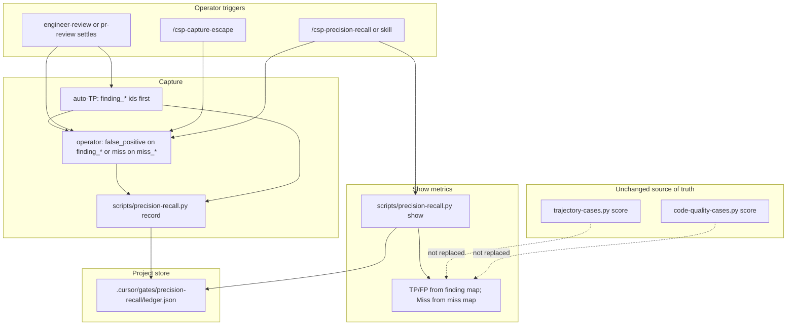

# Precision / recall outcome ledger — System Design

**Status:** draft
**AC:** AC-1, AC-2, AC-3, AC-4, AC-5 (precision / recall operator outcomes for engineer-review and capture-escape)
**Mode:** draft-from-ac
**Source plan:** n/a

## 1. Requirements

### Functional (acceptance criteria ids only)

| Id | Requirement |
|----|-------------|
| AC-1 | After engineer-review settles, or after `/csp-capture-escape`, an operator can record an outcome that is either a **false positive** (hurts precision) or a **confirmed miss / production escape** (hurts recall). |
| AC-2 | Counters or a ledger live in the project under `.cursor/`-style stores, with identity-keyed dedup by stable `id` and append-only / bump-hits semantics in the same spirit as `skills/engineer-review/references/review-learn-capture.md`. |
| AC-3 | A command or skill shows current precision and recall, including denominators: true positives, false positives, misses. |
| AC-4 | Hard-sensor trajectory scoring remains the source of truth for path `PASS` / `FAIL`. This metric does not replace `trajectory-cases.py score` or `code-quality-cases.py score`. |
| AC-5 | Out of scope for this delivery: semantic / hybrid indexing, lakehouse analytics, and a brand-new full adversarial verifier (a future hook may be noted only). |

### Non-functional

| Topic | Claim | Tier |
|-------|-------|------|
| Scale | Operator-scale ledger (tens to low hundreds of outcome ids per project), not analytics warehouse volume | Assumption A2 |
| Latency | Record and show are local disk + stdlib Python; interactive CLI seconds | Constraint (kit pattern) |
| Availability | Best-effort project-local store; never brick the pipeline on missing script or empty ledger | Constraint (match trajectory-score / harness-status skip style) |
| Cost | Stdlib only; no new hosted services | Constraint |

### Constraints

- Stack: kit markdown + bash + small Python helpers (not react-web / react-native / java-spring).
- Prefer extending existing patterns: review-learn capture, trajectory append-only ledgers, harness-status orientation, `/csp-capture-escape`, `scripts/tests/*.sh` contract tests.
- Kit change only (skills, scripts, commands, evals, docs) — not a consumer product app.
- Pipeline route for the feature work: full; tech-spec entry: agent; tech-spec depth: full.
- English identifiers in examples.
- **Scope of settle capture:** `csp-engineer-reviewer` **and** `csp-pr-reviewer` (shared report template / evidence fields). Manual backfill via command remains available for either.

## 2. High-level design

### Components

| Component | Role |
|-----------|------|
| Outcome capture skill | Operator-facing record path after settle or capture-escape; writes ledger rows |
| Slash command (thin) | Entry for manual record / show without inventing a new pipeline gate graph |
| `hitl-choice` preset **Precision-recall outcome** | Closed-set tokens for operator FP / miss / skip after settle (non-blocking) |
| Python helper `scripts/precision-recall.py` | Append / dedup / bump-hits; atomic write; compute precision, recall, denominators; `--json` skeleton |
| Project ledger | `.cursor/gates/precision-recall/ledger.json` — trajectory-style ledger directory (not a `pipeline-gates.sh` advancing kind) |
| Existing hard sensors | Unchanged: `trajectory-cases.py score`, `code-quality-cases.py score` |
| Existing miss stores | Unchanged: `teach-review` / `.cursor/review-learnings.md` — orthogonal to metric ledger |

### Diagram



### Data flow

1. **Settle path (engineer-review or pr-review):** After the validated report is shown and evidence-gated items are known, the orchestrator **must** auto-append one `true_positive` row per surviving finding using the finding-id algorithm below (`finding_…` namespace). Then the optional **Precision-recall outcome** ask (or `/csp-precision-recall` / skill `record`) lets the operator record `false_positive` on a `finding_…` id or `miss` on a `miss_…` id. This ask must not block `propose-commit`.
2. **Escape path:** `/csp-capture-escape` runs the existing destination gate + teach-review / project_secret path. Metric `miss` is recorded **only after successful destination settle** (see Deep dive). Id uses the `miss_…` namespace.
3. **Show path:** Skill or command runs `precision-recall.py show`, which resolves **two separate maps** (finding outcomes vs miss outcomes), prints precision, recall, and denominators. Does not call trajectory or code-quality scorers.

### Interface contracts (design level)

| Surface | Shape |
|---------|-------|
| Record CLI | `python3 scripts/precision-recall.py record --ledger <path> --id <namespaced-id> --kind true_positive\|false_positive\|miss [--source engineer-review\|pr-review\|capture-escape\|manual] [--note "..."]` |
| Show CLI | `python3 scripts/precision-recall.py show --ledger <path>` and `--json` |
| Skill | `precision-recall` — modes `record` and `show`; resolve kit root like `harness-status` / `trajectory-score` |
| Command | `/csp-precision-recall` — thin: `show` by default; record when args / follow-up supply `id` + kind |
| Coverage tokens | `precision_recall: appended\|deduped\|reclassified\|skipped\|n/a` (machine skeleton; chat uses full words) |
| Show ledger status | `ledger: absent\|empty\|loaded` distinct from script-absent `precision_recall: n/a` |

### Storage

- **Path:** `<project>/.cursor/gates/precision-recall/ledger.json` (create on first write).
- **Directory class:** Same family as `.cursor/gates/trajectory-run/` — a **telemetry / ledger directory**, not a pipeline advancing gate kind. Do **not** add `precision-recall` to `pg_list_gates` / `pipeline-gates.sh` slug markers. Harness and skills must not treat presence of this directory as unlocking `start-build`, review, or finale.
- **Why JSON:** Deterministic counters + matches trajectory JSON helpers; review-learn markdown stays for miss *instruction* text.
- **Install:** Skill / command / script install via existing kit install globs. Never copy the project ledger. Never copy `evals/` into consumer apps.
- **Atomic write:** Every successful `record` writes to a temp file in the same directory, then replaces `ledger.json` with `os.replace` (or equivalent atomic rename). Readers that see a missing/partial file treat it as `ledger: absent` / corrupt per error table — never half-apply an append in place.

## 3. Deep dive

### Data model

Ledger file:

```json
{
  "version": 1,
  "entries": [
    {
      "id": "finding_logic_removed-unused-import_foo-ts_L18",
      "kind": "true_positive",
      "hits": 1,
      "first_seen": "2026-09-10",
      "last_seen": "2026-09-10",
      "source": "engineer-review",
      "note": "optional short English note"
    },
    {
      "id": "miss_side-effect-live-actor",
      "kind": "miss",
      "hits": 1,
      "first_seen": "2026-09-10",
      "last_seen": "2026-09-10",
      "source": "capture-escape",
      "note": "optional short English note"
    }
  ]
}
```

| Field | Rules |
|-------|--------|
| `id` | Namespaced kebab string; identity key for dedup within its namespace |
| `kind` | `true_positive` \| `false_positive` \| `miss` |
| `hits` | Integer ≥ 1; bump on same `id` + same `kind` |
| `first_seen` / `last_seen` | `YYYY-MM-DD` |
| `source` | `engineer-review` \| `pr-review` \| `capture-escape` \| `manual` |
| `note` | Optional; no passwords, tokens, or personal data |

### Id namespaces (hard data-model rule)

| Namespace | Prefix | Allowed kinds | Used for |
|-----------|--------|---------------|----------|
| Finding outcomes | `finding_` | `true_positive`, `false_positive` only | Auto-TP and operator FP |
| Miss outcomes | `miss_` | `miss` only | Confirmed miss / production escape |

- Record **rejects** (exit 2, `precision_recall: skipped`) when kind and prefix disagree (example: `miss` on a `finding_…` id, or `true_positive` / `false_positive` on a `miss_…` id).
- Show **never** merges the two namespaces into one last-wins map. Escape `miss_…` rows cannot replace finding TP/FP, and finding rows cannot replace miss counts.

### Finding-row id algorithm (auto-TP and operator FP)

**Primary key inputs** (from phase JSON that survived the evidence gate into the shown report — schema in `skills/engineer-review/references/phase-protocol-detail.md`):

| Input | Source field |
|-------|----------------|
| `phase` | Phase JSON top-level `"phase"` (`lint` \| `logic` \| `patterns` \| `deadcode` \| `simplify` \| `architecture` \| `performance` \| `security` \| `figma`) |
| `title_raw` | `fixed[].summary` for Fixed items; for Clarify items the short title in the user-facing heading after `### C# — \`P#\` — `, falling back to `clarify[].question` if the heading title is unavailable |
| `path` | `fixed[].path` / `clarify[].path` (required evidence field) |
| `start_line` | `fixed[].start_line` / `clarify[].start_line` (required evidence field) |

**Kebab helper** `kebab(s)`:

1. Lowercase ASCII; map any byte outside `[a-z0-9]` to `-`.
2. Collapse repeated `-`; strip leading/trailing `-`.
3. Truncate to **48** characters; strip a trailing `-` again if truncation created one.
4. If empty after kebab, use `untitled`.

**Path stem** `path_stem(path)`:

1. Take the final path segment (basename).
2. Apply `kebab` (so `foo.ts` → `foo-ts`).

**Id formula:**

```text
finding_{phase}_{kebab(title_raw)}_{path_stem(path)}_L{start_line}
```

**Examples:**

- Fixed: phase `logic`, summary `Removed unused import`, path `src/foo.ts`, start_line `18` → `finding_logic_removed-unused-import_foo-ts_L18`
- Clarify: phase `architecture`, title `Session remount drops filter`, path `src/bar.tsx`, start_line `40` → `finding_architecture_session-remount-drops-filter_bar-tsx_L40`

**Cross-review uniqueness:** The same `(phase, title_raw, path, start_line)` produces the same id → bump-hits on repeat. Line drift or title rewrite produces a new id (accepted; see Assumption A6). Report labels `F1` / `C1` are **not** part of the id (they renumber per report).

**Operator FP:** The operator (or skill) must pass the **same** `finding_…` id that auto-TP recorded for that item (skill may list recent finding ids from the ledger / last report derivation). No separate FP key space.

**Items without required evidence fields** are dropped by the evidence gate and never receive auto-TP.

### Miss-row id algorithm

Same spirit as review-learn capture:

```text
miss_{kebab(miss_class)}
```

- `miss_class` comes from the operator’s non-empty escape / confirmed-miss description (symptom class), truncated via `kebab` to 48 characters after the `miss_` prefix body.
- Example: `miss_side-effect-live-actor`.
- Prefer mapping to an existing review-learn / teach-review class string when the operator already chose one; still store only the metric row here.

### Dedup / append-only / bump-hits (AC-2)

- Same `id` + same `kind` → bump `hits`, refresh `last_seen`. Coverage: `deduped`.
- Same `id` + **different** allowed kind within the **same** namespace → append a new entry (append-only). Show uses **latest entry for that id within its namespace map**. Typical case: auto `true_positive` later labeled `false_positive` on the same `finding_…` id. Coverage: `reclassified`.
- New `id` → append. Coverage: `appended`.
- Never delete entries in normal operation.
- Cross-namespace id collision is structurally impossible when prefixes are enforced; do not last-wins across namespaces.

### Metric resolution

Build **two** maps from the ledger (scan entries in order; last wins **inside** each map):

1. `finding_latest`: only ids matching `^finding_` and kinds in `{true_positive, false_positive}` (ignore illegal rows if any slipped in).
2. `miss_latest`: only ids matching `^miss_` and kind `miss`.

Then:

- `TP` = count of ids in `finding_latest` whose kind is `true_positive`
- `FP` = count of ids in `finding_latest` whose kind is `false_positive`
- `Miss` = count of ids in `miss_latest`
- `precision = TP / (TP + FP)` when `(TP + FP) > 0`, else ratio `n/a`
- `recall = TP / (TP + Miss)` when `(TP + Miss) > 0`, else ratio `n/a`
- Denominators always printed as the three counts (AC-3)
- `hits` are for frequency display / future prioritization; they do **not** inflate precision/recall denominators (Assumption A3)

### True positives (hard rule A1)

AC-1 names operator outcomes `false_positive` and `miss` only. AC-3 still requires a true-positive denominator.

**Hard rule:** After a validated engineer-review or pr-review report is shown, for every Fixed / Clarify item that survived the evidence gate, the orchestrator **must** auto-`record` `kind=true_positive` with `derive_finding_id(...)` before the optional Precision-recall outcome ask. No human confirm token for TP. Reviews that settle with **zero** surviving findings append no true-positive rows.

### Single-writer order (settle)

For one settle on one project ledger:

1. Validate report (`scripts/validate-review-report.sh` exit 0) and show it.
2. **Auto-TP pass** — sequential `record` calls for each surviving finding id (single writer: the settle orchestrator). Each call uses atomic replace.
3. Existing **Teach-review miss** gate (`miss` / `project_secret` / `no_miss`) unchanged.
4. Optional **Precision-recall outcome** ask / manual record for FP or miss — still the same writer process; no parallel agent writers to this ledger in the same settle.
5. Continue to `propose-commit` when the calling pipeline requires it (Assumption A4).

Concurrent manual `/csp-precision-recall` during settle is unsupported in this delivery; last atomic replace wins (Assumption A7).

### Operator capture flows

**After engineer-review or pr-review settles**

1. Auto-TP as above (hard rule).
2. Existing **Teach-review miss** gate unchanged.
3. **Precision-recall outcome** (`hitl-choice`) or `/csp-precision-recall` / skill `record`:
   - `false_positive` — require a `finding_…` id; record FP.
   - `miss` — require a `miss_…` id (from description via miss-row algorithm); record miss.
   - `skip` — write nothing (`precision_recall: skipped` or leave prior coverage).

**After `/csp-capture-escape`**

1. Existing destination gate + teach-review / project_secret path unchanged.
2. **When to record metric miss:** only after **successful destination settle**:
   - `miss` destination → skill `teach-review` returns success coverage (`teach_review: invoked` with a completed write path as defined by that skill); **or**
   - `project_secret` → `review_learn: appended` or `review_learn: deduped`.
3. **Do not** record metric miss when: empty description stop; destination abandoned; `review_learn: n/a` / `skipped`; teach-review failure without a completed kit write; operator never finished the destination gate.
4. On successful settle, record `kind=miss` with `miss_…` id. Dedup bumps hits if the escape class repeats.
5. Capture-escape never records `false_positive` (Assumption A5).

**Manual**

`/csp-precision-recall` with explicit `--id` / `--kind` for backfill. Source `manual`. Prefix/kind validation still applies.

### Cache / queues / events

None. Synchronous local file IO only (atomic replace per record).

### Error handling and retries

| Case | Behavior |
|------|----------|
| Missing ledger file on show | `ledger: absent`; counts 0; ratios `n/a`; exit 0 (healthy first-use) |
| Ledger exists, `entries: []` on show | `ledger: empty`; counts 0; ratios `n/a`; exit 0 (healthy empty) |
| Kit script / skill missing on show or record | `precision_recall: n/a`; one-sentence skip; do not brick pipeline — **distinct** from `ledger: absent\|empty` |
| Missing ledger on record | Create parent dirs + empty ledger via atomic replace, then append |
| Invalid kind / empty id / namespace mismatch | Exit 2; skill skips (`precision_recall: skipped`) |
| Corrupt JSON | Exit 1; do not invent repairs; skill skips with one sentence |
| Unknown CLI args | Exit 2 |

No network retries. No queue.

Harness-status (orientation only), when it mentions precision-recall, must surface the same distinction: script absent → `n/a`; ledger absent/empty/loaded as above — never conflate “tool missing” with “no outcomes yet.”

### Relationship to other stores

| Store | Relationship |
|-------|----------------|
| `.cursor/review-learnings.md` | Instruction ledger for project_secret misses — not the metric source |
| Kit `learned-misses.md` / teach-review | Kit instructions — orthogonal; miss-class kebab may align with `miss_…` metric ids |
| `.cursor/gates/trajectory-run/*.json` | Path hard sensors — untouched (AC-4); **sibling ledger style** for `precision-recall/` |
| `.cursor/gates/<pg-kind>/<slug>` | Pipeline advancing markers via `pipeline-gates.sh` — **not** this feature |
| `evals/code-quality/` | Tree hard sensors — untouched (AC-4) |

### Future hook only (AC-5)

Optional later seam: an adversarial verifier may emit suggested `miss` or `false_positive` **candidates** into chat for the operator to confirm before `record`. This delivery does not build that verifier, indexing, or lakehouse analytics.

## 4. Scale and reliability

### Load

Assumption A2: low dozens of outcome events per project month. Single JSON file is enough.

### Scaling

Vertical only (one file per project). No horizontal sharding. If the file grows large enough to hurt interactive show (revisit later), split by month files — not in this delivery.

### Failover / redundancy

Project git may ignore `.cursor/gates/` (existing pattern). Ledger is local operator telemetry, not a merge gate. No cross-replica sync. Atomic replace limits torn writes on a single writer.

### Monitoring

- Contract tests: `scripts/tests/precision-recall-test.sh` — append, dedup bump, reclassify within finding namespace, namespace isolation (miss cannot overwrite finding), finding-id derivation fixtures, atomic replace, precision/recall math, `ledger: absent|empty` vs script `n/a`, CLI exit codes.
- Optional: `harness-health.py` inventory line mentioning the new skill/command (orientation only) — does not advance gates; reports ledger status distinctly from script absence.
- Do **not** fold metric pass/fail into `trajectory-cases.py score` as a path gate. Bench may run the new contract script like other `scripts/tests/*.sh`.

## 5. Trade-offs

| Decision | Choice | Alternatives | Why this wins | Revisit later |
|----------|--------|--------------|---------------|---------------|
| Store format | JSON ledger under `.cursor/gates/precision-recall/` (trajectory-style ledger dir) | Markdown YAML like review-learn; SQLite; new top-level `.cursor/` file | Deterministic counters + matches trajectory helpers; clear non-gate semantics | Markdown mirror if humans insist on hand-edit |
| Id isolation | Hard `finding_` / `miss_` prefixes + separate metric maps | Single flat id map; encode kind only in `kind` field | Escape miss cannot last-wins-replace finding TP/FP | — |
| Finding primary key | `finding_{phase}_{kebab(title)}_{path_stem}_L{start_line}` from phase JSON / report title | Report `F#`/`C#` only; hash of snippet; class-only without path/line | Concrete, evidence-tied, cross-review stable when location+title hold | Soften line coupling if drift noise is high (A6) |
| TP acquisition | Mandatory auto-append on settled surviving findings | Optional “may”; third HITL `confirm_true` | Satisfies AC-3 without a third operator outcome; removes soft wording | Explicit confirm if auto-TP noise is high |
| Escape metric timing | Only after successful destination settle | Always on description; always after gate ask | Avoids counting abandoned / failed destination paths as recall misses | — |
| Writer / durability | Single-writer settle order + atomic temp+replace | In-place JSON rewrite; parallel writers | Matches kit file-marker caution; reduces torn ledgers | File lock if concurrent manual use becomes real |
| Denominator unit | Distinct ids (latest kind within namespace) | Sum of `hits` | Ratios stay interpretable; hits remain frequency | Hit-weighted metrics on request |
| Show entry | Skill + `/csp-precision-recall` (+ harness-status status line) | Only extend harness-status | Clear AC-3 surface | Merge show into harness-status if duplication hurts |
| Path PASS/FAIL | Unchanged hard sensors | Soft-replace trajectory score with precision | Violates AC-4 | Never for this metric |
| Out of scope | Future adversarial-verifier hook only | Build verifier / indexer / lakehouse now | AC-5 | Separate initiative |

### Rejected alternatives

- Semantic / hybrid indexing for miss similarity — rejected: AC-5 out of scope; namespaced stable `id` dedup is enough.
- Lakehouse or remote analytics — rejected: AC-5; project-local JSON fits kit stack.
- Full adversarial verifier as this delivery — rejected: AC-5; optional future candidate hook only.
- Replacing `trajectory-cases.py score` or `code-quality-cases.py score` with precision/recall — rejected: AC-4.
- Folding metric rows into `.cursor/review-learnings.md` — rejected: that file is instruction capture with Active cap and destination rules, not operator outcome math.
- Flat `id → latest kind` across findings and misses — rejected: escape miss and finding TP/FP must not overwrite each other.
- Using report-only `F#` / `C#` as the durable finding key — rejected: renumbers every report; fails cross-review uniqueness.
- Registering `precision-recall` as a `pipeline-gates.sh` advancing kind — rejected: telemetry ledger, not a plan slug gate.

## 6. Assumptions / open questions

### Assumptions

| Id | Claim | Why | How to revoke |
|----|-------|-----|---------------|
| A1 | True positives are **always** auto-recorded from every evidence-gated Fixed/Clarify item on engineer-review and pr-review settle; operators do not get a third outcome token | AC-1 names only FP and miss; AC-3 needs TP; soft optional auto-TP under-counts | Add explicit `confirm_true` / HITL token and stop auto-append |
| A2 | Volume stays operator-scale; one JSON file per project is enough | Kit harness telemetry pattern; no AC for warehouse scale | Split ledgers or add compaction when show latency hurts |
| A3 | Precision/recall denominators count distinct ids (latest kind within each namespace), not sum of hits | Keeps ratios meaningful while preserving bump-hits for frequency | Switch to hit-weighted formula if product owners require it |
| A4 | Precision-recall capture must not block `propose-commit` or Pipeline finale; skip is always safe | Existing settle → propose-commit spine must not regress | Promote to a hard gate only if a later AC says so |
| A5 | `/csp-capture-escape` contributes metric `miss` only after successful destination settle, never `false_positive` | Escape is a production miss; failed/abandoned destinations are not recall events | Allow FP on escape or always-on miss record only with a new AC |
| A6 | Finding ids include `start_line`; line drift across reviews creates a new id rather than bumping the old one | Evidence fields are the stable report contract; fuzzy location match is out of scope (AC-5) | Add fuzzy / class-only finding keys if drift noise dominates |
| A7 | Single-writer settle order is enough; no file lock for rare concurrent manual record | Operator-scale; atomic replace limits damage | Add lock or queue if concurrent writers appear |
| A8 | Script-absent `precision_recall: n/a` is a different signal from healthy `ledger: absent` / `ledger: empty` | Operators and harness-status must not treat “tool missing” as “perfect scores” or “no data yet” interchangeably | Collapse only if a later UX AC says so |

### Open questions

None. No Blocker-tier missing business fact blocks a happy path under the assumptions above.
