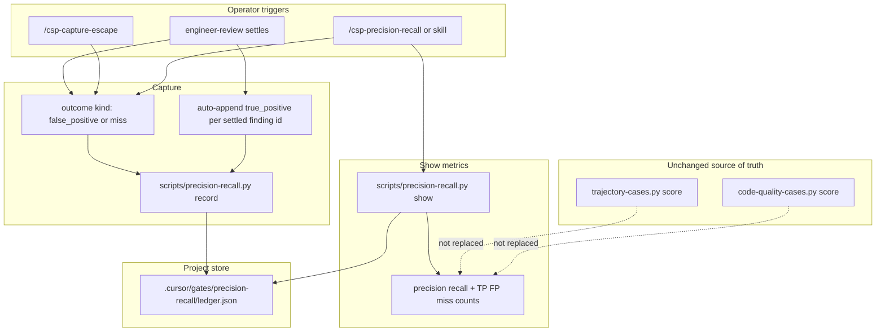

# Precision / recall outcome ledger — System Design

**Status:** draft
**AC:** AC-1, AC-2, AC-3, AC-4, AC-5 (precision / recall operator outcomes for engineer-review and capture-escape)
**Mode:** draft-from-ac
**Source plan:** n/a

## 1. Requirements

### Functional (acceptance criteria ids only)

| Id | Requirement |
|----|-------------|
| AC-1 | After engineer-review settles, or after `/csp-capture-escape`, an operator can record an outcome that is either a **false positive** (hurts precision) or a **confirmed miss / production escape** (hurts recall). |
| AC-2 | Counters or a ledger live in the project under `.cursor/`-style stores, with identity-keyed dedup by stable `id` and append-only / bump-hits semantics in the same spirit as `skills/engineer-review/references/review-learn-capture.md`. |
| AC-3 | A command or skill shows current precision and recall, including denominators: true positives, false positives, misses. |
| AC-4 | Hard-sensor trajectory scoring remains the source of truth for path `PASS` / `FAIL`. This metric does not replace `trajectory-cases.py score` or `code-quality-cases.py score`. |
| AC-5 | Out of scope for this delivery: semantic / hybrid indexing, lakehouse analytics, and a brand-new full adversarial verifier (a future hook may be noted only). |

### Non-functional

| Topic | Claim | Tier |
|-------|-------|------|
| Scale | Operator-scale ledger (tens to low hundreds of outcome ids per project), not analytics warehouse volume | Assumption A2 |
| Latency | Record and show are local disk + stdlib Python; interactive CLI seconds | Constraint (kit pattern) |
| Availability | Best-effort project-local store; missing ledger → show empty / zero denominators, never brick the pipeline | Constraint (match trajectory-score / harness-status skip style) |
| Cost | Stdlib only; no new hosted services | Constraint |

### Constraints

- Stack: kit markdown + bash + small Python helpers (not react-web / react-native / java-spring).
- Prefer extending existing patterns: review-learn capture, trajectory append-only ledgers, harness-status orientation, `/csp-capture-escape`, `scripts/tests/*.sh` contract tests.
- Kit change only (skills, scripts, commands, evals, docs) — not a consumer product app.
- Pipeline route for the feature work: full; tech-spec entry: agent; tech-spec depth: full.
- English identifiers in examples.

## 2. High-level design

### Components

| Component | Role |
|-----------|------|
| Outcome capture skill | Operator-facing record path after settle or capture-escape; writes ledger rows |
| Slash command (thin) | Entry for manual record / show without inventing a new pipeline gate graph |
| `hitl-choice` preset (optional extension) | Closed-set tokens for outcome kind when asking after settle |
| Python helper `scripts/precision-recall.py` | Append / dedup / bump-hits; compute precision, recall, denominators; `--json` skeleton |
| Project ledger | `.cursor/gates/precision-recall/ledger.json` |
| Existing hard sensors | Unchanged: `trajectory-cases.py score`, `code-quality-cases.py score` |
| Existing miss stores | Unchanged: `teach-review` / `.cursor/review-learnings.md` — orthogonal to metric ledger |

### Diagram



### Data flow

1. **Settle path:** After a validated engineer-review (or pr-review) report is shown and teach-review-miss handling has completed (or in parallel as a dedicated follow-on ask — see Deep dive), the harness may auto-append one `true_positive` row per settled finding that has a stable finding `id`. The operator may record `false_positive` for a finding id, or `miss` for a confirmed miss class / production escape.
2. **Escape path:** `/csp-capture-escape` continues to teach-review or project_secret capture. In addition, the operator (or the command after destination settles) records a `miss` outcome into the precision-recall ledger with a stable `id`.
3. **Show path:** Skill or command runs `precision-recall.py show`, which resolves latest kind per `id`, sums denominators, prints precision and recall. Does not call trajectory or code-quality scorers.

### Interface contracts (design level)

| Surface | Shape |
|---------|-------|
| Record CLI | `python3 scripts/precision-recall.py record --ledger <path> --id <stable-id> --kind true_positive\|false_positive\|miss [--source engineer-review\|capture-escape\|manual] [--note "..."]` |
| Show CLI | `python3 scripts/precision-recall.py show --ledger <path>` and `--json` |
| Skill | `precision-recall` — modes `record` and `show`; resolve kit root like `harness-status` / `trajectory-score` |
| Command | `/csp-precision-recall` — thin: `show` by default; record when args / follow-up supply `id` + kind |
| Coverage tokens | `precision_recall: appended\|deduped\|reclassified\|skipped\|n/a` (machine skeleton; chat uses full words) |

### Storage

- **Path:** `<project>/.cursor/gates/precision-recall/ledger.json` (create on first write).
- **Why JSON:** Same family as trajectory run ledgers; easy deterministic math in stdlib Python. Markdown review-learn stays for miss *instruction* text; this ledger is for *metric events* only.
- **Install:** Skill / command / script install via existing kit install globs. Never copy the project ledger. Never copy `evals/` into consumer apps.

## 3. Deep dive

### Data model

Ledger file:

```json
{
  "version": 1,
  "entries": [
    {
      "id": "finding_r1-side-effect-timing",
      "kind": "true_positive",
      "hits": 1,
      "first_seen": "2026-09-10",
      "last_seen": "2026-09-10",
      "source": "engineer-review",
      "note": "optional short English note"
    }
  ]
}
```

| Field | Rules |
|-------|--------|
| `id` | Stable kebab string; identity key for dedup |
| `kind` | `true_positive` \| `false_positive` \| `miss` |
| `hits` | Integer ≥ 1; bump on same `id` + same `kind` |
| `first_seen` / `last_seen` | `YYYY-MM-DD` |
| `source` | `engineer-review` \| `capture-escape` \| `manual` |
| `note` | Optional; no passwords, tokens, or personal data |

**Dedup / append-only / bump-hits (AC-2):**

- Same `id` + same `kind` → bump `hits`, refresh `last_seen` (review-learn spirit). Coverage: `deduped`.
- Same `id` + **different** `kind` → append a new entry (append-only; do not rewrite history). Show/score uses the **latest** entry for that `id` by file order (last wins). Typical case: auto `true_positive` later labeled `false_positive`. Coverage: `reclassified`.
- New `id` → append. Coverage: `appended`.
- Never delete entries in normal operation.

**Metric resolution:**

- Build a map `id → latest kind`.
- `TP` = count of ids whose latest kind is `true_positive`.
- `FP` = count of ids whose latest kind is `false_positive`.
- `Miss` = count of ids whose latest kind is `miss`.
- `precision = TP / (TP + FP)` when `(TP + FP) > 0`, else `n/a`.
- `recall = TP / (TP + Miss)` when `(TP + Miss) > 0`, else `n/a`.
- Denominators always printed as the three counts (AC-3).
- `hits` are for frequency display / future prioritization; they do **not** inflate precision/recall denominators (Assumption A3).

### True positives (happy path without a third operator outcome)

AC-1 only names operator outcomes `false_positive` and `miss`. AC-3 still requires a true-positive denominator.

**Chosen rule:** On engineer-review settle, for each finding that already carries a stable id (gate pointer + miss class / finding slug, same discipline as review-learn `id: miss_<kebab-class>`), auto-`record` `kind=true_positive`. Operator-recorded `false_positive` for that id reclassifies it. Confirmed misses / production escapes use `kind=miss` (from settle follow-up or `/csp-capture-escape`).

Reviews that settle with **zero** findings append no true-positive rows.

### Operator capture flows

**After engineer-review settles**

1. Existing **Teach-review miss** gate unchanged (`miss` / `project_secret` / `no_miss`).
2. New closed-set ask (skill `hitl-choice` preset **Precision-recall outcome**), only when the operator wants to label outcomes, **or** via `/csp-precision-recall` / skill `record` without blocking propose-commit:
   - `false_positive` — require non-empty finding `id` (reuse report finding id); record FP.
   - `miss` — require non-empty miss `id` / description → stable id; record miss.
   - `skip` — write nothing (`n/a`).
3. Auto true-positive append runs from the orchestrator or thin helper after the validated report is accepted for settle — it must not ask the human to confirm each TP.

**After `/csp-capture-escape`**

1. Existing destination gate + teach-review / project_secret path unchanged.
2. After destination handling, record `kind=miss` with stable id derived from the miss class (same kebab rules). Dedup bumps hits if the escape repeats.
3. Do not treat capture-escape as a false positive.

**Manual**

`/csp-precision-recall` with explicit `--id` / `--kind` (or chat args the skill parses) for backfill. Source `manual`.

### Cache / queues / events

None. Synchronous local file IO only.

### Error handling and retries

| Case | Behavior |
|------|----------|
| Missing ledger on show | Print zeros / `n/a` ratios; exit 0 |
| Missing ledger on record | Create parent dirs + empty ledger, then append |
| Invalid kind / empty id | Exit 2; skill says one sentence and skips (`precision_recall: skipped`) |
| Corrupt JSON | Exit 1; do not invent repairs; skill skips with one sentence |
| Kit script missing | Same skip style as trajectory-score / harness-status — do not brick pipeline |
| Unknown CLI args | Exit 2 (`set -euo pipefail` / argparse) |

No network retries. No queue.

### Relationship to other stores

| Store | Relationship |
|-------|----------------|
| `.cursor/review-learnings.md` | Instruction ledger for project_secret misses — not the metric source |
| Kit `learned-misses.md` / teach-review | Kit instructions — orthogonal; may share id naming conventions |
| `.cursor/gates/trajectory-run/*.json` | Path hard sensors — untouched (AC-4) |
| `evals/code-quality/` | Tree hard sensors — untouched (AC-4) |

### Future hook only (AC-5)

Optional later seam: an adversarial verifier may emit suggested `miss` or `false_positive` **candidates** into chat for the operator to confirm before `record`. This delivery does not build that verifier, indexing, or lakehouse analytics.

## 4. Scale and reliability

### Load

Assumption A2: low dozens of outcome events per project month. Single JSON file is enough.

### Scaling

Vertical only (one file per project). No horizontal sharding. If the file grows large enough to hurt interactive show (revisit later), split by month files — not in this delivery.

### Failover / redundancy

Project git may ignore `.cursor/gates/` (existing pattern). Ledger is local operator telemetry, not a merge gate. No cross-replica sync.

### Monitoring

- Contract tests: `scripts/tests/precision-recall-test.sh` — append, dedup bump, reclassify latest-kind wins, precision/recall math, corrupt/missing ledger behavior, CLI exit codes.
- Optional: `harness-health.py` inventory line mentioning the new skill/command (orientation only) — does not advance gates.
- Do **not** fold metric pass/fail into `trajectory-cases.py score` or `harness-bench.sh` as a path gate. Bench may run the new unit/contract script like other `scripts/tests/*.sh`.

## 5. Trade-offs

| Decision | Choice | Alternatives | Why this wins | Revisit later |
|----------|--------|--------------|---------------|---------------|
| Store format | JSON ledger under `.cursor/gates/precision-recall/` | Markdown YAML like review-learn; SQLite | Deterministic counters + matches trajectory JSON helpers; review-learn stays for prose instructions | If humans insist on editing by hand, add a markdown mirror |
| TP acquisition | Auto-append on settled findings; operator records FP and miss only | Third HITL token `confirm_true`; count all reviews as one TP | Fits AC-1 closed operator outcomes while satisfying AC-3 denominators without inventing a new business outcome | If auto-TP noise is high, add explicit confirm |
| Dedup across kinds | Append-only + latest kind wins | Mutate kind in place; separate FP set | Preserves history; still bump-hits for same kind | Compaction / archive if file large |
| Denominator unit | Distinct ids (latest kind) | Sum of `hits` | Precision/recall stay interpretable; hits remain frequency signal | Hit-weighted metrics if operators ask |
| Show entry | Skill + `/csp-precision-recall` (+ optional harness-status mention) | Only extend harness-status | Clear AC-3 surface; harness-status stays orientation inventory | Merge show into harness-status if duplication hurts |
| Capture vs teach-review | Separate metric ledger; do not replace miss instruction stores | Overload review-learnings with metric fields | Separation of concerns; AC-4 sibling idea for evals | — |
| Path PASS/FAIL | Unchanged hard sensors | Soft-replace trajectory score with precision | Violates AC-4 | Never for this metric |
| Out of scope | Note future adversarial-verifier hook only | Build verifier / indexer / lakehouse now | AC-5 | Separate initiative |

### Rejected alternatives

- Semantic / hybrid indexing for miss similarity — rejected: AC-5 out of scope; stable `id` dedup is enough.
- Lakehouse or remote analytics — rejected: AC-5; project-local JSON fits kit stack.
- Full adversarial verifier as this delivery — rejected: AC-5; optional future candidate hook only.
- Replacing `trajectory-cases.py score` or `code-quality-cases.py score` with precision/recall — rejected: AC-4.
- Folding metric rows into `.cursor/review-learnings.md` — rejected: that file is instruction capture with Active cap and destination rules, not operator outcome math.

## 6. Assumptions / open questions

### Assumptions

| Id | Claim | Why | How to revoke |
|----|-------|-----|---------------|
| A1 | True positives are auto-recorded from settled engineer-review findings with stable ids; operators do not need a third outcome token beyond false positive and miss | AC-1 names only those two operator outcomes; AC-3 still needs TP | Add explicit `confirm_true` / HITL token and stop auto-append |
| A2 | Volume stays operator-scale; one JSON file per project is enough | Kit harness telemetry pattern; no AC for warehouse scale | Split ledgers or add compaction when show latency hurts |
| A3 | Precision/recall denominators count distinct ids (latest kind), not sum of hits | Keeps ratios meaningful while preserving bump-hits for frequency | Switch to hit-weighted formula if product owners require it |
| A4 | Precision-recall capture must not block `propose-commit` or Pipeline finale; skip is always safe | Existing settle → propose-commit spine must not regress | Promote to a hard gate only if a later AC says so |
| A5 | `/csp-capture-escape` always contributes `miss` (hurts recall), never `false_positive` | Escape command is defined as a production miss | Allow FP labeling on escape only with a new AC |

### Open questions

None. No Blocker-tier missing business fact blocks a happy path under the assumptions above.
