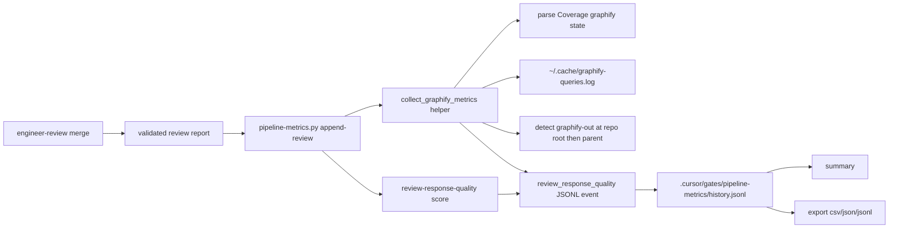

# Graphify usage in live pipeline-metrics — System Design

**Status:** merged  
**AC:** AC-1, AC-2, AC-3, AC-4, AC-5, AC-6  
**Mode:** draft-from-ac  
**Source plan:** n/a  
**Stack:** kit markdown + bash + small Python helpers (`scripts/pipeline-metrics.py`)

---

## 1. Requirements

### Functional (AC trace)

| ID | Requirement |
|----|-------------|
| **AC-1** | When a consumer run writes a live metrics history row via `append-review`, that row must also record Graphify usage metrics for the review window so a human can see whether Graphify was used and how much graph context was retrieved. |
| **AC-2** | Metrics must support understanding approximate **token savings** attributable to Graphify on local runs via an explicit **proxy** (not claimed Cursor conversation token counts), derived from available signals: at minimum `~/.cache/graphify-queries.log` fields `result_chars`, `token_budget`, `nodes_returned`, `duration_ms`, plus Coverage `graphify: used\|absent\|unqueryable` from the review report. The proxy must expose both **absolute** token estimates and a **percentage** savings rate vs the summed Graphify query budgets for the window (rate/Δ-style readability, same idea as harness rollups — not a second product). |
| **AC-3** | `summary` and `export` of `pipeline-metrics` must surface the new Graphify fields in the same journal (not a separate product). |
| **AC-4** | Missing Graphify CLI, missing `graphify-out/`, missing query log, or Coverage `absent`/`unqueryable` must **not** fail the pipeline or `append-review` — record an explicit absent / unqueryable / skip state and continue (preferred-when-present policy). |
| **AC-5** | Contract tests under `scripts/tests/` cover new append / summary / export behavior with fixtures (no dependency on a human’s real EnergySave corpora). |
| **AC-6** | Update the Ukrainian `docs/superpowers/pipeline-metrics-guide.md` so a human knows what the Graphify proxy means and what it does **not** measure. |

### Non-functional

- **Failure isolation:** Graphify collection is best-effort; exceptions while reading log / parsing Coverage never change the quality verdict exit path beyond today’s scorer behavior (**AC-4**).
- **Compatibility:** Existing history rows without a `graphify` object remain valid; readers treat missing keys as “no Graphify metrics recorded.”
- **Cost / latency:** Log parse is local file read + filter; target negligible overhead versus existing `review-response-quality` subprocess (Assumption: typical log ≪ 10 MB).
- **Stdlib only** for `pipeline-metrics.py` (existing style).

### Constraints

- Kit-owned tooling; live history stays under the **consumer** project at `.cursor/gates/pipeline-metrics/` — do not invent committing history to git.
- Prefer extending `append-review` and/or a small helper over a parallel metrics product.
- Never rebuild Graphify during review (existing `graphify-protocol.md`).
- Reuse: `scripts/pipeline-metrics.py`, `scripts/tests/pipeline-metrics-test.sh`, `docs/superpowers/pipeline-metrics-guide.md`, engineer-review Coverage + `append-review` hook.

---

## 2. High-level design

### Components



### Data flow

1. Engineer-review validates the report, then calls `append-review --path <report>` (unchanged caller contract; optional new flags for window/log override — see Deep dive).
2. `append-review` scores quality as today.
3. **Before** writing the JSONL row, call `collect_graphify_metrics(...)`:
   - Parse Coverage `graphify: used|absent|unqueryable` from the report text (`coverage` may be `null` if the token is missing).
   - Detect artifacts (soft, never rebuild): check **repo root** first, then **workspace parent**, for `graphify-out/GRAPH_REPORT.md` **or** `graphify-out/graph.json` (same roots/filenames as `graphify-protocol.md`).
   - Always attempt query-log read when not `--skip-graphify-metrics`, except when Coverage is explicitly `absent` (record `state: absent`, numerics null, skip log aggregates).
   - Filter log lines to the **capped review window**; aggregate signals; compute proxy fields when ≥1 in-window query.
   - Resolve `graphify.state` from Coverage + in-window query count + artifact detect (see §3.1 / §3.2); any I/O / parse error → `state: unqueryable` (or `skip` with `reason`), empty aggregates, **do not raise out of `append-review`**.
4. Attach nested `graphify` object on the same `kind: review_response_quality` event.
5. `summary` / `export` read the nested object and surface Graphify columns / rollups (including dual Coverage-echo vs log-backed state notes in §3.5).

### API contracts (CLI)

| Command | Change |
|---------|--------|
| `append-review` | Always attempts Graphify collection; new optional flags (non-breaking defaults). Exit code remains quality-scorer driven only — Graphify never forces non-zero. |
| `summary` | Extra lines / rollups for Graphify among `review_response_quality` rows. |
| `export` | CSV adds Graphify columns; JSON/JSONL already emit full objects. |

Optional flags (design level):

| Flag | Purpose |
|------|---------|
| `--repo-root PATH` | Consumer / workspace root for detect + cwd filter (default: cwd when `append-review` runs). |
| `--graphify-log PATH` | Override log path (default: `~/.cache/graphify-queries.log`). |
| `--review-started-at ISO8601` | Window start; if omitted, derive (see Deep dive). |
| `--review-ended-at ISO8601` | Window end; default `recorded_at` / now. |
| `--skip-graphify-metrics` | Explicit skip state without reading disk (tests / emergency). |

Engineer-review skill need not pass new flags on day one if defaults are good enough; tests will pass overrides.

### Storage

- Same consumer journal: `.cursor/gates/pipeline-metrics/history.jsonl`.
- No new gate directory; no separate Graphify metrics product.
- Schema: **additive** nested object on existing review events; keep `SCHEMA_VERSION = 1` (optional keys). Do not rewrite old rows.

---

## 3. Deep dive

### 3.1 Data model (`graphify` object on review events)

```json
{
  "schema_version": 1,
  "kind": "review_response_quality",
  "recorded_at": "2026-09-16T12:00:00Z",
  "verdict": "PASS",
  "quality": { "...": "unchanged" },
  "source": { "report": "/path/to/report.md" },
  "graphify": {
    "state": "used",
    "coverage": "used",
    "artifacts_present": true,
    "log_path": "/Users/me/.cache/graphify-queries.log",
    "log_found": true,
    "window_started_at": "2026-09-16T11:50:00Z",
    "window_ended_at": "2026-09-16T12:00:00Z",
    "query_count": 3,
    "sum_result_chars": 4200,
    "sum_nodes_returned": 18,
    "sum_duration_ms": 240,
    "sum_token_budget": 6000,
    "proxy_retrieved_tokens": 1050,
    "proxy_savings_vs_budget_tokens": 4950,
    "proxy_savings_pct": 82.5,
    "proxy_definition": "chars_div4_vs_budget",
    "reason": null
  }
}
```

#### State enum

`coverage` always echoes the parsed token (`used` \| `absent` \| `unqueryable` \| `null`). Log-backed `state` is resolved separately so humans can tell Coverage text from evidence in the query log.

| `state` | When |
|---------|------|
| `used` | Coverage `used` **and** ≥1 in-window query; **or** `coverage: null` **and** ≥1 in-window query. |
| `absent` | Coverage `absent`; **or** `coverage: null`, zero in-window queries, **and** artifact detect finds neither file at either root. |
| `unqueryable` | Coverage `unqueryable`; **or** Coverage `used` with zero in-window queries / missing / unreadable log (`reason: no_queries_in_window` or `log_missing`); **or** `coverage: null`, artifacts present, zero in-window queries; **or** collection parse failure. |
| `skip` | Caller passed `--skip-graphify-metrics`, or collection deliberately skipped; `reason` set. |

Coverage is **not** required for `state: used` when the log proves in-window queries. Explicit Coverage `absent` / `unqueryable` still wins over log noise (state follows Coverage; aggregates stay null for `absent`).

Numeric fields are `null` when not applicable (`absent` / `skip` / failed collection / empty useful window). Never omit `state`.

### 3.2 Coverage parse and artifact detect

**Coverage**

- Scan the validated report for a Coverage line matching (case-insensitive, tolerant whitespace):  
  `graphify:\s*(used|absent|unqueryable)`.
- Prefer the Coverage section if markers exist; otherwise first match in file.
- Missing token → `coverage: null` (does not fail report quality scoring).

**Artifact detect** (soft; never rebuild; sets `artifacts_present`)

1. **Repo root** (`--repo-root`, default process cwd):  
   `graphify-out/GRAPH_REPORT.md` **or** `graphify-out/graph.json`.
2. If neither exists there, **workspace parent** (immediate parent of repo root): same two filenames under `graphify-out/`.
3. `artifacts_present = true` if either file exists at either root; else `false`.

**State resolution** (after windowed log filter):

| `coverage` | In-window queries | `artifacts_present` | `state` |
|------------|-------------------|---------------------|---------|
| `used` | ≥1 | * | `used` |
| `used` | 0 | * | `unqueryable` (`reason: no_queries_in_window` or `log_missing`) — **not** `absent` |
| `absent` | * | * | `absent` |
| `unqueryable` | * | * | `unqueryable` |
| `null` | ≥1 | * | `used` |
| `null` | 0 | `false` | `absent` |
| `null` | 0 | `true` | `unqueryable` |

### 3.3 Query log ingest

**Default path:** `Path.home() / ".cache" / "graphify-queries.log"`.

**Assumption (log shape):** newline-delimited JSON objects (JSONL) including at least some of: `result_chars`, `token_budget`, `nodes_returned`, `duration_ms`, plus a timestamp field (`ts` / `timestamp` / `recorded_at` / `time`) and optionally `cwd` / `repo` / `path`. Parser is resilient: skip non-JSON lines; missing numeric fields count as 0 for that line’s contribution; lines without a parseable timestamp are excluded from the window (counted in `reason` / debug only if needed — not required in history).

**Review window (capped):**

`LOOKBACK` default = **2 hours**.

1. `window_ended_at` = `--review-ended-at` if set, else `recorded_at`.
2. `window_started_at`:
   - If `--review-started-at` is set → that value (caller-owned; may exceed `LOOKBACK`).
   - Else → `recorded_at − LOOKBACK`.
   - If report mtime is available **and** no `--review-started-at`, optionally **tighten** only:  
     `window_started_at = max(report_mtime, recorded_at − LOOKBACK)`.  
     Stale or old `report_mtime` cannot open a window older than `LOOKBACK`; only `--review-started-at` may widen beyond that default.

**Optional cwd filter:** if log entries expose a workspace path, keep entries whose path is under `--repo-root` (or equal). If no path field exists on entries, keep all timestamp-filtered rows (Assumption: single-user local machine; document contamination risk in guide).

**Never** invoke `graphify` CLI or rebuild during collection.

### 3.4 Token-savings **proxy** (explicit, non-Cursor)

Cursor does not expose true conversation token counts. Define one named proxy and refuse to label it as Cursor savings.

| Field | Formula |
|-------|---------|
| `proxy_retrieved_tokens` | `ceil(sum_result_chars / CHARS_PER_TOKEN)` with `CHARS_PER_TOKEN = 4` |
| `proxy_savings_vs_budget_tokens` | `max(0, sum_token_budget − proxy_retrieved_tokens)` |
| `proxy_savings_pct` | When `sum_token_budget > 0`: `round(100.0 * proxy_savings_vs_budget_tokens / sum_token_budget, 1)`; else `null`. Clamped conceptually to `[0, 100]` by the `max(0, …)` savings formula when retrieved ≤ budget; if retrieved somehow exceeds budget, savings tokens stay `0` and pct stays `0.0`. |
| `proxy_definition` | constant string `"chars_div4_vs_budget"` for export/versioning |

**Meaning:** approximate tokens of Graphify **returned** context versus the sum of Graphify **query budgets** for queries in the window — a compactness / under-budget signal for local Graphify usage. Absolute fields answer “how many proxy tokens”; `proxy_savings_pct` answers “what share of the Graphify budget was left unused by returned context” (human-readable rate, aligned with harness practice of reporting rates/Δ rather than only raw counts).

**Does not measure:** Cursor chat/context tokens; tokens avoided by not walking the repo; full `graph.json` size; phase-agent prompt size; dollar cost; product-level “% cheaper chats.”

Also retain raw aggregates (`sum_result_chars`, `sum_nodes_returned`, `sum_duration_ms`, `sum_token_budget`, `query_count`) so humans can graph volume independently of the proxy.

### 3.5 `summary` surface (**AC-3**)

For `review_response_quality` rows (in the selected window):

- **Log-backed rollup:** counts by `graphify.state`: `used` / `absent` / `unqueryable` / `skip` / `missing` (no `graphify` key — legacy rows).
- **Coverage-echo rollup:** counts by `graphify.coverage` (`used` / `absent` / `unqueryable` / `null` / missing). Printed separately so Coverage text is not conflated with log evidence.
- Note in summary (one short line): Coverage `used` with empty log window yields `state: unqueryable`, **not** `absent` — “Graphify claimed in Coverage but no in-window queries.”
- Among rows with numeric proxy: sum of `proxy_retrieved_tokens`, `proxy_savings_vs_budget_tokens`, `sum_result_chars`, `query_count`, `sum_token_budget`.
- **Primary rate rollup:** when `sum(sum_token_budget) > 0` over those rows, print  
  `window_proxy_savings_pct = round(100.0 * sum(proxy_savings_vs_budget_tokens) / sum(sum_token_budget), 1)`  
  (budget-weighted; null-pct rows contribute 0 savings and 0 budget only if their budget fields are null — exclude rows whose `sum_token_budget` is null from both sums).
- Optional secondary: unweighted average of non-null per-row `proxy_savings_pct` (and min/max).
- One-line disclaimer in summary output: proxy ≠ Cursor tokens (short English string is fine in CLI; Ukrainian explanation lives in the guide per **AC-6**).

### 3.6 `export` surface (**AC-3**)

CSV `fieldnames` add (flat columns for spreadsheets):

- `graphify_state`
- `graphify_coverage`
- `graphify_query_count`
- `graphify_sum_result_chars`
- `graphify_sum_nodes_returned`
- `graphify_sum_duration_ms`
- `graphify_sum_token_budget`
- `graphify_proxy_retrieved_tokens`
- `graphify_proxy_savings_vs_budget_tokens`
- `graphify_proxy_savings_pct`
- `graphify_proxy_definition`

JSON / JSONL: unchanged full-row dump (nested `graphify` included when present).

Trajectory-score rows leave Graphify columns empty.

### 3.7 Error handling (**AC-4**)

| Condition | Behavior |
|-----------|----------|
| No CLI / no rebuild needed | Collection never calls CLI |
| Artifact detect: neither `GRAPH_REPORT.md` nor `graph.json` at repo root or workspace parent | `artifacts_present: false` |
| Coverage `absent` | `state: absent`; numerics null; do not require log |
| Coverage `unqueryable` | `state: unqueryable`; still fill windowed aggregates / proxy (including pct) when ≥1 in-window query; otherwise numerics null |
| `coverage: null` + ≥1 in-window query | `state: used`; fill aggregates / proxy |
| `coverage: null` + 0 queries + no artifacts | `state: absent` |
| `coverage: null` + 0 queries + artifacts present | `state: unqueryable` |
| Missing / unreadable log | `log_found: false`; with Coverage `used` or usable null+artifacts path → `state: unqueryable` |
| Coverage `used` + empty in-window set | `state: unqueryable`, `reason: no_queries_in_window` — **never** map to `absent` |
| Malformed log lines | Skip bad lines; if zero usable → as empty window |
| Any unexpected exception in helper | Catch inside helper; return `state: unqueryable`, `reason: collection_error`; `append-review` continues |

`append-review` exit code: **only** from review quality scoring (unchanged). Graphify never flips PASS→FAIL.

### 3.8 Helper placement

Prefer a function (or small private module section) inside `scripts/pipeline-metrics.py`, e.g. `collect_graphify_metrics(...) → dict`, called from `cmd_append_review`. Avoid a second user-facing CLI product. Optional later extract to `scripts/graphify_metrics.py` only if file size becomes painful — not required for this design.

### 3.9 Contract tests (**AC-5**)

Extend `scripts/tests/pipeline-metrics-test.sh` (and fixture files under e.g. `scripts/tests/fixtures/pipeline-metrics/graphify/`):

| Case | Expect |
|------|--------|
| Report Coverage `used` + fixture log with in-window JSONL | `state=used`, `coverage=used`, aggregates and proxy match fixture math including `proxy_savings_pct`; exit 0 with PASS quality |
| Fixture with `sum_token_budget == 0` | `proxy_savings_pct` is `null` (no divide-by-zero) |
| Report **omits** Coverage token + ≥1 in-window query | `coverage=null`, `state=used`, aggregates filled |
| Report omits Coverage + no artifacts + empty window | `coverage=null`, `state=absent` |
| Report omits Coverage + artifacts present + empty window | `coverage=null`, `state=unqueryable` |
| Coverage `absent` | `state=absent`, numerics null; exit still quality-driven |
| Coverage `unqueryable` | `state=unqueryable`; no fail from Graphify |
| Coverage `used` + missing log / empty window | `state=unqueryable`, **not** `absent`; `reason` set; append succeeds |
| Stale report mtime older than `LOOKBACK` (no `--review-started-at`) | `window_started_at == recorded_at − LOOKBACK` (capped; not stale mtime) |
| Missing log path | `unqueryable` / `log_found=false`; append succeeds |
| `--skip-graphify-metrics` | `state=skip` |
| `summary` | Contains Graphify **state** rollup and **coverage** echo rollup; used+empty noted as unqueryable ≠ absent |
| `export --format csv` | Header includes new columns **including `graphify_proxy_savings_pct`**; used-row cell matches the same fixture pct math as append |
| No real EnergySave / user cache | All logs and reports are temp fixtures |

### 3.10 Guide update (**AC-6**)

Ukrainian `docs/superpowers/pipeline-metrics-guide.md`:

- New short section: what Graphify fields appear after `append-review`.
- Explain `proxy_retrieved_tokens`, `proxy_savings_vs_budget_tokens`, and **`proxy_savings_pct`** in plain language (absolute vs відсоток економії відносно бюджету Graphify-запитів).
- Explicit **does not measure** list (Cursor tokens, full-repo walk savings, money, “% cheaper Cursor chats”).
- Note preferred-when-present: absent Graphify does not break the pipeline.
- One bullet: journal stays **append-only** (new rows; no rewrite of history) — same idea as event-log metrics, not overwrite-in-place scoreboards.
- Keep command names in backticks; no requirement to invent new PNG diagrams (optional one sentence under the existing metrics-path picture).

### 3.11 Cache / queues / events

- No cache layer beyond reading Graphify’s existing query log.
- No queues or async workers.
- No separate event bus — single JSONL append.

---

## 4. Scale and reliability

### Load

- Assumption: tens to low hundreds of review events per consumer project over months; query log filter over a 2-hour window is O(lines in log), fine for local files.

### Scaling

- Vertical only (local stdlib script). No horizontal scale story.
- If logs grow huge: revisit bounded read (tail / stop after N matching lines) — see Trade-offs.

### Failover

- Soft-fail Graphify path (**AC-4**); quality path remains authoritative for exit code.
- Legacy rows without `graphify` still summary/export cleanly.

### Monitoring

- Humans use `summary` + CSV charts (existing live-metrics workflow).
- No new alerting product.

---

## 5. Trade-offs

| Decision | Choice | Alternatives | Why this wins | Revisit later |
|----------|--------|--------------|---------------|---------------|
| Where to record | Nested `graphify` on existing `review_response_quality` row | Separate `kind: graphify_usage` event | One row per review; AC-1 “history row … also record”; simpler join for graphs | If Graphify metrics needed without a review report |
| Proxy definition | `chars/4` vs sum `token_budget`, plus `proxy_savings_pct` | Only raw chars; absolute-only without %; vs inventing Cursor API | Absolute + rate (harness-style readability); still labeled proxy | If Graphify exposes better counters or Cursor exposes usage |
| Window default | Cap: `recorded_at − LOOKBACK`, optionally tightened with `max(report_mtime, recorded_at − LOOKBACK)`; flags override | Unbounded lookback from stale mtime; require skill start mark | Prevents stale report mtime from swallowing unrelated log history; zero skill change on day one | If contamination across reviews is common → require `mark-stage` / `--review-started-at` from skill |
| Log location | Default `~/.cache/graphify-queries.log` + override | Require agent to pass path always | Matches AC; fixtures override in tests | If Graphify changes log path |
| Schema version | Keep `1`, additive object | Bump to `2` | Backward compatible; old readers ignore unknown keys | If breaking renames needed |
| Detect artifacts | Soft detect at **repo root then workspace parent** for `GRAPH_REPORT.md` / `graph.json`; never rebuild | Hard-require `graphify-out/` for `used` | Aligns with `graphify-protocol.md` preferred-when-present | — |
| Coverage vs log | Dual fields: `coverage` echo + log-backed `state`; null Coverage + in-window queries → `used` | Require Coverage token for `used` | Matches preferred-when-present and real log evidence | — |
| Implementation locus | Helper inside `pipeline-metrics.py` | New parallel script/product | Constraint + reuse | Extract module if file bloats |

### Revisit later

- Tighter review-window marking from engineer-review (`mark-stage graphify-window`).
- Cwd filtering once log schema is confirmed in the wild.
- Tail/limit for multi-megabyte logs.
- Richer proxy if Graphify documents official savings metrics.

---

## 6. Assumptions / open questions

### Assumptions (defaults; revoke if wrong)

| ID | Claim | Why safe | How to revoke |
|----|-------|----------|---------------|
| A1 | Query log is JSONL (or JSON-per-line) with the AC field names when present | AC lists those fields; resilient parser skips junk | Adjust parser when real log samples differ |
| A2 | `CHARS_PER_TOKEN = 4` is an acceptable public heuristic for the proxy | Industry-rough; labeled proxy with `proxy_definition` | Change constant + bump `proxy_definition` string |
| A3 | Default capped window `recorded_at − LOOKBACK` (LOOKBACK = 2h), optionally tightened via `max(report_mtime, recorded_at − LOOKBACK)`, is enough for a single engineer-review without unbounded stale-mtime expansion | Typical local review duration; stale reports cannot open a wider-than-LOOKBACK window unless `--review-started-at` is set | Change LOOKBACK; or require `--review-started-at` from engineer-review |
| A4 | Without per-entry cwd, timestamp window alone is acceptable on a developer machine | Single active review common | Add cwd filter when fields exist; document multi-project caveat in guide |
| A5 | Keeping `SCHEMA_VERSION = 1` with optional `graphify` is enough | Additive JSONL | Bump if tooling requires explicit version gate |

### Open questions (Blockers)

None for merge readiness from AC. No missing business fact that blocks a happy path: AC defines signals, soft-fail policy, journal location, test and guide expectations.

---

## Implementation boundary (non-goals for this design file)

- Does **not** write the tech-spec or implementation plan tasks.
- Does **not** change Graphify build/install policy or force Graphify on consumers.
- Does **not** claim exact Cursor token savings in UI or docs.
