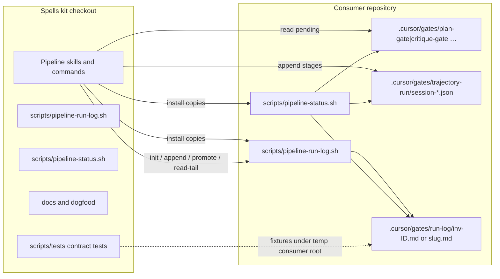

# Pipeline run memory — System Design

**Status:** merged  
**AC:** AC1, AC2, AC3, AC4, AC5  
**Mode:** draft-from-ac  
**Source plan:** n/a

## 1. Requirements

### Functional (AC ids only)

| Id | Requirement |
|----|-------------|
| AC1 | Pipeline run memory lives in the **consumer repository**, not in the shared Spells kit checkout. |
| AC2 | A short **run journal / run-log** is stored on disk in the consumer repo (near the plan and/or under `.cursor/`). |
| AC3 | Pipeline skills **write** key decisions / stage into that journal and **read** it for orientation together with existing gate markers under `.cursor/gates/`. |
| AC4 | There is **no** new chat-conversation memory system inside the kit. |
| AC5 | Contract tests and documentation in the kit describe the consumer-repo behavior (installer copies helpers/docs as needed; runtime state stays in the consumer project). |

### Non-functional

| Concern | Expectation |
|---------|-------------|
| Scale | One short journal per pipeline invocation (pre-plan) and one per plan slug after promote. Order of tens of lines per run, not megabytes. |
| Latency | Append and read-tail must complete in well under one second on a local disk (same class as existing gate helpers). |
| Availability | Best-effort: missing helper or missing journal → one-sentence skip; never invent stage or decision text. |
| Durability | Plain files under the consumer project `.cursor/gates/`; no network service. |
| Privacy | Journal holds stage ids and short decision tokens already used at human gates — not pasted chat transcripts, not ticket body dumps. |
| Concurrency | Concurrent pipeline starts must not wipe each other’s pre-plan journals. |

### Constraints

- Stack: kit markdown + bash + small python helpers (matches `.cursor/project-patterns.md`).
- Reuse existing consumer disk layout: `.cursor/gates/<kind>/<slug>`, trajectory session ledgers under `.cursor/gates/trajectory-run/`, orientation via `scripts/pipeline-status.sh` and skill `pipeline-status`.
- Installer already copies `pipeline-gates.sh` and `pipeline-status.sh` into the consumer `scripts/`; new helpers follow that pattern.
- Kit checkout never receives consumer run-state writes (same rule as gates and session ledgers today).
- No React / Spring / database components.

## 2. High-level design

### Chosen storage approach

**Short append-only run-log files under `.cursor/gates/run-log/` in the consumer project**, keyed by **per-invocation id** before a plan exists and by **plan slug** after promote. Pipeline skills write and read via an installed helper; `pipeline-status.sh` may summarize the resolved journal. Session ledgers and human-gate markers stay the source of truth for scoring and pending HITL; the run-log is a thin orientation journal of key decisions and stage transitions.

### Components



| Component | Role |
|-----------|------|
| `.cursor/gates/run-log/inv-<invocation_id>.md` | Pre-plan journal for one pipeline start (isolated per invocation). |
| `.cursor/gates/run-log/<slug>.md` | Per-plan journal after successful promote (slug from `pipeline-gates.sh`). |
| `scripts/pipeline-run-log.sh` | `init`, `append`, `promote`, `read-tail`, `path`; resolves slug via `pipeline-gates.sh`. |
| Pipeline skills / commands | Generate or pass `invocation_id`; init / append / promote at named stops; read-tail for orientation. |
| `scripts/pipeline-status.sh` | Derives route / layer / stage from pending gates + session ledger; optionally includes `run_log_path` and `run_log_tail`. |
| Kit docs + contract tests | Document consumer paths, gitignore guidance, and assert helper behavior on fixture trees (AC5). |

### Data flow

1. **Pipeline start** (`/csp-start-task`, `/csp-start-issue-task`, or equivalent): mint a new `invocation_id` for this chat/run. Call `pipeline-run-log.sh init --invocation <id>` to create **only** `.cursor/gates/run-log/inv-<id>.md` with a header (`invocation`, `route` if known, `started`). Do **not** truncate, rename, or delete any other `inv-*.md` or `<slug>.md` files.
2. **Pre-plan stages**: skills append lines to `inv-<id>.md` (same `invocation_id` for the run).
3. **Plan path known**: run the **promote** algorithm (section 3) from `inv-<id>.md` → `run-log/<slug>.md`. Further appends use `--plan` and write the slug file.
4. **Human gates**: append one line for the gate and chosen token(s). Gate markers under `.cursor/gates/<kind>/<slug>` remain authoritative for pending / clear.
5. **Orientation**: `hitl-choice` / `/csp-pipeline-status` use `pipeline-status.sh` (gates + ledger). Skills may `read-tail` with `--invocation` and/or `--plan`. Prefer disk journals over inventing memory from conversation (AC4).
6. **New run**: always a **new** `invocation_id` and a fresh `inv-<id>.md`. Optional reset applies only to that new file via `init`, never to a foreign invocation’s journal. Scoring still uses session ledger + metrics history only.

### API contracts (CLI / skill protocol)

```text
# Create this invocation’s pre-plan journal (never touches other inv-* files)
pipeline-run-log.sh init --root <project> --invocation <id> [--route <full|fast|issue|unknown>]

# Append one journal line
pipeline-run-log.sh append --root <project> --invocation <id> [--plan <path>] \
  --stage <id> --note "<short text>"

# Promote pre-plan journal to slug path when plan is known
pipeline-run-log.sh promote --root <project> --invocation <id> --plan <path> \
  [--route <full|fast|issue|unknown>]

# Read last N body lines (default N=12)
pipeline-run-log.sh read-tail --root <project> [--invocation <id>] [--plan <path>] [--lines N]

# Resolve path only (for tests / status)
pipeline-run-log.sh path --root <project> [--invocation <id>] [--plan <path>]
```

**`invocation_id` format:** `[A-Za-z0-9][A-Za-z0-9._-]{0,63}` (example: `20260921T120000Z-a1b2c3d4e5f6`). Skills mint once at start and reuse for that run.

**`--note` hard max:** 120 Unicode characters after collapsing internal newlines to spaces and trimming ends. Longer input is truncated to 120 characters by the helper (no multi-line notes).

Exit codes: `0` success; `2` unknown args / invalid `invocation_id`; missing root → non-zero; promote failure → non-zero (see promote algorithm). Missing journal on `read-tail` → empty stdout + exit `0`.

Skill protocol:

- **Write:** after every named stage entry and every human-gate answer that already appends the session ledger, also append one run-log line (same stop).
- **Read:** before orientation / closed-set asks, optionally read-tail; combine with gate markers; never treat run-log as permission to clear foreign gates.
- **Forbidden:** storing raw chat transcripts, full Jira descriptions, or a kit-global conversation store (AC4).

### Storage choices

| Store | Location | Purpose | Mutated by |
|-------|----------|---------|------------|
| Human-gate markers | `.cursor/gates/{plan-gate,critique-gate,plan-critique-clear,review-gate,docs-gate}/<slug>` | Pending / clear HITL | Existing gate writers |
| Session ledger | `.cursor/gates/trajectory-run/session-{full,fast,issue}.json` | Trajectory hard-sensor path | `trajectory-cases.py record` |
| Metrics history | `.cursor/gates/pipeline-metrics/history.jsonl` | Pass/duration graphs | `pipeline-metrics.py` |
| **Run-log (new)** | `.cursor/gates/run-log/inv-<id>.md` then `<slug>.md` | Short decision / stage journal | `pipeline-run-log.sh` via skills |
| Plans / specs | `docs/**` | Product artifacts | Humans + coding agents |

Runtime state stays in the consumer project. The kit holds only scripts, skill text, docs, and tests (AC1, AC5).

## 3. Deep dive

### Data model — run-log file

**Path convention**

| When | Path |
|------|------|
| Pre-plan (invocation known) | `<consumer>/.cursor/gates/run-log/inv-<invocation_id>.md` |
| Plan path known (after promote or append with `--plan`) | `<consumer>/.cursor/gates/run-log/<slug>.md` (`<slug>` from `pipeline-gates.sh`) |

There is **no** shared `active.md`. Isolation is per `invocation_id`.

**File shape (markdown, English machine skeleton)**

```markdown
# Pipeline run-log
invocation: 20260921T120000Z-a1b2c3d4e5f6
plan: docs/superpowers/plans/example.md
slug: ACP-1234
route: full
started: 2026-09-21T12:00:00Z

- 2026-09-21T12:01:00Z | stage=pipeline-route-hitl | note=chose full
- 2026-09-21T12:05:00Z | stage=approve-plan | note=approve
- 2026-09-21T12:10:00Z | stage=review-gate | note=pending
```

Rules:

- Header keys when present: `invocation`, `plan`, `slug`, `route`, `started`. Pre-plan files omit `plan` / `slug` until promote refreshes them.
- Body lines are append-only: `- <iso8601> | stage=<id> | note=<short>`.
- `note` is one short clause (max 120 characters after helper normalization).
- **v1 length policy:** append-only for the life of that file. No mid-run soft truncate of oldest lines. A fresh file appears only via `init` for a **new** `invocation_id`, or via optional reset semantics scoped to that same id on an explicit re-`init` of the same invocation (same path rewritten). Foreign journals are never reset by another start.

**Duplicate appends:** if the last body line’s `stage=` and `note=` equal the new append (after note normalization), the helper skips writing and exits `0` (idempotent noise filter).

**Not stored**

- Full chat turns or tool traces
- Entire acceptance-criteria text
- Secrets / credentials
- Kit-checkout paths as the journal home

### Promote algorithm

Inputs: `--root`, `--invocation <id>`, `--plan <path>`, optional `--route`.

1. Compute `slug` with existing `pg_*` helpers for `--plan`.
2. `source = .cursor/gates/run-log/inv-<id>.md`. If source is missing → exit non-zero; do nothing else.
3. `target = .cursor/gates/run-log/<slug>.md`.
4. **Target absent:** prefer **`mv` source → target**. On success, rewrite the target **header** so `plan`, `slug`, and `route` (when `--route` given; else keep existing route header or `unknown`) match the promote inputs; keep `invocation` and `started` from the moved file. Optionally refresh `current-invocation` with `plan` / `slug` lines. Exit `0`.
5. **Target exists (refuse-on-conflict):** exit non-zero; leave **source readable and intact**; do **not** merge, truncate, or delete either file. Caller skips promote (one-sentence note) and continues appending with `--invocation`. Authority for this rule: tech-spec (supersedes any older merge wording).
6. **On I/O failure** during an absent-target `mv` / header refresh: leave **source readable and intact**; leave target unchanged if the move did not complete. Exit non-zero. No retry loop.

### Relation to `pipeline-status.sh`

Existing precedence for `stage` / `layer` stays:

1. Pending human gates (`docs-gate` → `review-gate` → `critique-gate` → `plan-gate`)
2. Else last `stages_entered` from session ledger
3. Else `idle`

Run-log enrichment (additive JSON fields when `--json`):

| Field | Type | Meaning |
|-------|------|---------|
| `run_log_path` | string \| null | Relative path to the resolved journal, if any |
| `run_log_tail` | string[] | Last N body lines (default 5), empty if missing |

Path resolution for status: `--invocation` → pending gate’s plan slug journal → `current-invocation` pointer → omit (do not guess among multiple `inv-*` files by mtime).

Text strip may add one optional line: `Recent: <last note>` when a tail exists. Missing run-log never changes `stage` / `layer`.

### Endpoints

No HTTP / GraphQL. CLI surface is `pipeline-run-log.sh` as above, plus existing `pipeline-status.sh` flags. Installer copies the new script beside `pipeline-gates.sh` / `pipeline-status.sh`.

### Caching

None. Each append is a direct filesystem write under lock; each read-tail is a direct read.

### Queues / events

None. Synchronous append at the same pipeline stops that already touch the session ledger.

### Error handling and retries

| Failure | Behavior |
|---------|----------|
| Helper missing after install gap | One-sentence skip in skill; continue pipeline (same pattern as missing `pipeline-status.sh`) |
| Cannot create `.cursor/gates/run-log/` | Skip write; do not brick gates or ledger |
| `read-tail` on missing file | Empty output, exit 0 |
| Unknown CLI args / invalid `invocation_id` | Exit 2 |
| Second pipeline start while another invocation’s journal exists | Mint a new `invocation_id`; `init` creates a new `inv-<id>.md` only; **never** truncate or overwrite another invocation’s journal |
| Promote: target missing, `mv` succeeds | Header refreshed (`plan` / `slug` / `route`); exit 0 |
| Promote: target exists | Refuse-on-conflict; source left intact; exit non-zero |
| Promote I/O failure | Source left readable; skip promote (no retry loop); pipeline continues |
| Concurrent appends (same file) | `flock` on the journal file for the duration of each append (and for promote’s target write); serialized writers |
| Duplicate stage+note vs last body line | Skip write; exit 0 |

No automatic retry loops; a single failed write or promote is skipped rather than blocking HITL.

### Who writes / who reads

| Actor | Write | Read |
|-------|-------|------|
| `csp-start-task` / `csp-start-issue-task` / bootstrap | `init` for new `invocation_id` | Optional |
| Route / tech-spec / approve-plan / critic / start-build / finish-plan / update-docs / create-pr skills | Append; `promote` when plan path first known | Read-tail when orienting |
| `hitl-choice` | Append after token recorded (caller or thin hook in skill text) | Via `pipeline-status` strip enrichment |
| `/csp-pipeline-status` | Never | Via resolver |
| `trajectory-score` / metrics | Unchanged (ledger / history only) | No requirement to read run-log |
| Kit checkout agents | Never write consumer journals into the kit tree | N/A |

### Installer and documentation (AC5)

- `scripts/install-to-project.sh` copies `pipeline-run-log.sh` into `<project>/scripts/` (executable), same as `pipeline-status.sh`.
- Skill and command markdown install via existing walks; update skill text for write/read/promote stops and for minting `invocation_id`.
- Kit docs: short section in `pipeline-flow.md` (and dogfood checklist) describing consumer paths, “no chat memory in kit”, and a **recommendation to gitignore** `.cursor/gates/run-log/` unless the team wants journals versioned. Installer may print the same recommendation once after copy.
- Contract tests under `scripts/tests/pipeline-run-log-test.sh` (plus wiring assert that installer / skills mention the helper). Required cases include:
  - `init` of invocation B does not clear invocation A’s `inv-*.md`
  - promote when **target does not exist** (`mv` + header refresh)
  - promote when **target exists** (body append + header refresh + source removed)
  - promote **failure** leaves source readable and does not delete it
  - append flock / duplicate stage+note skip / `--note` truncation at 120 characters  
  Fixtures use a temp directory as `--root`.

## 4. Scale and reliability

### Load estimation

**Assumption:** fewer than ten concurrent pipeline chats per consumer repo; each run appends fewer than one hundred journal lines. Disk and parse cost are negligible versus language-model turns.

### Scaling

Vertical only (local files). No horizontal service. Pre-plan isolation uses per-invocation files; post-plan uses per-slug files like other gates.

### Failover and redundancy

No replication. Recovery = re-run orientation from gates + ledger; journal is convenience. Losing the journal does not unblock or re-block gates incorrectly.

### Monitoring and alerting

No new daemons. Contract tests in `scripts/tests/` and optional dogfood checklist row. Harness health may later list the helper as wired inventory (**Assumption:** not required for v1 of this design).

## 5. Trade-offs

### Material decisions

| Decision | Choice | Alternatives | Why this wins |
|----------|--------|--------------|---------------|
| Where memory lives | Consumer `.cursor/gates/run-log/` | Kit checkout store; user-global `~/.cursor` only | AC1; matches gates/ledger locality; install copies helpers, not runtime state |
| Journal vs overload session ledger | Separate short markdown journal | Stuff decisions into `session-*.json`; new gate kind | Ledger stays score-shaped; journal stays human-readable; avoids breaking trajectory fixtures |
| Path family | Under `.cursor/gates/run-log/` | Beside plan under `docs/`; `.cursor/run-log.md` only | Same tree agents already inspect; slug reuse from `pipeline-gates.sh`; docs/ stays product prose |
| Pre-plan isolation | Per-invocation `inv-<id>.md` | Shared `active.md` truncated on each start | Concurrent starts cannot wipe another chat’s pre-plan journal |
| Promote when target exists | Refuse-on-conflict; keep both files | Merge bodies; truncate target | Avoids interleaved “Recent” lies after context loss |
| Promote failure | Leave source; skip (no retry loop) | Auto-retry; delete source anyway | Source remains readable for a later promote or direct `--plan` appends |
| Orientation authority | Gates + ledger first; run-log enriches | Run-log overrides stage | Prevents stale journal lines from disagreeing with pending HITL |
| Mid-run length control | Append-only in v1; reset only via `init` for that invocation | Soft-delete oldest lines | Simpler helper; short runs do not need trim |
| Concurrent appends | `flock` on the journal file | Best-effort torn lines | Deterministic serialization with small bash cost |
| Duplicate lines | Skip if last body line matches stage+note | Always append | Cuts accidental double-wire noise |
| Chat memory | None in kit (AC4) | Embeddings / conversation DB in kit | Out of scope; durable disk journal in consumer is enough |
| Helper language | Bash + tiny python if needed for stamp | Pure python module; node | Matches `pipeline-status.sh` / `pipeline-gates.sh` |

### Rejected alternatives

- **Kit-global conversation memory / vector store** — rejected: violates AC4; wrong ownership for consumer secrets and ticket text.
- **Shared single `active.md` truncated on every pipeline start** — rejected: wipes concurrent pre-plan chats.
- **Dedicated orientation JSON rewritten every stage under `.cursor/gates/pipeline-orientation/`** — rejected as a full stage mirror; run-log is append-only notes, not a second pending-gate system.
- **Plan-adjacent `*.run-log.md` under `docs/` as the only store** — rejected as primary: pollutes docs trees and complicates pre-plan stages.
- **Replacing session ledgers with the run-log** — rejected: hard-sensor scoring and golden cases depend on the JSON ledger contract.
- **Promote truncate-target when slug file exists** — rejected: destroys the other run’s notes on the same plan slug.
- **Soft truncate of oldest body lines in v1** — rejected for v1 complexity; revisit if journals grow noisy.
- **Writing run-state into the Spells kit repo when dogfooding** — rejected for product behavior: tests use a temp consumer `--root`; design target remains consumer project root.

### Revisit later

- Whether `/csp-pipeline-status` should print the full tail by default or only on a flag.
- Soft truncate or archival of abandoned `inv-*.md` orphans after successful slug promote elsewhere.
- Whether status without `--invocation` should pick newest `inv-*` by mtime (currently: omit enrichment).

## 6. Assumptions / open questions

### Assumptions

| Claim | Why safe | How to revoke |
|-------|----------|---------------|
| Skills can mint and retain one `invocation_id` for the life of a pipeline chat | Same pattern as holding a plan path in chat context | Persist id in a tiny pointer file per chat if hosts cannot retain it |
| `note` text may reuse closed-set tokens and stage ids already written to the session ledger | Same vocabulary skills already use; no new business facts | Add a fixed enum of note verbs if free text drifts |
| Enriching `pipeline-status.sh` JSON with `run_log_path` / `run_log_tail` is additive and non-breaking | Existing tests key on current fields; new keys are optional | Gate enrichment behind a flag if a consumer parser is strict |
| Installer copy of one bash helper matches current `pipeline-status.sh` install | Same script already copies gate/status helpers | Symlink-only install if teams prefer; document in install script |
| Contract tests run against temp `--root` trees in `scripts/tests/` | Matches `pipeline-status-test.sh` pattern | Add dogfood-only manual steps if fixtures cannot cover install |
| Recommending gitignore of `.cursor/gates/run-log/` is enough guidance | Teams that want journals in git can remove the ignore | Make installer write a snippet only when a project `.gitignore` already mentions `.cursor/` |

### Open questions

None. No Blocker-tier business fact is missing from AC1–AC5 for this design.
